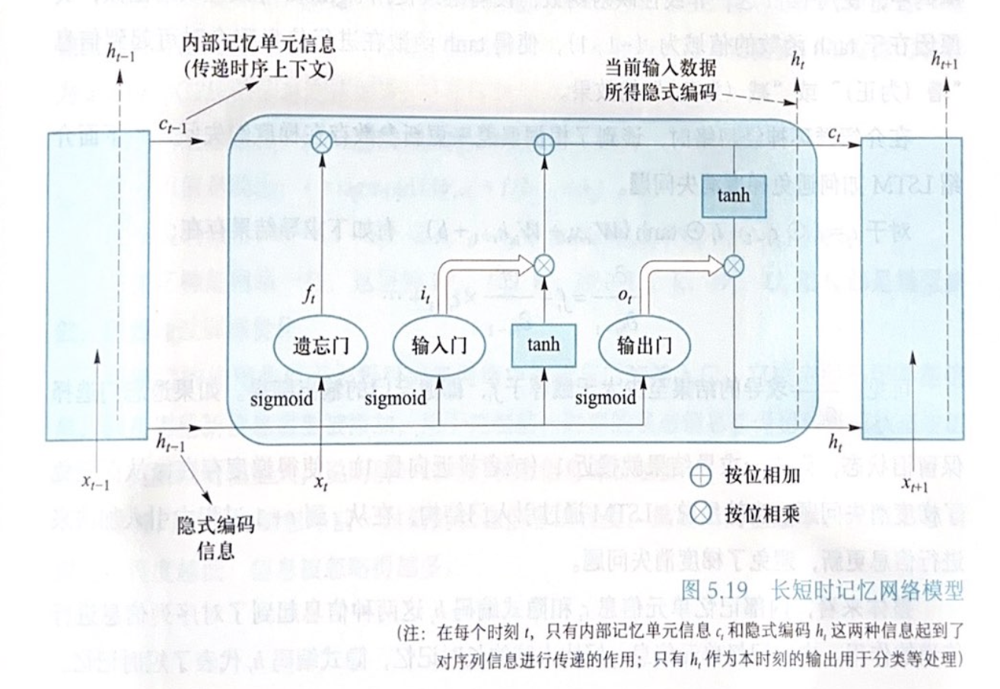
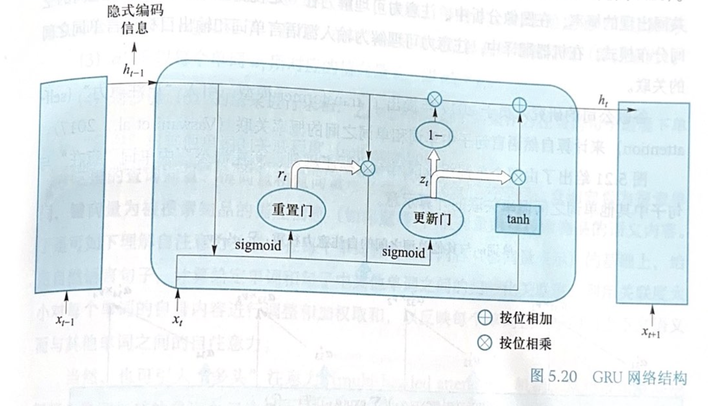

# 人工智能引论：复习

!!! Info "无奈的碎碎念"

    这是我在 2024 年秋冬学期修读「人工智能引论」时做的复习笔记，后半部分鸽掉了。逻辑上，本门课完全可以被「机器学习」这门课覆盖掉。

## 知识表达与推理

- 命题：确定为真或假的陈述句。
- 命题联结词：$\neg$（非）、$\land$（合取）、$\lor$（析取）、$\rightarrow$（蕴含）、$\leftrightarrow$（双条件）。
- 逻辑等价：具有相同真值的命题，用 $\equiv$ 表示。
- 谓词：刻画个体属性或者描述个体之间关系存在性的元素，其值为真或为假。
- 量词：全称量词 $\forall$ 和存在量词 $\exists$。
- 变元：约束变元是在全称量词或者存在量词的约束条件下的变量符号，自由变元是没有约束的变量符号。
- 项：描述对象的逻辑表达式，递归定义：常量符号和变量符号是项、如果 $t_1, t_2, \ldots, t_n$ 是项，$f$ 是 $n$ 元函数符号，则 $f(t_1, t_2, \ldots, t_n)$ 是项、被有限次数使用上述规则产生的符号串是项。
- 原子谓词公式：若 $P(x_1, x_2, \ldots, x_n)$ 是 $n$ 元谓词符号，$t_1, t_2, \ldots, t_n$ 是项，则 $P(t_1, t_2, \ldots, t_n)$ 是原子谓词公式，简称原子公式。
- 合式公式：联结词和原子公式构成的复杂语句，也称为谓词公式。

**知识图谱推理**：

知识图谱

## 搜寻探索与问题求解

## 机器学习

没有免费午餐定理：任何一个机器学习模型如果在一些训练集以外的样本误差小，那么必然在一些训练集以外的样本表现欠佳。

## 深度学习

### 1. 钩式历史

### 2. 前馈神经网络

前馈神经网络，也叫深度前馈网络或者**多层感知机/Multilayer Perceptron/MLP**。

1. Sigmoid：$\operatorname*{sigmoid}(x) = \dfrac{1}{1 + e^{-x}}$，其导数为 $\operatorname*{sigmoid}'(x) = \operatorname*{sigmoid}(x)(1 - \operatorname*{sigmoid}(x))$。Sigmoid 输出的值域在 $(0, 1)$ 内，因此可以将其视为概率值。其也满足单调递增和非线性变化，但是会有梯度消失的问题。
2. Tanh：$\operatorname*{tanh}(x) = \dfrac{1 - e^{-2x}}{1 + e^{-2x}}$，同样满足单调递增和非线性变化，同时其值域为 $(-1, 1)$，并且在原点梯度更大。但是同样会有梯度消失的问题。
3. ReLU/整流线性单元/Restified Linear Unit：$\operatorname*{ReLU}(x) = \max(0, x)$。使用较为普遍，当 $x > 0$ 时，梯度为 1，这就有效缓解了梯度消失问题，但是当 $x < 0$ 时，$\operatorname*{ReLU}$ 的梯度和值都为 0，这就导致神经网络中若干参数的激活值为 0，一方面导致参与分类任务的神经元数目稀缺，另一方面也导致神经元**死亡**，其对应的权重永远不会更新。解决这个问题可以使用 ReLU 的变种 Leaky ReLU 等。
4. Softmax：$\operatorname*{softmax}(x_i) = \dfrac{e^{x_i}}{\sum_{j = 1}^{n}e^{x_j}}$，是对 Logisitc 回归的一种推广，用于多分类问题。

### 3. 神经网络参数优化

神经网络参数优化是一个监督学习的过程，给定 $n$ 个标注样本数据 $(x_i, y_i)$，其中 $x_i$ 是输入数据，$y_i$ 是标注信息，我们通过损失函数计算模型预测值和真实值之间的差距，通过优化损失函数来优化模型参数。具体而言，模型会利用反向传播算法将损失函数计算所得到的误差从输出端出发，从后向前传递给神经网络的每个单元，通过梯度下降对参数进行优化。

**损失函数/Loss Function**：

1. 均方误差损失函数
2. 交叉熵损失函数：在信息论的视角来看，如果对于同一个随机变量 $\mathtt{x}$ 有两个单独的概率分布 $P$ 和 $Q$，令其交叉熵为 $H(P, Q) = -\mathbb{E}_{\mathtt{x}\sim P}\log Q(x)$。在机器学习的视角来看，其中 $P$ 是 $\mathtt{x}$ 的真实分布，$Q$ 是 $\mathtt{x}$ 的预测分布。交叉熵损失描述了两个概率分布的距离。可以通过最小化交叉熵损失训练神经网络。

**梯度下降**：

**反向传播**：

### 4. 卷积神经网络

**卷积计算**：

填充

步长

**池化**：

- 最大池化
- 平均池化
- k-max 池化

### 5. 循环神经网络

**循环神经网络模型**：

**长短时记忆网络/Long Short-Term Memory**：引入了**内部记忆单元/Internal Memory Cell** 和**门结构/Gate** 对当前时刻输入信息和前序时刻生成信息进行整合和前递，内部记忆单元的信息可以视为对历史信息的累积。符号和术语如下：

- $x_t$：时刻 $t$ 的输入；
- $i_t$：输入门的输出，$i_t = \operatorname*{sigmoid}(W_{xi}x_t + W_{hi}h_{t-1} + b_i)$，其中 $W_{xi}$、$W_{hi}$ 和 $b_i$ 是输入门的权重和偏置；
- $f_t$：遗忘门的输出，$f_t = \operatorname*{sigmoid}(W_{xf}x_t + W_{hf}h_{t-1} + b_f)$，其中 $W_{xf}$、$W_{hf}$ 和 $b_f$ 是遗忘门的权重和偏置；
- $o_t$：输出门的输出，$o_t = \operatorname*{sigmoid}(W_{xo}x_t + W_{ho}h_{t-1} + b_o)$，其中 $W_{xo}$、$W_{ho}$ 和 $b_o$ 是输出门的权重和偏置；
- $c_t$：内部记忆单元的输出，$c_t = f_t \odot c_{t-1} + i_t \odot \operatorname*{tanh}(W_{xc}x_t + W_{hc}h_{t-1} + b_c)$，其中 $W_{xc}$、$W_{hc}$ 和 $b_c$ 是内部记忆单元的权重和偏置，输入门 $i_t$ 控制有多少信息流入当前时刻内部记忆单元 $c_t$，遗忘门 $f_t$ 控制上一时刻内部记忆单元 $c_{t-1}$ 有多少信息流入当前时刻内部记忆单元 $c_t$；
- $h_t$：时刻 $t$ 输入数据的隐式编码，$h_t = o_t \odot \operatorname*{tanh}(c_t)$，输入门、遗忘门和输出门的信息一起参与得到当前时刻的隐式编码 $h_t$；
- $\odot$：逐元素乘法。

对于 $c_t = f_t \odot c_{t-1} + i_t \odot \operatorname*{tanh}(W_{xc}x_t + W_{hc}h_{t-1} + b_c)$，可以看到

$$
\frac{\partial c_t}{\partial c_{t-1}} = f_t + \frac{\partial f_t}{\partial c_{t-1}}c_{t-1} + \cdots \geq f_t
$$

可以看到，LSTM 通过引入门结构，在相邻的时刻之间使用加法进行信息更新，可以避免梯度消失问题。

**门控循环单元/Gated Recurrent Unit**：简化了 LSTM，不使用记忆单元，使用隐藏状态进行信息传递。

- 输入数据 $x_t$、前一时刻隐式编码 $h_{t-1}$；
- 更新门/Update Gate：$z_t = \operatorname*{sigmoid}(W_{xz}x_t + W_{hz}h_{t-1} + b_z)$；
- 重置门/Reset Gate：$r_t = \operatorname*{sigmoid}(W_{xr}x_t + W_{hr}h_{t-1} + b_r)$；
- 隐式编码输出：$h_t = (1 - z_t) \odot h_{t-1} + z_t \odot \operatorname*{tanh}(W_{xh}x_t + U_{h}(r_t \odot h_{t-1}) + b_h)$。

这里的模型参数 $W_{xz}$、$W_{hz}$、$b_z$、$W_{xr}$、$W_{hr}$、$b_r$、$W_{xh}$、$U_{h}$ 和 $b_h$ 都是需要训练优化。

更新门类似于遗忘门与输入门，决定要忘记或者添加那些信息，控制前一状态的信息被保留到当前状态中的程度，更新门的值越大，前一状态的信息被保留的程度越高。重置门控制忽略前一时刻的状态信息的程度，重置门的信息越少，信息通过程度越低，信息被忽略的程度就越高。

### 6. 神经网络正则化

深度神经网络的结构复杂，参数多，容易过拟合，我们使用正则化技术提升神经网络的泛化能力。

- **Dropout**：在训练过程中，随机丢掉一部分神经元来降低神经网络的复杂度，从而防止过拟合。实现：通过每次迭代训练过程中，都以一定概率随机屏蔽每一层中的若干个神经元。
- **批归一化/Batch Normalization**：由于随着神经网络的深度增加，输入数据经过激活函数若干次非线性变换后，整体分布朝着非线性函数的值域上下界两端靠拢，因此在反向传播的过程中，靠近输入端处容易出现梯度消失问题。解决方法：通过规范化手段，把神经网络每一层中的任意神经元的输入值分布改变成均值为 0，方差为 1 的标准正态分布。
- **$L_1$ 和 $L_2$ 正则化**：对于具有 $n$ 个训练数据 $\{(x_1, y_1), (x_2, y_2), \ldots, (x_n, y_n)\}$ 的神经网络模型，加入**正则化项**之后的神经网络的损失函数一般可以表示如下：

    $$
    \min \frac{1}{n} \sum_{i = 1}^{n}\operatorname*{Loss}(y_i, f(\boldsymbol{W}, x_i)) + \lambda \times \Phi(\boldsymbol{W})
    $$

    其中 $f(\boldsymbol{W}, x_i)$ 是神经网络模型的输出，$\boldsymbol{W}$ 是神经网络模型的参数，$\lambda$ 是正则化权重，正则化项一般使用参数的范数来表示，常见的是 $L_0$ 范数（$L_0$ 正则化是一个 $\mathsf{NP}$ 难问题，所以用的少）、$L_1$ 范数（稀疏规则蒜子/Lasso Regularization）和 $L_2$ 范数。

### 7. 前沿应用

- 注意力机制：谷歌提出了 Transformer 模型，引入了**自注意力**机制。
- Word2Vec：
- 图像分类与目标定位

## 强化学习

### 1. 强化学习基本概念

基本概念：

- **智能体/Agent**：强化学习算法的主体，根据经验做出主观判断并且执行动作；
- **环境/Environment**：智能体以外的一切都称为环境，环境在与智能体的交互中，能被智能体采取的动作影响，同时智能体也能向智能体反馈状态和奖励；
- **状态/State**：智能体对环境的一种理解和编码，包含对智能体采取决策产生影响的信息；
- **动作/Action**：智能体对环境产生影响的方式；
- **策略/Policy**：智能体在所处状态下执行某个动作的依据，即给定一个状态，智能体可以根据一个策略来选择应该采取的动作；
- **奖励/Reward**：智能体在环境中执行动作后，从环境中获得的收益。奖励是现实中奖励和惩罚的综合，用正值表示实际奖励，负值表示实际惩罚。

**强化学习是智能体在与环境交互中学习能够帮助其获得最大化奖励这一策略的过程**。在每一次迭代中，智能体根据当前策略选择一个动作，该动作影响环境，导致环境发生改变，智能体从环境中得到状态变化和奖励反馈等信息，并根据这些反馈更新其内部策略。

|  学习方式  |       学习依据       |       数据来源       |         决策过程         |                学习目标                |
| :--------: | :------------------: | :------------------: | :----------------------: | :------------------------------------: |
|  监督学习  |     基于监督信息     |  一次给定的标注数据  | 单步决策（分类和识别等） |          样本到语义标签的映射          |
| 无监督学习 | 基于对数据结构的假设 | 一次给定的未标注数据 |            无            |             数据的分布模式             |
|  强化学习  |       基于评估       |   在时序交互中产生   |         序贯决策         | 选择能够获取最大收益的状态到动作的映射 |

一个**随机过程**是一列随着时间变化的随机变量。当时间是离散量的时候，随机过程可以表示为 $\{X_t\}_{t = 0, 1, 2, \ldots}$，这里每一个 $X_t$ 都是一个随机变量。一个随机过程满足马尔可夫性是指其满足下面的条件：

$$
P(X_{t+1} = x_{t+1} \mid X_t = x_t, X_{t-1} = x_{t-1}, \ldots, X_0 = x_0) = P(X_{t+1} = x_{t+1} \mid X_t = x_t)
$$

这表明下一刻的状态只与当前状态相关。

**马尔可夫决策过程/Markov Decision Process/MDP**：强化学习的基本数学模型，由一个五元组 $(S, A, P, R, \gamma)$ 组成，其中：

- $S$：状态集合，所求解问题所有可能出现的状态构成的集合，集合不保证有限；
- $A$：动作集合，所求解问题中智能体可以采取的所有动作构成的集合，集合不保证有限；
- $P$：状态转移概率分布，$P(s_{t+1} \mid s_t, a_t)$ 表示在状态 $s_t$ 采取动作 $a_t$ 后转移到状态 $s_{t+1}$ 的概率，其满足马尔可夫性。状态转移可以确定也可以随机；
- $R$：奖励函数，$R(s_t, a_t, s_{t+1})$ 表示在状态 $s_t$ 采取动作 $a_t$ 后转移到状态 $s_{t+1}$ 的奖励；
- $\gamma$：折扣因子，$0 \leq \gamma \leq 1$，后续时刻奖励对于当前动作的价值系数。

同时，在每个时刻我们定义回报 $G$ 来反映当前时刻可以得到的累加奖励 $G_t = R_{t+1} + \gamma R_{t+2} + \gamma^2 R_{t+3} + \cdots = \sum_{k = 0}^{\infty}\gamma^k R_{t+k+1}$。回报表明了该时刻可以得到的累加奖励。

马尔可夫决策过程产生的状态序列称为轨迹/Trajectory，轨迹的长度可以是无限的，也可以有终止状态。状态序列中包含终止状态的问题叫做分段/Episodic 问题，不包含终止状态的问题称为持续/Continuing 问题，在分段问题中，一个包含初始状态到终止状态的完整轨迹称为一个片段/Episode。

**形式化问题定义**：

- 策略函数：$\pi: S \times A \rightarrow [0, 1]$，表示在状态 $s$ 采取动作 $a$ 的概率，对于确定的状态函数，记 $a = \pi(s)$。一个好的策略函数应该能够使得智能体在采取一系列行动后获得最大的累积奖励，也就是最大化每一时刻的回报值。
- 价值函数/Value Function：$V(s): S \rightarrow \mathbb{R}$，其中 $V_{\pi} = \mathbb{E}_{\pi}[G_t \mid S_t = s]$，表示在时刻 $t$ 处于状态 $s$ 时按照策略 $\pi$ 采取行动时所获得回报的期望；
- 动作价值函数/Action Value Function：$q: S\times A \rightarrow \mathbb{R}$，其中 $q_{\pi}(s, a) = \mathbb{E}_{\pi}[G_t \mid S_t = s, A_t = a]$，表示在时刻 $t$ 处于状态 $s$ 采取动作 $a$ 时所获得回报的期望。

所以，强化学习问题可以转化成一个策略学习问题：给定一个马尔可夫决策过程 $\operatorname*{MDP} = (S, A, P, R, \gamma)$，求解一个最优策略 $\pi^*$，使得对任意的 $s\in S$，$V_{\pi^*}(s)$ 的值最大。

**贝尔曼方程/动态规划方程**：

已知价值函数和动作价值函数的定义：

$$\begin{aligned}
V_{\pi}(s) & = \mathbb{E}_{\pi}[R_{t+1} + \gamma R_{t+2} + \gamma^2 R_{t+3} + \cdots \mid S_t = s] \\
q_{\pi}(s, a) & = \mathbb{E}_{\pi}[R_{t+1} + \gamma R_{t+2} + \gamma^2 R_{t+3} + \cdots \mid S_t = s, A_t = a]
\end{aligned}$$

变形可以得到：

$$\begin{aligned}
V_{\pi}(s) & = \mathbb{E}_{\pi}[R_{t+1} + R_{t+2} + \gamma^2 R_{t+3} + \cdots \mid S_t = s] \\
&= \mathbb{E}_{a\sim \pi(s, \cdot)}[\mathbb{E}_{\pi}[R_{t+1} + \gamma R_{t+2} + \gamma^2 R_{t+3} + \cdots \mid S_t = s, A_t = a]] \\
&= \sum_{a \in A} \pi(s, a)q_{\pi}(s, a)
\end{aligned}$$

同理，可以得到动作价值函数的贝尔曼方程：

$$\begin{aligned}
q_{\pi}(s, a) & = \mathbb{E}_{\pi}[R_{t+1} + \gamma R_{t+2} + \gamma^2 R_{t+3} + \cdots \mid S_t = s, A_t = a] \\
&= \mathbb{E}_{s^{\prime}\sim P(\cdot \mid s, a)}[R(s, a, s^{\prime}) + \gamma \mathbb{E}_{\pi}[R_{t+2} + \gamma R_{t+3} + \cdots \mid S_{t+1} = s^{\prime}]] \\
&= \sum_{s^{\prime}\in S}P(s^{\prime} \mid s, a)[R(s, a, s^{\prime}) + \gamma V_{\pi}(s^{\prime})]
\end{aligned}$$

两个方程放在一起，可以得到：

$$\begin{aligned}
V_{\pi}(s) & = \sum_{a\in A}\pi(s, a)\sum_{s^{\prime}\in S}P(s^{\prime} \mid s, a)[R(s, a, s^{\prime}) + \gamma V_{\pi}(s^{\prime})] \\
&= \mathbb{E}_{a\sim \pi(s, \cdot)}[\mathbb{E}_{s^{\prime}\sim P(\cdot \mid s, a)}[R(s, a, s^{\prime}) + \gamma V_{\pi}(s^{\prime})]] \\ \\ 
q_{\pi}(s, a) & = \sum_{s^{\prime}\in S}P(s^{\prime} \mid s, a)[R(s, a, s^{\prime}) + \gamma \sum_{a^{\prime}\in A}\pi(s^{\prime}, a^{\prime})q_{\pi}(s^{\prime}, a^{\prime})] \\
&= \mathbb{E}_{s^{\prime}\sim P(\cdot \mid s, a)}[R(s, a, s^{\prime}) + \gamma \mathbb{E}_{a^{\prime}\sim \pi(s^{\prime}, \cdot)}[q_{\pi}(s^{\prime}, a^{\prime})]]
\end{aligned}$$

所以价值函数的取值和事件无关，只和**策略**、**策略** $\pi$ **下从某个状态转移到后续状态获得的回报和后续所得回报有关**。

<!-- 在实际中，需要计算得到最优策略以指导智能体在当前状态如何选择一个可获得最大回报的动作。求解最优策略的一种方法就是去求解最优的价值函数或最优的动作-价值函数（即基于价值方法，value-based approach）。一旦找到了最优的价值函数或动作-价值函数，自然而然也就是找到最优策略。当然，在强化学习中还有基于策略（policy-based）和基于模型（model-based）等不同方法。 
 -->

### 2. 基于价值的强化学习

### 3. 基于策略的强化学习

### 4. 深度强化学习应用

## 人工智能博弈

