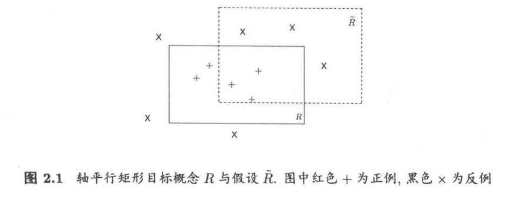
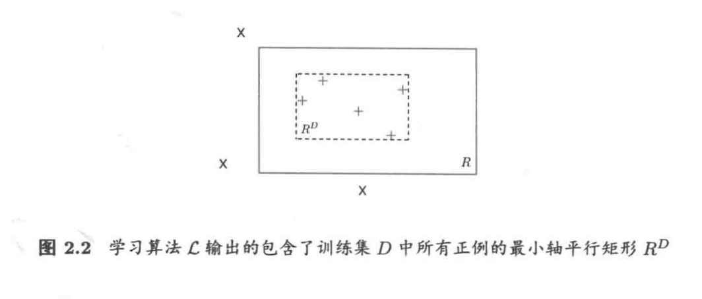

# Chapter 2: 可学性

## 1. 基本概念

给定样本集 $D = \{(\boldsymbol{x}_1,y_1),(\boldsymbol{x}_2,y_2),\ldots,(\boldsymbol{x}_m,y_m)\}$，$\boldsymbol{x}_i \in \mathcal{X}$，本书讨论的主要是二分类问题，也就是 $y_i \in \mathcal{Y} = \{-1,+1\}$。假设 $D$ 是 $\mathcal{X} \times \mathcal{Y}$ 上的联合分布，$D_{\mathcal{X}}$ 是样本空间 $\mathcal{X}$ 上的边缘分布。$D$ 中所有样本都是独立同分布从 $D$ 采样而得，记为 $D \sim D^m$，即它们是独立同分布/Independent and Identically Distributed/IID 样本。

令 $h$ 为从 $\mathcal{X}$ 到 $\mathcal{Y}$ 的一个映射，其**泛化误差/Generalization Error** 为

$$E(h;\mathcal{D}) = P_{(\boldsymbol{x},y)\sim\mathcal{D}}(h(\boldsymbol{x}) \neq y) = \mathbb{E}_{(\boldsymbol{x},y)\sim\mathcal{D}}[\mathbb{I}(h(\boldsymbol{x}) \neq y)],$$

$h$ 在 $D$ 上的**经验误差/Empirical Error** 为

$$\hat{E}(h;D) = \frac{1}{m}\sum_{i=1}^m\mathbb{I}(h(\boldsymbol{x}_i) \neq y_i).$$

泛化误差和经验误差分别和数学期望 $\boldsymbol{\mu}$ 与随机变量的均值 $\bar{X}$ 对应。由于 $D$ 是 $\mathcal{D}$ 的独立同分布采样，因此 $h$ 的经验误差的期望等于其泛化误差。在下文明确时，我们将把 $E(h;\mathcal{D})$ 和 $\hat{E}(h;D)$ 分别简记为 $E(h)$ 和 $\hat{E}(h)$。令 $\epsilon$ 为 $E(h)$ 的上限，即 $E(h) \leq \epsilon$，我们通常用 $\epsilon$ 表示预先设定的学得模型所应满足的误差要求，亦称误差参数。

若 $h$ 在 $D$ 上的经验误差为 0，则称 $h$ 与 $D$ 一致，否则称 $h$ 与 $D$ 不一致。对任意两个 $\mathcal{X} \to \mathcal{Y}$ 的映射 $h_1$ 和 $h_2$，可通过其不合/Disagreement 来度量它们之间的差别，即：

$$\text{dis}(h_1,h_2) = P_{\boldsymbol{x}\sim\mathcal{D}_{\mathcal{X}}}(h_1(\boldsymbol{x}) \neq h_2(\boldsymbol{x})).$$

令 $c$ 表示**概念/Concept**，它是从样本空间 $\mathcal{X}$ 到标记空间 $\mathcal{Y}$ 的映射，判定样本 $\boldsymbol{x}$ 的标记 $y$。对任何 $(\boldsymbol{x},y)$ 有 $c(\boldsymbol{x}) = y$ 成立，则称 $c$ 为**目标概念**。所以我们希望学得的目标概念所组成的集合称为**概念类/Concept Class**，用符号 $\mathcal{C}$ 表示。

给定学习算法 $\mathfrak{L}$，其考虑的所有**可能概念**的集合称为**假设空间/Hypothesis Space**，用符号 $\mathcal{H}$ 表示。由于学习算法事先并不知道概念类 $\mathcal{C}$ 的真实存在，因此 $\mathcal{H}$ 和 $\mathcal{C}$ 通常是不同的，学习算法会把自认为可能的目标概念集中起来构成 $\mathcal{H}$。对 $h \in \mathcal{H}$，由于并不能确定它是否真是目标概念，因此称为**假设/Hypothesis**。显然，假设 $h$ 也是从样本空间 $\mathcal{X}$ 到标记空间 $\mathcal{Y}$ 的映射。

若目标概念 $c \in \mathcal{H}$，则 $\mathcal{H}$ 中存在假设能将所有样本正确分开，我们称这个学习问题对假设空间 $\mathcal{H}$ 是**可分/Separable**的；若 $c \notin \mathcal{H}$，则假设空间 $\mathcal{H}$ 中不存在任何假设能将所有样本完全正确分开，我们称该学习问题对假设空间 $\mathcal{H}$ 是**不可分/Non-separable**的。

## 2. PAC 学习

学习理论中最基本的是概率近似正确/Probably Approximately Correct/PAC 理论，令 $\delta$ 表示置信度参数，定义：

**定义 2.1**（PAC 辨识/PAC Identify）：对 $0 < \epsilon,\delta < 1$，所有 $c \in \mathcal{C}$ 和分布 $\mathcal{D}$，若存在学习算法 $\mathfrak{L}$，其输出假设 $h \in \mathcal{H}$ 满足

$$P(E(h) \leq \epsilon) \geq 1-\delta,$$

则称学习算法 $\mathfrak{L}$ 能从假设空间 $\mathcal{H}$ 中 PAC 辨识概念类 $\mathcal{C}$。

!!! Info
    虽然这里没有出现概念 $c$，但是在实际计算泛化误差的时候，由于目标概念一定可以将每个样本的标签正确分类，因此其实概念就内嵌在定义之中

这样的学习算法 $\mathfrak{L}$ 能以较大的概率（至少 $1-\delta$）学得目标概念 $c$ 的近似（误差最大为 $\epsilon$）。在此基础上可定义：

**定义 2.2**（PAC 可学/PAC Learnable）：令 $m$ 表示从分布 $\mathcal{D}$ 独立同分布采样得到的样本数目，$0 < \epsilon,\delta < 1$，对所有分布 $\mathcal{D}$，若存在学习算法 $\mathfrak{L}$ 和多项式函数 $\text{poly}(\cdot,\cdot,\cdot,\cdot)$，使得对于任何 $m \geq \text{poly}(1/\epsilon,1/\delta,\text{size}(x),\text{size}(c))$，$\mathfrak{L}$ 能从假设空间 $\mathcal{H}$ 中 PAC 辨识概念类 $\mathcal{C}$，则称概念类 $\mathcal{C}$ 对假设空间 $\mathcal{H}$ 而言是 PAC 可学的，有时也简称概念类 $\mathcal{C}$ 是 PAC 可学的。

**定义 2.3**（PAC 学习算法/PAC Learning Algorithm）：若学习算法 $\mathfrak{L}$ 使概念类 $\mathcal{C}$ 为 PAC 可学，且 $\mathfrak{L}$ 的运行时间也是多项式函数 $\text{poly}(1/\epsilon,1/\delta,\text{size}(x),\text{size}(c))$，则称概念类 $\mathcal{C}$ 是高效 PAC 可学/Efficiently PAC Learnable 的，称 $\mathfrak{L}$ 为概念类 $\mathcal{C}$ 的 PAC 学习算法。

**定义 2.4**（样本复杂度/Sample Complexity）：满足 PAC 学习算法 $\mathfrak{L}$ 所需的 $m \geq \text{poly}(1/\epsilon,1/\delta,\text{size}(x),\text{size}(c))$ 中最小的 $m$，称为学习算法 $\mathfrak{L}$ 的样本复杂度。

假设空间中包含了与学习算法 $\mathfrak{L}$ 所有可能输出的假设，若在 PAC 学习理论中假设空间与概念类完全相同，即 $\mathcal{H} = \mathcal{C}$，这称为**恰 PAC 可学/Properly PAC Learnable**；直观地看，这意味着学习算法的能力与学习任务恰好匹配。但是这样的要求太过苛刻，因为在现实应用中我们对概念类 $\mathcal{C}$ 通常一无所知，甚至目标概念都可能不在假设空间中。更重要的是研究假设空间与概念类不同的情形，即 $\mathcal{H} \neq \mathcal{C}$。

下面使用 Heffding 不等式估计泛化误差和经验误差之间的关系：

**引理 2.1**：若训练集 $D$ 包含 $m$ 个从分布 $\mathcal{D}$ 上独立同分布采样而得的样本，$0 < \epsilon < 1$，则对任意 $h \in \mathcal{H}$，有

$$\begin{aligned}
    P(\hat{E}(h)-E(h) \geq -\epsilon) &\leq \exp(-2m\epsilon^2),\\
    P(\hat{E}(h)-\hat{E}(h) \geq \epsilon) &\leq \exp(-2m\epsilon^2),\\
    P(|E(h)-\hat{E}(h)| \geq \epsilon) &\leq 2\exp(-2m\epsilon^2).
\end{aligned}$$

直接通过泛化误差和经验误差与数学期望和均值的关系就可以得到引理。

**定理 2.1**：若训练集 $D$ 包含 $m$ 个从分布 $\mathcal{D}$ 上独立同分布采样而得的样本，则对任意 $h \in \mathcal{H}$，下式以至少 $1-\delta$ 的概率成立：

$$\hat{E}(h)-\sqrt{\frac{1}{2m}\ln\frac{2}{\delta}} < E(h) < \hat{E}(h)+\sqrt{\frac{1}{2m}\ln\frac{2}{\delta}}.$$

!!! Info "证明"
    基于引理 2.1，不妨令 $\delta = 2\exp(-2m\epsilon^2)$，即 $\epsilon = \sqrt{\frac{1}{2m}\ln\frac{2}{\delta}}$，将 $\epsilon$ 代入引理 2.1 可得 $P(|E(h)-\hat{E}(h)| \geq \sqrt{\frac{1}{2m}\ln\frac{2}{\delta}}) \leq \delta$，即至少以 $1-\delta$ 的概率有 $|E(h)-\hat{E}(h)| < \sqrt{\frac{1}{2m}\ln\frac{2}{\delta}}$，从而定理 2.1 得证。

这表明，当样本数目 $m$ 充分大的时候，$h$ 的经验误差可以作为其泛化误差的很好的近似。

显然，当 $c \notin \mathcal{H}$ 时，学习算法 $\mathfrak{L}$ 无法学得目标概念 $c$ 的 $\epsilon$ 近似。但是，当假设空间 $\mathcal{H}$ 给定时，其中必存在一个泛化误差最小的假设，找出此假设的 $\epsilon$ 近似也不失为一个较好的目标。下面以该思想给出不可知 PAC 学习的定义。

**定义 2.5**（不可知 PAC 可学/Agnostic PAC Learnable）：令 $m$ 表示从分布 $\mathcal{D}$ 独立同分布采样得到的样本数目，$0 < \epsilon,\delta < 1$，对所有分布 $\mathcal{D}$，若存在学习算法 $\mathfrak{L}$ 和多项式函数 $\text{poly}(\cdot,\cdot,\cdot,\cdot)$，使得对于任何 $m \geq \text{poly}(1/\epsilon,1/\delta,\text{size}(x),\text{size}(c))$，$\mathfrak{L}$ 能从假设空间 $\mathcal{H}$ 中输出满足

$$P\left(E(h) - \min_{h'\in\mathcal{H}} E(h') < \epsilon\right) \geq 1-\delta,$$

则称假设空间 $\mathcal{H}$ 是不可知 PAC 可学的。同样可以定义高效不可知 PAC 可学和不可知 PAC 学习算法。

PAC 是一种分布无关的理论模型，对分布 $\mathcal{D}$ 没有做任何假设，$\mathcal{D}$ 可以是任意分布，但是测试集和训练集必须来自同一个分布。另外，PAC 考虑的是针对某个概念类 $\mathcal{C}$ 而不是某个特定概念的可学性，目标概念 $c \in \mathcal{C}$ 对学习算法来说是未知的。

PAC 学习中一个关键因素是假设空间 $\mathcal{H}$ 的复杂度。一般而言，$\mathcal{H}$ 越大，其包含任意目标概念的可能性越大，但从中找到某个具体目标概念的难度也越大。$|\mathcal{H}|$ 有限时，我们称 $\mathcal{H}$ 为有限假设空间，否则为无限假设空间。对应的复杂度将在下一章进行介绍。

## 3. 分析实例

证明一个概念类是 PAC 可学的，需显示出存在某个学习算法，它在使用了一定数量的样本后能够 PAC 辨识概念类。

### 3.1 布尔合取式的学习

令样本 $\boldsymbol{x} \in \mathcal{X}_n = \{0,1\}^n$ 表示对 $n$ 个布尔变量 $b_i\enspace (i\in[n])$ 的一种赋值。布尔合取式/Boolean Conjunctions 概念是形如 $b_i$ 和 $\neg b_i$ 的**文字**构成的合取式。例如，合取式 $c = b_1 \wedge \neg b_3 \wedge b_4$ 意味着对于样本集 $\{\boldsymbol{x} \in \mathcal{X}_n : x_1 = 1, x_3 = 0, x_4 = 1\}$ 有 $c(\boldsymbol{x}) = 1$。所有这样的概念组组成了布尔合取式概念类 $\mathcal{C}_n$。

下面将证明布尔合取式概念类 $\mathcal{C}_n$ 是 PAC 可学的。

<!-- 对假设空间 $\mathcal{H} = \mathcal{C}_n$，根据定义 2.2，需找到一个学习算法 $\\mathfrak{L}$，使得存在一个多项式函数 $\text{poly}(\cdot,\cdot,\cdot,\cdot)$，当样本集大小 $m \geq \text{poly}(1/\epsilon,1/\delta,\text{size}(x),\text{size}(c))$ 时，学习算法 $\\mathfrak{L}$ 输出的假设满足要求 $P(E(h) \leq \epsilon) \geq 1-\delta$。$\text{size}(x)$ 和 $\text{size}(c)$ 对应于合取式中的文字个数，$\forall c \in \mathcal{C}_n$ 有 $\text{size}(x) = \text{size}(c) \leq 2n$，因此样本集大小 $m$ 应该是关于 $1/\epsilon,1/\delta,n$ 的多项式。

构造这样一个学习算法：初始 $h = b_1 \wedge \neg b_1 \wedge \cdots \wedge b_n \wedge \neg b_n$，注意到对于任何赋值，初始 $h$ 都返回 0。学习算法逐略训练集中的所有反例，仅使用其中的正例来进行学习。对于训练集中的每个正例 $x$，若 $x_i = 0$ 则从 $h$ 中删除 $b_i$，若 $x_i = 1$ 则从 $h$ 中删除 $\neg b_i$。这样，学习算法就从 $h$ 中删除了所有与正例不符的文字 -->

假设目标概念为 $c$，我们对每个文字进行分析：

首先，**每个** $c$ **包含的文字都一定会包含在** $h$ **之中**，这是因为 $h$ 的初始值包含了所有文字，而学习算法会逐渐删除与正例不符的文字。因为正例可以满足目标概念，并且对目标概念完成了某种意义上的覆盖：如果某个文字对应的变量在正例中出现，但是没有在目标概念中出现，那么这个文字对我们的结论没有影响，删了就删了；如果某个文字对应的变量同时在目标概念和正例中出现，那么这个文字一定会被保留；如果某个文字对应的变量在正例中没有出现，但是在目标概念中出现，该文字也不会被出现。这也就是原文中：一个文字仅当在某个正例中的对应值为 0 时才会被删除，而 $c$ 中文字在任何正例中的对应值都不会为 0。

其次，**考虑在出现在** $h$ **中但是没有出现在** $c$ **中的文字** $\tilde{b}$。对满足 $\tilde{b} = 0$ 的正例 $\boldsymbol{x}$，$h$ 由于包含 $\tilde{b}$ 而在 $\boldsymbol{x}$ 上出错（在计算泛化误差的时候需要考虑这种文字）；但同时，$h$ 也好好能使算法从 $h$ 中删除 $\tilde{b}$（在学习的过程中删除）。令 $P(\tilde{b})$ 表示此类样本出现的概率，有

$$P(\tilde{b}) = P_{\boldsymbol{x}\sim\mathcal{D}}(c(\boldsymbol{x}) = 1 \land \tilde{b}(\boldsymbol{x}) = 0).$$

由于 $h$ 所犯的每个错误都可以归因于 $h$ 中至少有一个文字 $\tilde{b}$，从而可得  

$$\begin{aligned}
    E(h) &= \int \mathbb{I}\left(c(\boldsymbol{x}) = 1 \land h(\boldsymbol{x}) = 0 \right) \,\mathrm{d} P(\boldsymbol{x})\\ 
    &= \int \mathbb{I}\left(c(\boldsymbol{x}) = 1 \land \left(\lor_{\tilde{b}\in h} \tilde{b}(\boldsymbol{x}) = 0\right) \right) \,\mathrm{d} P(\boldsymbol{x})\\
    &= \int \mathbb{I}\left(\lor_{\tilde{b}\in h} \left(c(\boldsymbol{x}) = 1 \land \tilde{b}(\boldsymbol{x}) = 0\right) \right) \,\mathrm{d} P(\boldsymbol{x})\\
    &= \int \oplus_{\tilde{b}\in h} \mathbb{I}\left(c(\boldsymbol{x}) = 1 \land \tilde{b}(\boldsymbol{x}) = 0\right) \,\mathrm{d} P(\boldsymbol{x})\\
    &\leq P\left(\cup_{\tilde{b}\in h} \tilde{b}\right) \leq \sum_{\tilde{b}\in h} P(\tilde{b}).
\end{aligned}$$

按照 PAC 可学性进行分析，我们期望泛化误差小于 $\epsilon$ 的概率至少为 $1-\delta$，记满足 $P(\tilde{b}) \geq \frac{\epsilon}{2n}$ 的文字 $\tilde{b}$ 为**坏字**，若 $h$ 不包含任何坏字，则有

$$E(h) < \sum_{\tilde{b}\in h} P(\tilde{b}) \leq 2n \cdot \frac{\epsilon}{2n} = \epsilon.$$

下面需要求不包含任何坏字的概率：对任何一个给定的坏字 $\tilde{b}$，随机抽取一个样本导致其被删除的概率为 $P(\tilde{b})$，于是，学习算法在使用了 $m$ 个样本后坏字 $\tilde{b}$ 不被从 $h$ 中删除的概率至多为 $(1-\epsilon/2n)^m$。考虑所有 $2n$ 个文字，则 $h$ 中存在坏字未被删除的概率至多为 $2n(1-\epsilon/2n)^m$（这里使用了联合界定理，有坏字没被删除这一事件可以表示为事件的并），从而可知 $h$ 不包含任何坏字的概率至少为 $1-2n(1-\epsilon/2n)^m$。因此：

$$P(E(h) \leq \epsilon) \geq 1-2n\left(1-\frac{\epsilon}{2n}\right)^m.$$

若要满足 PAC 可学，需要：

$$\left(1-\frac{\epsilon}{2n}\right)^m \leq \exp\left(-\frac{m\epsilon}{2n}\right) \leq \frac{\delta}{2n},$$

其中第一个不等式是因为 $1-x \leq \exp(-x)$。解不等式可以得到：

$$m \geq \frac{2n}{\epsilon}\ln\frac{2n}{\delta}.$$

上述构造的算法仅需要满足此不等式中的样本数，就能以至少 $1-\delta$ 的概率得到满足 $E(h) \leq \epsilon$ 的假设 $h$，因此根据定义 2.2 可知概念类 $\mathcal{C}_n$ 是 PAC 可学的。注意到，学习算法 $\mathfrak{L}$ 处理每个 $(x,y)$ 所需的计算时间至多为 $n$ 的线性函数，因此概念类 $\mathcal{C}_n$ 是高效 PAC 可学的。

### 3.2 3-DNF 和 3-CNF 的学习

在 PAC 学习理论中，学习算法 $\mathfrak{L}$ 从假设空间 $\mathcal{H}$ 中输出假设来逼近目标概念。一个假设空间是否是高效 PAC 可学的，有时还取决于假设的具体表示形式。

- 析取范式/Disjunctive Normal Form/DNF 亦称析取合范式，是多个布尔合取式的析取。具体来说，每个合取项中至多包含 $k$ 个文字。例如 $(x_1 \land \neg x_2 \land x_3) \lor (\neg x_1 \land x_3) \lor (\neg x_1 \land x_2)$ 是一个 3-DNF 公式。
- 合取范式/Conjunctive Normal Form/CNF 亦称合取析范式，是多个布尔析取式的合取。具体来说，每个析取项中至多包含 $k$ 个文字。例如 $(x_1 \lor \neg x_2 \lor x_3) \land (\neg x_1 \lor x_3)$ 是一个 3-CNF 公式，布尔合取式亦可看作 1-CNF。

前人证明了 3-DNF 概念类不是高效 PAC 可学的，除非 $\mathsf{RP} = \mathsf{NP}$。但是 3-CNF 就是高效 PAC 可学的。第一个证明暂且不表。但注意到通过分配律，每一个 3-DNF 公式都可以等价转化成 3-CNF 公式，我们看一下第二个证明。

主要思路是将 3-CNF 的 PAC 问题规约到布尔合取式概念类的 PAC 学习问题。对于包含 $n$ 个布尔变量的集合 $B = \{b_1,\ldots,b_n\}$，考虑其中任意三个布尔变量 $u,v,w \in B$ 形成的三元组，构造一个新的布尔变量集合 $A = \{a_{u,v,w} = u \lor v \lor w\}$，$|A| = (2n)^3$，注意到当 $u = v = w$ 时有 $a_{u,v,w} = u$，因此 $B \subseteq A$，即所有原来的变量都包含在 $A$ 中，同样二元的合取式也一定在 $A$ 中。于是，$B$ 上任意的 3-CNF 概念 $c$ 都能转化为 $A$ 上的布尔合取式概念 $c'$，仅需把 $(u \lor v \lor w)$ 替换为 $a_{u,v,w}$ 即可。这样就把 3-CNF 概念类的学习问题归约为一个在更大变量集合 $A$ 上的布尔合取式概念的学习，而布尔合取式概念类是高效 PAC 可学的，于是 3-CNF 概念类也是高效 PAC 可学的。

这揭示了一个重要洞察：即使对同一个概念类，不同的表示形式可能会导致不同的 PAC 可学性质。

### 3.3 轴平行矩形的学习

面对有限维假设空间，我们总能通过经验风险最小化原则计算出每个假设的经验误差，然后输出经验误差最小的假设。对于无限假设空间，不再存在这种通用法宝，PAC 学习理论因此更为复杂，但是在某些情形下，也可以通过概念类本身的一些特性构造学习算法进行分析。

轴平行矩形/Axis-Parallel Rectangle/APR 是平面 $\mathbb{R}^2$ 上四条边均与坐标轴平行的矩形区域。$\mathbb{R}^2$ 中每个点对应于一个数据样本，即 $\mathcal{X} = \mathbb{R}^2$。概念 $c$ 是某个特定的轴平行矩形，对该矩形内的点 $x$ 有 $c(x) = 1$，对该矩形之外的点有 $c(x) = -1$。概念类 $\mathcal{C}$ 是 $\mathbb{R}^2$ 上所有轴平行矩形的集合。我们的目标是证明轴平行矩形概念类是 PAC 可学的。证明梗概类似于估计面积：

上图中轴平行矩形 $R$ 来自目标概念，$\hat{R}$ 表示一个假设，$R$ 和 $\hat{R}$ 的错误区域为 $(R - \hat{R}) \cup (\hat{R} - R)$，即位于 $R$ 内但在 $\hat{R}$ 外的区域，以及在 $\hat{R}$ 内但在 $R$ 外的区域。$R$ 会将前一个区域中的点错误地判断为反例，而将后一个区域中的点错误地判断为正例。

考虑一个简单的学习算法 $\mathfrak{L}$：对于训练集 $D$，$\mathfrak{L}$ 输出一个包含了 $D$ 中所有正例的最小轴平行矩形 $R^D$。显然，$R^D$ 中的点一定包含在目标概念 $R$ 中，因此 $R^D$ 不会将负例判别为正例，它把错误的区域都包含在了 $R$ 中。

令 $P(R)$ 表示 $R$ 区域的概率质量，即按照分布 $\mathcal{D}$ 随机生成的点落在区域 $R$ 中的概率。由于学习算法 $\mathfrak{L}$ 的错误仅可能出现在 $R$ 内的点上，不妨设 $P(R) > \epsilon$，否则无论输入什么训练集 $D$，$R^D$ 的错误率都不会超过 $\epsilon$。

因为 $P(R) > \epsilon$，所以我们可以沿 $R$ 的四条边定义 4 个轴平行矩形区域 $r_1,r_2,r_3,r_4$，使得每个区域的概率质量均为 $\epsilon/4$。于是，我们有 $P(r_1 \cup r_2 \cup r_3 \cup r_4) \leq \epsilon$。

有一个关键的观察是：由于 $R^D$ 位于 $R$ 内部，且它和 $r_1,r_2,r_3,r_4$ 都是轴平行矩形，因此若 $R^D$ 与 $r_1,r_2,r_3,r_4$ 都相交，则对于任何一个 $r_i$（$i\in \{1,2,3,4\}$），$R^D$ 都必有一条边落在 $r_i$ 之内。此时 $R^D$ 的错误区域被这 4 个区域完全覆盖，其泛化误差 $E(R^D) \leq \epsilon$。直接计算其概率是比较困难的，因此我们通过估计其反面来证明：

若泛化误差 $E(R^D) > \epsilon$，则 $R^D$ 必然至少与 $r_1,r_2,r_3,r_4$ 中的某一个不相交。训练集 $D$ 中的每个样本是从分布 $\mathcal{D}$ 随机采样得到的，其出现在 $r_i$ 中的概率为 $\epsilon/4$。设 $D$ 包含 $m$ 个样本，则有

$$\begin{aligned}
P_{\mathcal{D}\sim\mathcal{D}^m}(E(R^D) > \epsilon) &\leq P_{\mathcal{D}\sim\mathcal{D}^m}(\cup_{i=1}^4\{R^D \cap r_i = \emptyset\})\\
&\leq \sum_{i=1}^4 P_{\mathcal{D}\sim\mathcal{D}^m}(\{R^D \cap r_i = \emptyset\})\\
&\leq 4(1-\epsilon/4)^m\\
&\leq 4e^{-m\epsilon/4}.
\end{aligned}$$

令 $4e^{-m\epsilon/4} \leq \delta$，即可确保

$$P_{\mathcal{D}\sim\mathcal{D}^m}(E(R^D) \leq \epsilon) = 1-P_{\mathcal{D}\sim\mathcal{D}^m}(E(R^D) > \epsilon) \geq 1-\delta,$$

于是可求解得到

$$m \geq \frac{4}{\epsilon}\ln\frac{4}{\delta}.$$

这样就可以知道轴平行矩形概念类是高效 PAC 可学的，这是因为该学习算法涉及到的计算时间仅仅为常数。
