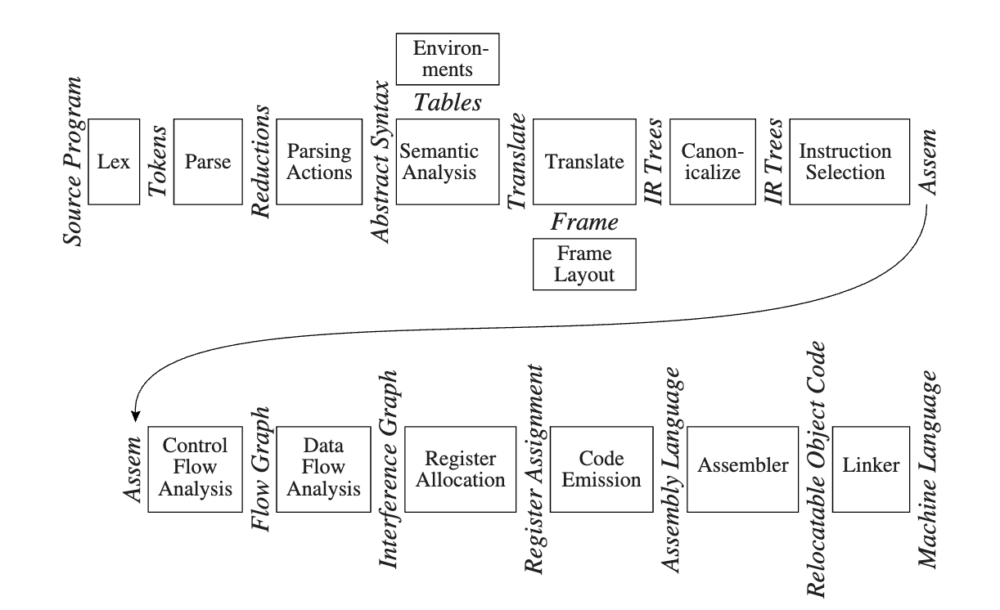

# 编译原理

!!! Abstract "「大二春夏」"

    这是我在修读浙江大学《编译原理》课程时记录的课程笔记。授课老师为 [姚培森](https://rainoftime.github.io/) 教授

## Table of Contents

- [ ] [Topic 1：词法分析](./1%20lex.md)
- [ ] [Topic 2：语法分析](./2%20parse.md)
- [ ] [Topic 3: 抽象语法](./3%20ast.md)
- [ ] [Topic 4: 语义分析](./4%20semantic.md)
- [ ] [Topic 5: 激活记录](./5%20activation.md)

## Introduction

- 词法分析/Lexical Analysis：输入源程序，输出单词符号序列，将源文件分解为一个个独立的单词符号；
- 语法分析/Syntax Analysis：分析程序的短语结构，输入单词符号，输出规约；
- 语义动作/Parcing Actions：建立每个短语对应的抽象语法树；
- 语义分析/Semantic Analysis：确定每个短语的含义，建立变量和其声明的关联，检查表达式的类型，翻译每个短语；

<!-- - 栈帧布局/Stack Frame Layout：按机器要求的方式将变量、函数参数分配于活跃记录（即栈帧）内；
- 翻译/Translation：生成中间表示树（IR 树），这是一种与任何特定程序设计语言和目标机体系结构无关的表示；
- 规范化/Canonicalization：提取表达式中的副作用，整理条件分支，以方便下一阶段的处理；
- 指令选择/Instruction Selection：将 IR 树结点组合成与目标机指令的动作相对应的块；
- 控制流分析/Control Flow Analysis：分析指令的顺序并建立控制流图，此图表示程序执行时可能流经的所有控制流；
- 数据流分析/Data Flow Analysis：收集程序变量的数据流信息，例如活跃分析（liveness analysis）计算每一个变量的需使用其值的地点（即它的活跃点）；
- 寄存器分配/Register Allocation：为程序中的每一个变量和临时数据选择一个寄存器，不在同一时间活跃的两个变量可以共享同一个寄存器；
- 代码流出/Code Emission：用机器寄存器替代每一条机器指令中出现的临时变量名。 -->
