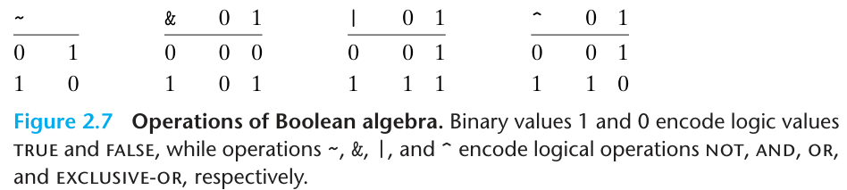

# CSAPP

!!! Abstract
    这是我对《深入理解计算机系统》一书的读书笔记。

    参考：

    - 《深入理解计算机系统》

    - 《Comptuer System: A Programmer's Perspective》

## Chapter 01 A Tour of Computer Systems

### 1.4.1 Hardware Organization of a System

计算机系统的硬件组成包括：**总线/Bus**，**I/O设备/IO devices**，**主存/Main memory**，**处理器/Processor**。

- 总线是贯穿整个系统的一组电子管道，携带信息字节并负责在各个设备之间传输。总线被设计成传送定长的字节块，被称为**字/Word**，现代的计算机的字长大多为4个字节/32位或者8个字节/64位。

- I/O设备

- 主存是一个临时存储设备，在处理器执行程序的时候，用来存放程序和程序处理的数据。主存是由一组动态随机存取存储器/Dynamic random access memory/DRAM组成的，在逻辑上看是一个线性的字节数组，每个字节都有唯一的地址，且地址从零开始。

- **中央处理器单元/Central processing unit**简称为处理器，处理器负责解释（或者执行）主存中的指令。处理器的核心是大小为一个字的**寄存器/Register**，称为**程序计数器/Program counter/PC**，

### 1.9.1 Amdahl's Law

当我们对系统的某个部分加速的时候，其对整个系统性能的影响取决于该部分的重要性和加速程度。特别地，假设系统执行某个应用程序需要的时间为$T_{old}$，某部分所需执行时间与该时间所用的比例为$\alpha$，而这部分性能提升的比例为$k$，改进之后，总的执行时间为

$$T_{new}=T_{old}*(1-\alpha)+T_{old}*\alpha/k.$$

那么，我们可以的到加速比$S$为 

$$S=\frac{T_{old}}{T_{new}}=\frac{1}{(1-\alpha)+\alpha/k}.$$

我们同时也考虑极限情况，也就是 $k\to\infty$ 的情况，此时加速比$S$为

$$S=\frac{1}{1-\alpha}.$$

这就是加速比的上界了。

总之，Amdahl's Law告诉我们，为了显著提升系统性能，必须提升全系统中相当大的部分的性能

### 1.9.2 Concurrency and parallelism

并发（concurrency）和并行（parallelism）是两个不同的概念。并发是一个通用的概念，指一个同时具有多个活动的系统。并行是指使用并发来使一个系统运行得更快。并行可以在计算机系统的多个抽象层次上运用，我们按照系统层次结构中从高到底的顺序重点强调三个层次：

- 线程级并发：使用

## Chapter 02 Representing and Manipulating Information

### 2.1 Information Storage

#### 2.1.6 Introduction to Boolean Algebra

十九世纪中期，布尔通过将逻辑值`TRUE`和`FALSE`编码为二进制值`1`与`0`，能够设计为一种代数，以研究逻辑推理的基本原则，这种代数叫做**布尔代数/Boolean algebra**。

布尔代数有四种基本运算`~`、`&`、`|`、`^`，分别对应于逻辑运算**NOT**、**AND**、**OR**与**EXCLUSIVE-OR**，我们可以列出简单的真值表如下：

接下来，我们将上述四个布尔运算推广到**位向量/Bit vectors**的运算，所谓位向量就是固定长度$w$，由`0`与`1`组成的串。所谓的推广也非常简单，就是将上述四个布尔运算应用到位向量的每一位上，得到的结果也是一个位向量。换句话说，就是我们在C语言中学的按位运算。

### 2.2 Integer Representations

#### 2.2.1 Unsigned Encodings

无符号数的编码就是经典的二进制编码，假设一个无符号整数数据有$w$位，我们可以将位向量写作$\vec{x}$，也就是$[x_{w-1},x_{w-2},\cdots,x_0]$来表示向量的每一位。我们用一个函数$B2U_w$（是Binary to Unsigned的缩写）来表示二进制向无符号整数的转换：

$$B2U_w(\vec{x})\colonequals\sum_{i=0}^{w-1}x_i2^i.$$

我们很容易可以得知：

- 用$w$位能表示的无符号整数的范围为$[0,2^w-1]$；
- 函数$B2U_w$是一个双射。$B2U_w$将每一个长度为$w$的位向量映射为唯一的无符号整数，相对地，每一个在区间$[0,2^w-1]$内的整数都可以唯一表示为一个长度为$w$的位向量。

#### 2.2.2 Two's-Complement Encodings

最常见的有符号整数编码是**补码/Two's-complement**编码。在补码编码中，一个$w$位的有符号整数$\vec{x}$的值可以表示为：

$$B2T_w(\vec{x})\colonequals -x_{w-1}2^{w-1}+\sum_{i=0}^{w-2}x_i2^i.$$

最高有效位也称为符号位，其权重为$-2^{w-1}$，其余位的权重和无符号整数编码一样。同样，我们可以得知：

- 用$w$位能表示的有符号整数的范围为$[-2^{w-1},2^{w-1}-1]$；
- 函数$B2T_w$是一个双射。

类似的，我们可以定义四进制与十六进制的编码。

补码编码有十分有趣的特性：

- 补码的范围是**不对称**的，负数的范围比整数的范围大1，也就是说编码的最小值$TMin$没有与之对应的整数。
- 最大的无符号数值刚刚好比最大值的两倍多一点点$UMax_w=2TMax_w+1$。补码的负数的位模式在无符号表示中都变成了比原补码整数大的正数。

> 在C库中的`limits.h`中定义了一些常用的整数的最大值与最小值，用来限制编译器运行的不同整型数据的取值范围，例如`INT_MAX`、`INT_MIN`、`UINT_MAX`等。
> 
> 在C库中的`stdint.h`中定义了一些固定大小的整数类型，例如`int8_t`、`uint8_t`、`int16_t`、`uint16_t`等，这些类型很好地提升了程序的可移植性。

有符号数还有下面两种其他的表示方法：

- **反码/Ones'-complement**：除了最高位有效的权是$-(2^{w-1}-1)$，其余和补码是一样的：

$$B2O_w(\vec{x}) \colonequals -x_{w-1}(2^{w-1}-1)+\sum_{i=0}^{w-2}x_i2^i.$$

- **原码/Sign-magnitude**：最高位是符号位，用来确定剩下的位应该取正权还是取负权，其余位表示数值的绝对值：

$$B2S_w(\vec{x}) \colonequals (-1)^{x_w-1}\cdot\left(\sum_{i=0}^{w-2}x_i2^i\right).$$

这两种编码方式都有统一的缺点：对于数字`0`，有两种完全不同的表示方法，并且这两种编码不能很好地支持算数运算，因而，我们现在开始使用更加方便的补码编码。

### 2.3 Integer Arithmetic

#### 2.3.1 Unsigned Addition

### 2.4 Floating Point

## Chapter 03 Machine-Level Representation of Programs