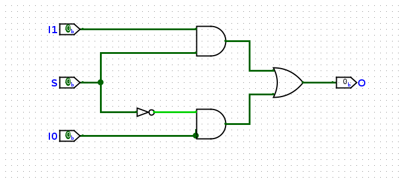
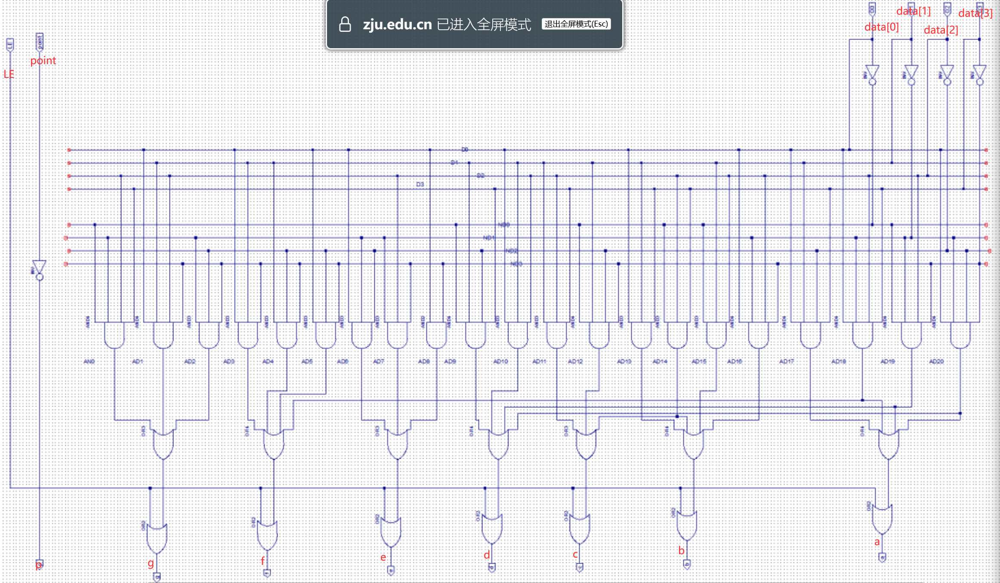

# 实验纪实与代码分析

## 1 2-to-1 Multiplexer

我们首先以一种特别的角度看与门：与的运算的作用之一就是**屏蔽**，当某个输入的值为零时，与的输出就是零，不管另一个输入是什么。这就使得我想要的数据都未被屏蔽，不想要的都被屏蔽为0。比如对于运算$A\land S$，$S$可以看作一个选择子，当$S=T$的时候，输出就是$A$，不论$A$的真值为多少，输出的值就是$A$的值；当$S=F$的时候，输出就是$F$，这时候$A$就被**屏蔽**了。

二路选择器的逻辑就是“屏蔽”，对于下面的二路选择器，最重要的结构就是**上下两个与门**和**中间一个非门**，选择信号$S$分成两份，通过非门变成两个不同的信号，分别接向两个与门，如果$S$的信号为$1$/$T$，那么就将下面的门屏蔽，输出上边的门信号；反之亦然。


=== "结构化描述"
    这里边利用了Verilog内置的一些门，比如`AND`和`OR`门。这种描述方式的优点就是可以很好的与真实的电路相对应，但是缺点就是不够简洁，写起来很坐牢。
    ```Verilog
    module Mux2to1 (
        input I0,
        input I1,
        input S,
        output O
    );
        wire S0_n;
        NOT not0 (S0_n, S);
        // assign S0_n = ~S;
        wire and0_s;
        wire and1_s;
        AND and0(and0_s, I0, S0_n);
        AND and1(and1_s, I1, S);
        OR or0(O, and0_s, and1_s);
    ```

=== "数据流描述"
    这种描述方法充分利用了与`&`、或`|`、非`~`以及异或`^`等运算符代替了`AND`、`OR`、`NOT`等门的描述，使得描述更加简洁。忍不住了，直接写数组。
    ```Verilog
    module Mux2to1 (
        input [1:0] I,
        input S,
        output O
    );
        assign O = I[0] & ~S | I[1] & S;
    ```
    并且这种写法还需要注意优先级的问题，Verilog的优先级是`~`>`&`>`|`，所以这里的写法是正确的。

    我们还应该知道：
    
    - **一个类C的运算符其实是一个简化描述的电路**；
    - 一个运算符的操作数是这个电路的输入；
    - 一个运算符运算表达式的值是这个电路的输出；
    - 运算表达式的嵌套是门电路的级联；

=== "行为描述"
    这种描述方法是最简洁的，但是也是最抽象的，使用了大量的高度抽象的类C语句来提升编程的灵活性：
    ```Verilog
    module Mux2to1 (
        input I0,
        input I1,
        input S,
        output O
    );
        assign O = S ? I1 : I0;
    ```

    Verilog利用了C中的三目运算符来实现了二路选择器，语法是这样的`exp0 ? exp1 : exp2`，这里的赋值语句并不是表示*如果选择子$S$是$1$，我就把`I0`和`I1`连上*，实际上**这就是一个二路选择器**，`exp0`是**构造选择子电路的输出**，真不是不连电路啊……


if-else 必须在always块中使用，并且输出必须是reg类型。但是在`always@(*)`中，内部的reg被综合成wire类型

## 2 复合多路选择器/Cascaded Mux

多路选择器可以根据选择子从**多个单bit**输入中选择**单bit**输出，但是如果我们需要从**多个多bit**输入中选择**多bit**输出，那么就需要使用复合多路选择器。复合多路选择器在硬件实现上其实是由多个单路选择器级联而成的。


## 3 七段数码管译码器/Seven-Segment Decoder

七段数码管的显示译码的对应关系如下，使用复合多路选择器，就不难得到下面源码。解释源码的方法很简单，把它的接口`a`到`g`分开，当卡诺图写就好了。


=== "index版本"

    好看一点并且比较符合**选择**想法的写法。

    ```verilog
    module SegDecoder_new (
        input wire [3:0] data,
        input wire point,
        input wire LE,
        output wire a,
        output wire b,
        output wire c,
        output wire d,
        output wire e,
        output wire f,
        output wire g,
        output wire p
    );

        wire [6:0] segs [15:0];
        assign segs[0] = 7'b0000001;
        assign segs[1] = 7'b1001111;
        assign segs[2] = 7'b0010010;
        assign segs[3] = 7'b0000110;
        assign segs[4] = 7'b1001100;
        assign segs[5] = 7'b0100100;
        assign segs[6] = 7'b0100000;
        assign segs[7] = 7'b0001111;
        assign segs[8] = 7'b0000000;
        assign segs[9] = 7'b0000100;
        assign segs[10] = 7'b0001000;
        assign segs[11] = 7'b1100000;
        assign segs[12] = 7'b0110001;
        assign segs[13] = 7'b1000010;
        assign segs[14] = 7'b0110000;
        assign segs[15] = 7'b0111000;

        assign {a, b, c, d, e, f, g} = {7{LE}} | segs[data];

        assign p = ~point;

    endmodule //SegDecoder
    ```

=== "与或版本"
    这个是对应的图片，非常的朴素。
    
    但是这个是老实人写法，就直接按照真值表画电路硬刚，千万别这么写，丑死了。

    ```verilog
    module SegDecoder (
        input wire [3:0] data,
        input wire point,
        input wire LE,
        output wire a,
        output wire b,
        output wire c,
        output wire d,
        output wire e,
        output wire f,
        output wire g,
        output wire p
    );
    
        assign a = LE | ( data[0] &  data[1] & ~data[2] &  data[3] | 
                          data[0] & ~data[1] &  data[2] &  data[3] | 
                         ~data[0] & ~data[1] &  data[2] & ~data[3] | 
                          data[0] & ~data[1] & ~data[2] & ~data[3] );
        assign b = LE | ( data[0] &  data[1] &  data[3] | 
                         ~data[0] &  data[2] &  data[3] |
                         ~data[0] &  data[1] &  data[2] | 
                          data[0] & ~data[1] &  data[2] & ~data[3] );
        assign c = LE | ( data[1] &  data[2] &  data[3] |
                         ~data[0] &  data[1] & ~data[2] & ~data[3] |
                         ~data[0] &  data[2] &  data[3] );
        assign d = LE | (~data[0] &  data[1] & ~data[2] &  data[3] |
                          data[0] &  data[1] &  data[2] |
                         ~data[0] & ~data[1] &  data[2] & ~data[3] |
                          data[0] & ~data[1] & ~data[2] & ~data[3] );
        assign e = LE | ( data[0] & ~data[1] & ~data[2] |
                         ~data[1] &  data[2] & ~data[3] |
                          data[0] & ~data[3] );
        assign f = LE | ( data[0] &  data[1] & ~data[3] |
                          data[1] & ~data[2] & ~data[3] |
                          data[0] & ~data[2] & ~data[3] |
                          data[0] & ~data[1] &  data[2] &  data[3] );
        assign g = LE | (~data[0] & ~data[1] &  data[2] &  data[3] |
                          data[0] &  data[1] &  data[2] & ~data[3] |
                         ~data[1] & ~data[2] & ~data[3] );
        assign p = ~point;

    endmodule //SegDecoder
    ```

## 4 全加器(Full Adder)


=== "1-bit full adder"

    ```verilog
    module Adder(
        input a,
        input b,
        input c_in,
        output s,
        output c_out
    );
        
        assign s = a ^ b ^ c_in;
        assign c_out = a & b | a & c_in | b & c_in;

    endmodule 
    ```

=== "ripple-carry adder"

    ```verilog
    module Adders #(
        parameter LENGTH = 32
    )(
        input [LENGTH-1:0] a,
        input [LENGTH-1:0] b,
        input c_in,
        output [LENGTH-1:0] s,
        output c_out
    );
    
        wire c[LENGTH:0];
        assign c[0] = c_in;

        genvar i;
        generate
            for(i = 0; i < LENGTH; i = i + 1)begin
                Adder adder(.a(a[i]), .b(b[i]), .c_in(c[i]), .s(s[i]), .c_out(c[i+1]));
            end      
        endgenerate

        assign c_out = c[LENGTH];
    
    endmodule
    ```

=== "sub-adder"

    ```verilog
    module AddSubers #(
        parameter LENGTH = 32
    )(
        input [LENGTH-1:0] a,
        input [LENGTH-1:0] b,
        input do_sub,
        output [LENGTH-1:0] s,
        output c
    );
        wire [LENGTH-1:0] res_adder;
        assign res_adder = {LENGTH{do_sub}};
        wire [LENGTH-1:0] tmp;
        assign tmp = res_adder ^ b;
        Adders #(.LENGTH(LENGTH))adder_sub(.a(a), .b(tmp), .c_in(do_sub), .s(s), .c_out(c));
    
    endmodule
    ```

=== "4-bit lookahead adder"

    ```verilog
    module Lookahead_Adder4(
        input [3:0] a,
        input [3:0] b,
        input c_in,
        output [3:0] s,
        output c_out
    );

        wire [3:0] G;
        wire [3:0] P;
        wire [4:0] c;

        genvar i;
        generate
            for(i = 0; i<4; i=i+1)begin
                assign G[i] = a[i] & b[i];
                assign P[i] = a[i] ^ b[i];
            end
        endgenerate

        assign c[0] = c_in;
        assign c[1] = G[0] | P[0] & c[0];
        // assign c[2] = G[1] | P[1] & c[1];
        assign c[2] = G[1] | P[1] & G[0] | P[1] & P[0] & c[0] ;
        assign c[3] = G[2] | P[2] & G[1] | P[2] & P[1] & G[0] | 
                      P[2] & P[1] & P[0] & c[0] ;
        assign c[4] = G[3] | P[3] & G[2] | P[3] & P[2] & G[1] | 
                      P[3] & P[2] & P[1] & G[0] | P[3] & P[2] & P[1] & P[0] & c[0];
        assign c_out = c[4];

        generate
            for(i = 0; i<4; i=i+1)begin
                assign s[i] = P[i] ^ c[i];
            end
        endgenerate
    
    endmodule
    ```

## 5 七段数码管驱动

## 6 有限状态机

说是有限状态机，其实就是完成 C 程里面一个常见的小程序，记录输入 a 的数量，当连续输入三个 a 的时候，结束程序，当输入 b 的时候，计数清零。

=== "FSM"

    ```verilog
    module FSM(
        input rstn,
        input clk,
        input a,
        input b,
        output [1:0] state
    );
    
    typedef enum logic [1:0] {st0, st1, st2, st3} fsm_state_t;
    fsm_state_t state_s;
    
    always @(posedge clk or negedge rstn) begin
        if(~rstn)
            state_s <= st0;
        else begin
            case(state_s)
                st0: begin
                    if(a) state_s <= st1; 
                    else if(b) state_s <= st0;
                end
                st1: begin
                    if(a) state_s <= st2;
                    else if(b) state_s <= st0;
                end
                st2: begin
                    if(a) state_s <= st3;
                    else if(b) state_s <= st0;
                end
                st3: state_s <= st3;
            endcase
        end
    end

    assign state = state_s;

    endmodule
    ```
=== "RTFSC: ClkDiv"

    实现了一个分频器，将输入的时钟信号分频为 1/2 的幂的频率输出。

    ```Verilog 
    module ClkDiv(
        input clk,
        input rstn,
        output reg [31:0] clk_div
    );
        always@(posedge clk)begin
            if(~rstn)clk_div<=32'b0;
            else clk_div<=clk_div+32'b1;
        end

    endmodule
    ```

    很简单有效的实现，`clk_div[0]` 每个时钟周期翻转一次，其频率是时钟频率的一半，而翻转的时候会向上产生进位，从而 `clk_div[1]` 的频率是 `clk_div[0]` 的 1/2，也就是时钟频率的 1/4，后边的频率依次减半。

=== "RTFSC：Debouncer"
    
    ```Verilog
    module Debouncer ( // repo/sys-project/lab3-1/syn/Debouncer.v
        input  wire  clk,//100Mhz 2^10
        input  wire  btn,
        output wire  btn_dbnc
    );

        reg [7:0] shift = 0;

        always @ (posedge clk) begin
            shift <= {shift[6:0], btn};
        end

        assign btn_dbnc = &shift;
    endmodule
    ```
   
=== "RTFSC：PosSample"

    ```Verilog
    module PosSample ( // repo/sys-project/lab3-1/syn/Debouncer.v
        input clk,
        input data,
        output sample
    );

        reg old_data;
        always@(posedge clk)begin
            old_data <= data;
        end

        assign sample = ~old_data & data;

    endmodule
    ```

## 7 计数器 & 定时器

=== "Cnt ver1"

    丑陋版，因为当初做的时候改了好多，这种形式比较好 debug，当然可能用枚举会好看一丢丢，不过好看不到哪里去。
    ```verilog
    module Cnt #(
        parameter BASE = 10,
        parameter INITIAL = 0
    ) (
        input clk,
        input rstn,
        input low_co,
        input high_rst,
        output co,
        output reg [3:0] cnt
    );

    logic [3:0] state;
    reg carryFlag;
    always @(posedge clk)begin
        if (~rstn)begin
            state <= {INITIAL[3], INITIAL[2], INITIAL[1], INITIAL[0]};
        end else if (high_rst)begin
            state <= 4'b0;
        end else if (low_co)
            case(state)
                4'b0: begin 
                    state <= 4'b1;
                    carryFlag = 0;
                end
                4'b1: state <= 4'b10;
                4'b10: state <= 4'b11;
                4'b11: state <= 4'b100;
                4'b100: state <= 4'b101;
                4'b101: state <= 4'b110;
                4'b110: state <= 4'b111;
                4'b111: state <= 4'b1000;
                4'b1000: begin 
                    state <= 4'b1001;
                    carryFlag = 0;
                end
                4'b1001: begin
                    state <= 4'b0;
                    carryFlag = 1;
                end
                default: state <= state + 4'b1;
            endcase
        else carryFlag = 0;
    end

    assign cnt = state;
    assign co = carryFlag;

    endmodule
    ```
=== "Cnt_24 ver1"

    还有优化的空间，但是最重要的想法在于**全局使能信号**，只有当低位有进位的时候，也就是 `low_co` 为 `1` 的时候，传给高位的信号（包括低位向高位的信号）才会有意义，否则就有可能出现乱进位的情况。
    ```verilog
    module Cnt2num #(
        parameter BASE = 24,
        parameter INITIAL = 16
    )(
        input clk,
        input rstn,
        input high_rst,
        input low_co,
        output co,
        output [7:0] cnt
    );
    
        localparam HIGH_BASE = 10;
        localparam LOW_BASE  = 10;
        localparam HIGH_INIT = INITIAL/10;
        localparam LOW_INIT  = INITIAL%10;
        localparam HIGH_CO   = (BASE-1)/10;
        localparam LOW_CO    = (BASE-1)%10;

        wire low_carry, low_carry_flag;
        assign low_carry = low_co & low_carry_flag;
        reg HIGH_rst, tmp;
        reg [7:0] ALL_CO;
        assign ALL_CO = {HIGH_CO[3], HIGH_CO[2], HIGH_CO[1], HIGH_CO[0], LOW_CO[3], LOW_CO[2], LOW_CO[1], LOW_CO[0]};
        always @(posedge clk) begin
            if(cnt == ALL_CO)begin
                HIGH_rst = 1'b1;
            end else begin
                HIGH_rst = 1'b0;
            end
        end
        assign co = tmp | HIGH_rst;
    
        Cnt #(.BASE(HIGH_BASE), .INITIAL(HIGH_INIT))cnt_high(.clk(clk), .rstn(rstn), .high_rst(HIGH_rst), .low_co(low_carry), .co(tmp), .cnt(cnt[7:4]));
        Cnt #(.BASE(LOW_BASE), .INITIAL(LOW_INIT))cnt_low(.clk(clk), .rstn(rstn), .high_rst(HIGH_rst), .low_co(low_co), .co(low_carry_flag), .cnt(cnt[3:0]));
    
    
    endmodule
    ```

## 8 乘法器

=== "Multipler ver1"

    ```verilog
    module Multiplier #(
        parameter LEN = 32
    )(
        input clk,
        input rst,
        input [LEN-1:0] multiplicand,
        input [LEN-1:0] multiplier,
        input start,
    
        output [LEN*2-1:0] product,
        output finish
    );
    
        localparam PRODUCT_LEN = LEN*2;
        logic [LEN-1:0] multiplicand_reg;
        logic [PRODUCT_LEN-1:0] product_reg;
    
        localparam CNT_LEN = $clog2(LEN);
        localparam CNT_NUM = LEN - 1;
        typedef enum logic [1:0] {IDLE, WORK, FINAL} fsm_state;
        fsm_state fsm_state_reg;
        logic [CNT_LEN-1:0] work_cnt;
        
        logic finish_reg;
        logic start_load;
        logic [LEN-1:0] product_trans;
        assign product = product_trans;
        assign finish = finish_reg;

        always @(posedge clk or posedge rst)begin
            if(rst)begin
                fsm_state_reg <= IDLE;
            end else begin
                if(start) begin
                   start_load = 1'b1; 
                end
                if(start_load)begin
                    case(fsm_state_reg)
                        IDLE:begin
                            multiplicand_reg <= multiplicand;
                            product_reg[PRODUCT_LEN-1:LEN] = {LEN{1'b0}};
                            product_reg[LEN-1:0] = multiplier; 
                            fsm_state_reg <= WORK;
                            start_load = 1'b1;
                            work_cnt <= {CNT_LEN{1'b0}};
                            product_trans = 0;
                        end
                        WORK:begin
                            if(product_reg[0])begin
                                product_reg[PRODUCT_LEN-1:LEN] = product_reg[PRODUCT_LEN-1:LEN] + multiplicand_reg;
                                product_reg = product_reg >> 1;
                                product_reg[PRODUCT_LEN-1] = (product_reg[PRODUCT_LEN-2:LEN-1] < multiplicand_reg); 
                            end else begin
                                product_reg = product_reg >> 1;
                            end
                            work_cnt <= work_cnt + 1;
                            if(work_cnt == CNT_NUM[CNT_LEN-1:0]) begin
                                fsm_state_reg <= FINAL;
                                finish_reg <= 1'b1;
                                product_trans = product_reg;
                            end
                        end
                        FINAL:begin
                            finish_reg <= 1'b0;
                            start_load = 1'b0;
                            fsm_state_reg <= IDLE;
                        end
                        default: begin fsm_state_reg <= IDLE; end
                    endcase
                end
            end 
        end

    endmodule
    ```

=== "RTFSC: judge"

    ```verilog
    import "DPI-C" function int mul_judge(
        input int unsigned multiplicand,
        input int unsigned multiplier,
        input longint unsigned product
    );

    module Judge (
        input clk,
        input rstn,
        input [31:0] multiplicand,
        input [31:0] multiplier,
        input start,
        input [63:0] product,
        input finish,
        output reg error
    );
    
        reg [31:0] multiplicand_reg;
        reg [31:0] multiplier_reg;
        always@(posedge clk or negedge rstn)begin
            if(~rstn)begin
                multiplicand_reg <= 32'b0;
                multiplier_reg <= 32'b0;
            end else if(start)begin
                multiplicand_reg <= multiplicand;
                multiplier_reg <= multiplier;
            end
        end
    
        always@(posedge clk or negedge rstn)begin
            if(~rstn)begin
                error <= 1'b0;
            end else begin
                if(finish)begin
                    if(mul_judge(multiplicand,multiplier,product)==32'b1)begin
                        error <= 1'b0;
                    end else begin
                        error <= 1'b1;
                    end
                end
            end
        end
    
    endmodule
    ```

## 9 卷积模块

=== "Conv 包"

    定义了需要的参数与数据类型。

    ```verilog
    package Conv;
        parameter WIDTH = 64;
        parameter LEN   = 4;

        typedef logic [WIDTH-1:0] data_t;
        typedef logic [WIDTH*2-1:0] result_t;

        typedef struct{
            data_t data [LEN-1:0];
        } data_vector;

    endpackage
    ```

=== "ConvUnit"

    作为外壳调用移位器与卷积计算模块

    ```verilog
    module ConvUnit (
        input clk,
        input rst,
        input Conv::data_t in_data,
        input Conv::data_vector kernel,
        input in_valid,
        output in_ready,

        output Conv::result_t result,
        output out_valid,
        input out_ready
    );

        Conv::data_vector trans_data;
        logic trans_valid, trans_ready;
        Shift shift(.clk(clk), .rst(rst), .in_data(in_data), .in_valid(in_valid), .in_ready(in_ready), .data(trans_data), .out_valid(trans_valid), .out_ready(trans_ready));
        ConvOperator operator(.clk(clk), .rst(rst), .kernel(kernel), .data(trans_data), .in_valid(trans_valid), .in_ready(trans_ready), .result(result), .out_valid(out_valid), .out_ready(out_ready));

    endmodule
    ```

=== "Shift"

    移位器模块，读入数据并且输出，注意结构体与数组/向量的转换与链接。

    ```verilog
    module Shift (
        input clk,
        input rst,
        input Conv::data_t in_data,
        input in_valid,
        output reg in_ready,

        output Conv::data_vector data,
        output reg out_valid,
        input out_ready
    );

        typedef enum logic {RDATA, TDATA} fsm_state;
        fsm_state state_reg;
        Conv::data_t data_reg [Conv::LEN-1:0];

        generate
            for(genvar i = 0; i < Conv::LEN; i = i + 1)begin
                assign data.data[i] = data_reg[i];
            end
        endgenerate
        
        always @(posedge clk or posedge rst)begin
            if(rst)begin
                state_reg <= RDATA;
                in_ready <= 1'b1;
                out_valid <= 1'b0;
                for(integer i = 0; i < Conv::LEN; i = i + 1)begin
                    data_reg[i] <= 0;
                end
            end else begin
                case(state_reg)
                    RDATA:begin
                        if(in_ready & in_valid)begin
                            data_reg[Conv::LEN-2:0] <= data_reg[Conv::LEN-1:1]; // transfer data
                            data_reg[Conv::LEN-1] <= in_data;
                            state_reg <= TDATA;
                            in_ready <= 1'b0;
                        end else begin ; end
                    end
                    TDATA:begin
                        out_valid <= 1'b1;
                        if(out_ready & out_valid)begin
                            out_valid <= 1'b0;
                            data <= tmp;
                            state_reg <= RDATA;
                            in_ready <= 1'b1;
                        end else begin
                            ;
                        end 
                    end
                endcase
            end
        end
    endmodule
    ```

=== "ConvOperator"

    卷积计算模块，乘法器调用的是前一个实验的乘法器。需要注意卷积核与数据的乘积（调用乘法器）与加法树在宏观上其实是组合逻辑的想法，我们完全将其作为模块化硬件的实现，不依赖于有限状态机。乘法器完成计算的时候需要传递信号给有限状态机，这里的实现容易被忽略，需要注意一下。

    ```verilog
    module ConvOperator(
        input clk,
        input rst,
        input Conv::data_vector kernel,
        input Conv::data_vector data,
        input in_valid,
        output reg in_ready,

        output Conv::result_t result,
        output reg out_valid,
        input out_ready
    );

        localparam VECTOR_WIDTH = 2*Conv::WIDTH;
        typedef struct {
            Conv::result_t data;
            logic valid;
        } mid_vector;

        mid_vector vector_stage1 [Conv::LEN-1:0]; 
        mid_vector vector_stage2;

        typedef enum logic [1:0] {RDATA, WORK, TDATA} fsm_state;
        fsm_state state_reg;

        Conv::result_t add_tmp [Conv::LEN-1:1] /* verilator split_var */;
        Conv::result_t stage1 [Conv::LEN-1:0];
        logic [Conv::LEN-1:0] start_flag, finish_flag;

        generate
            for(genvar i=0;i<Conv::LEN;i=i+1)begin
                assign stage1[i] = vector_stage1[i].data;
                assign finish_flag[i] = vector_stage1[i].valid;
                Multiplier #(.LEN(Conv::WIDTH)) mul (.clk(clk), .rst(rst), .multiplicand(kernel.data[i]),
                             .multiplier(data.data[i]), .start(start_flag[i]), .product(vector_stage1[i].data), 
                             .finish(vector_stage1[i].valid));
            end
        endgenerate

        generate
            for(genvar i = 1;i < Conv::LEN;i=i+1)begin
                if(i<Conv::LEN/2)begin
                    assign add_tmp[i] = add_tmp[i*2] + add_tmp[i*2+1];
                end else begin
                    assign add_tmp[i] = stage1[(i-Conv::LEN/2)*2] + stage1[(i-Conv::LEN/2)*2+1]; 
                end
            end
        endgenerate

        always @(posedge clk or posedge rst)begin
            if (rst)begin
                state_reg <= RDATA;
                in_ready <= 1'b1;
                out_valid <= 1'b0;
            end else begin ; end
            case(state_reg)
                RDATA: begin
                    if (in_ready & in_valid)begin
                        in_ready <= 1'b0;
                        for(integer i = 0; i <= Conv::LEN-1; i = i + 1)begin
                            vector_stage1[i].data = {VECTOR_WIDTH{1'b0}};
                            vector_stage1[i].valid = 1'b0;
                        end
                        vector_stage2.data = {VECTOR_WIDTH{1'b0}};
                        vector_stage2.valid = 1'b0;
                        start_flag <= {Conv::LEN{1'b1}};
                        state_reg <= WORK;  
                    end else begin ; end
                end   
                WORK: begin
                    if (&finish_flag == 1)begin
                        start_flag <= {Conv::LEN{1'b0}};
                        state_reg <= TDATA;
                        vector_stage2.data = add_tmp[1];
                        result <= vector_stage2.data;
                        out_valid <= 1'b1;
                        vector_stage2.valid = 1'b1;
                    end else begin ; end
                end
                TDATA:begin 
                    if(out_ready & out_valid & vector_stage2.valid)begin
                        out_valid <= 1'b0;
                        state_reg <= RDATA;
                        in_ready <= 1'b1;
                    end else begin ; end
                end
                default: begin ; end
            endcase
        end
    endmodule
    ```

## 10 串口使用

```Verilog title="UartLoop.sv"
`include"uart_struct.vh"
module UartLoop(
    input clk,
    input rstn,
    Decoupled_ift.Slave uart_rdata,
    Decoupled_ift.Master uart_tdata,
    input UartPack::uart_t debug_data,
    input logic debug_send,
    output UartPack::uart_t debug_rdata,
    output UartPack::uart_t debug_tdata
);
    import UartPack::*;

    uart_t rdata;
    logic rdata_valid;

    uart_t tdata;
    logic tdata_valid;

    assign debug_rdata = rdata;
    assign debug_tdata = tdata;
    typedef enum logic [1:0] { RDATA, TRANS, TDATA } fsm_t;
    fsm_t fsm;
    always @(posedge clk or negedge rstn) begin
        if(~rstn)begin
            rdata_valid <= 0;
            tdata_valid <= 0;
            uart_rdata.ready <= 1;
            uart_tdata.valid <= 0;
            fsm <= RDATA;
        end
        else begin 
            case(fsm)
                RDATA:begin
                    if(uart_rdata.valid && uart_rdata.ready)begin
                        rdata <= uart_rdata.data;
                        rdata_valid <= 1;
                        tdata_valid <= 0;
                        uart_rdata.ready <= 0;
                        uart_tdata.valid <= 0;
                        fsm <= TRANS;
                    end
                end
                TRANS: begin
                    if(rdata_valid)begin
                        tdata = rdata;
                        uart_tdata.data <= tdata;
                        rdata_valid <= 0;
                        tdata_valid <= 1;
                        uart_rdata.ready <= 1;
                        uart_tdata.valid <= 1;
                        fsm <= TDATA;
                    end
                end
                TDATA: begin
                    if(tdata_valid && uart_tdata.ready)begin
                        uart_tdata.valid <= 0;
                        tdata_valid <= 0;
                        fsm <= RDATA;
                    end
                end
                default: ;
            endcase
        end
    end

endmodule
```

## 11 汇编实验

=== "Fibonacci"

    ```asm title="fibonacci.s"
    # implementing fibonacci in RISC-V assembly
    # n in a0
    fibonacci:
        li t0, 2                # test if n < 2    
        blt a0, t0, fib_base    # if n < 2, return 1

        addi sp, sp, -8         # allocate stack space
        sw   ra, 4(sp)          # store return address
        sw   a0, 0(sp)          # store original n

        addi a0, a0, -1         # n-1 in a0
        jal  x1, fibonacci      # calculate fib(n-1)

        lw   t0, 0(sp)          # load original n to t0
        sw   a0, 0(sp)          # store fib(n-1) to stack
        addi a0, t0, -2         # now n-2 in a0
        jal  x1, fibonacci      # calculate fib(n-2)

        lw   t0, 0(sp)          # load fib(n-1) to t0
        add  a0, a0, t0         # calculate fib(n) = fib(n-1) + fib(n-2)
        lw   ra, 4(sp)          # load return address
        addi sp, sp, 8          # clean up stack
        ret

    fib_base:                   # base case, return 1
        li a0, 1
        ret
    ```

=== "Bubble Sort"

    ```asm title="bubble_sort.s"
    bubble_sort:
        # arr in a0, len in a1
        # i in t0, j in t1, len - i - 1 in t2
        # swap procedure uses t3 and t4
        li   t0, 0
    outer_loop_begin:
        bge  t0, a1, outer_loop_end
        li   t1, 0              # j = 0
        sub  t2, a1, t0         # len - i
        addi t2, t2, -1         # t2 = len - i - 1
    inner_loop_begin:
        bge  t1, t2, inner_loop_end
        # read from array uses t5 for the address
        slli t5, t1, 3
        add  t5, t5, a0         # t5 = &arr[j]
        ld   t3, 0(t5)          # t3 = arr[j]
        ld   t4, 8(t5)          # t4 = arr[j + 1]
        bge  t4, t3, no_swap
        # swap procedure
        sd   t4, 0(t5)          # arr[j] = arr[j + 1]
        sd   t3, 8(t5)          # arr[j + 1] = arr[j] 
    no_swap:
        addi t1, t1, 1          # j++
        j    inner_loop_begin
    inner_loop_end:
        addi t0, t0, 1          # i++
        j    outer_loop_begin
    outer_loop_end:
        ret
    ```


<!-- ## 12 单周期 CPU

=== "ALU"

    ```SystemVerilog
    `include "core_struct.vh"
    module ALU (
        input  CorePack::data_t a,
        input  CorePack::data_t b,
        input  CorePack::alu_op_enum  alu_op,
        output CorePack::data_t res
    );

        import CorePack::*;

        logic [31:0] tmp_ADDW;
        logic [31:0] tmp_SUBW;
        logic [31:0] tmp_SLLW;
        logic [31:0] tmp_SRLW;
        logic [31:0] tmp_SRAW;
        always_comb begin
            tmp_ADDW = a[31:0] +  b[31:0];
            tmp_SUBW = a[31:0] -  b[31:0];
            tmp_SLLW = a[31:0] << b[4:0];
            tmp_SRLW = a[31:0] >> b[4:0];
            tmp_SRAW = $signed(a[31:0]) >>> b[4:0];
            case (alu_op)
                ALU_ADD:     res = a +  b;
                ALU_SUB:     res = a -  b;
                ALU_AND:     res = a &  b;
                ALU_OR:      res = a |  b;
                ALU_XOR:     res = a ^  b;
                ALU_SLT:     res = ($signed(a) < $signed(b)) ? 1 : 0;
                ALU_SLTU:    res = (a < b) ? 1 : 0;
                ALU_SLL:     res = a << b[5:0];
                ALU_SRL:     res = a >> b[5:0];
                ALU_SRA:     res = $signed(a) >>> b[5:0];
                ALU_ADDW:    res = {{32{tmp_ADDW[31]}}, tmp_ADDW[31:0]};
                ALU_SUBW:    res = {{32{tmp_SUBW[31]}}, tmp_SUBW[31:0]};
                ALU_SLLW:    res = {{32{tmp_SLLW[31]}}, tmp_SLLW[31:0]};
                ALU_SRLW:    res = {{32{tmp_SRLW[31]}}, tmp_SRLW[31:0]};
                ALU_SRAW:    res = {{32{tmp_SRAW[31]}}, tmp_SRAW[31:0]};
                ALU_DEFAULT: res = 0;
            endcase
        end

    endmodule
    ```
=== "Cmp"

    ```SystemVerilog
    `include"core_struct.vh"
    module Cmp (
        input CorePack::data_t a,
        input CorePack::data_t b,
        input CorePack::cmp_op_enum cmp_op,
        output cmp_res
    );

        import CorePack::*;

        logic cmp_res_tmp;
        assign cmp_res = cmp_res_tmp;
        always_comb begin
            case (cmp_op)
                CMP_NO:  cmp_res_tmp = 0;
                CMP_EQ:  cmp_res_tmp = (a == b) ? 1 : 0;
                CMP_NE:  cmp_res_tmp = (a != b) ? 1 : 0;
                CMP_LT:  cmp_res_tmp = ($signed(a) < $signed(b)) ? 1 : 0;
                CMP_GE:  cmp_res_tmp = ($signed(a) >= $signed(b)) ? 1 : 0;
                CMP_LTU: cmp_res_tmp = (a < b) ? 1 : 0;
                CMP_GEU: cmp_res_tmp = (a >= b) ? 1 : 0;
                default: cmp_res_tmp = 0;
            endcase
        end
        
    endmodule
    ```

=== "RegFile"

    ```SystemVerilog
    `include "core_struct.vh"
    module RegFile (
        input clk,
        input rst,
        input we,
        input CorePack::reg_ind_t  read_addr_1,
        input CorePack::reg_ind_t  read_addr_2,
        input CorePack::reg_ind_t  write_addr,
        input  CorePack::data_t write_data,
        output CorePack::data_t read_data_1,
        output CorePack::data_t read_data_2
    );
    import CorePack::*;

    integer i;
    data_t register [1:31]; // x1 - x31, x0 keeps zero
    
    data_t reg_0;
    assign reg_0 = 0;
    always_ff @(posedge clk) begin
        if (rst) begin
            for (i = 1; i <= 31; i = i + 1) begin
                register[i] <= 0;
            end
        end else begin
            if (we) begin
                register[write_addr] <= write_data;
            end
        end
    end
    always_comb begin
        read_data_1 = (read_addr_1 == 0) ? reg_0 : register[read_addr_1];
        read_data_2 = (read_addr_2 == 0) ? reg_0 : register[read_addr_2];
    end
    endmodule
    ```

=== "Core"

    ```SystemVerilog
    `include "core_struct.vh"
    module Core (
        input clk,
        input rst,

        Mem_ift.Master imem_ift,
        Mem_ift.Master dmem_ift,

        output cosim_valid,
        output CorePack::CoreInfo cosim_core_info
    );
        import CorePack::*;
        
        logic [63:0] next_pc;           // next pc
        logic [63:0] pc;                // current pc
        logic [31:0] inst;              // selected-4bytes instruction
        logic [63:0] inst_unselected;   // i.e. ro_rdata from the IMEM
        logic        cmp_res;           // assigned with br_taken to be used in PC
                                        // we only use the Cmp unit for determining the branch in this proj
        logic        br_taken;          // 1 for take the branch
        logic [63:0] alu_res;           // the output of the alu_unit
        logic [63:0] ro_addr;           // tell the address to IMEM for our instruction
        logic [63:0] ro_rdata;          // read only data read from IMEM
        logic [63:0] Imm;               // immediate value generated by ImmGen

        logic        we_reg;
        logic        we_mem;
        logic        re_mem;
        logic        is_j;
        logic        npc_sel;           // next_pc selector (useless in this proj)
        logic [2 :0] immgen_op;
        logic [3 :0] alu_op;
        logic [2 :0] cmp_op;
        logic [1 :0] alu_asel;
        logic [1 :0] alu_bsel;
        logic [1 :0] wb_sel;
        logic [2 :0] mem_op;
        logic [4 :0] memdata_width;
        logic [63:0] wb_val;

        parameter    pc_increment = 4;

        // Part PC
        always_comb begin
            br_taken = cmp_res;
            if (br_taken | is_j) begin          // jump instruction or take the branch
                next_pc = alu_res;
            end else begin
                next_pc = pc + pc_increment;
            end
            ro_addr = pc;
        end

        always @(posedge clk) begin
            if (rst) begin 
                pc <= 64'b0;
            end else begin
                pc <= next_pc;
            end
        end

        // Part IMEM
        always_comb begin
            imem_ift.r_request_valid        = 1;
            imem_ift.r_request_bits.raddr   = ro_addr;
            imem_ift.r_reply_ready          = 1;
            imem_ift.w_request_bits.wdata   = 0;
            imem_ift.w_request_bits.waddr   = 0;
            imem_ift.w_request_bits.wmask   = 0;
            imem_ift.w_request_valid        = 0;
            imem_ift.w_reply_ready          = 0;
            ro_rdata                        = imem_ift.r_reply_bits.rdata;
            inst_unselected                 = ro_rdata;
        end

        // Part Inst Selector
        always_comb begin
            if (pc[2] == 1) begin
                inst = inst_unselected[63:32];
            end else begin
                inst = inst_unselected[31:0];
            end
        end

        // Part RegFile
        logic [4 :0] rs1;
        logic [4 :0] rs2;
        logic [4 :0] rd;
        logic [63:0] read_data_1;
        logic [63:0] read_data_2;

        always_comb begin
            rs1 = inst[19:15];
            rs2 = inst[24:20];
            rd  = inst[11:7];
        end

        RegFile regf(.clk(clk),
                    .rst(rst),
                    .we(we_reg),
                    .read_addr_1(rs1),
                    .read_addr_2(rs2),
                    .write_addr(rd),
                    .write_data(wb_val),
                    .read_data_1(read_data_1),
                    .read_data_2(read_data_2)
        );

        // Part Imm Gen
        always_comb begin
            case(immgen_op)
                IMM0:    Imm = 64'b0;
                I_IMM:   Imm = {{52{inst[31]}}, inst[31:20]};
                S_IMM:   Imm = {{52{inst[31]}}, inst[31:25], inst[11:7]};
                B_IMM:   Imm = {{51{inst[31]}}, inst[31], inst[7], inst[30:25], inst[11:8], 1'b0};
                U_IMM:   Imm = {{32{inst[31]}}, inst[31:12], 12'b0};
                UJ_IMM:  Imm = {{43{inst[31]}}, inst[31], inst[19:12], inst[20], inst[30:21], 1'b0};
                default: Imm = 64'b0;
            endcase
        end

        // Part Branch Comparator
        Cmp cmp(.a(read_data_1),
                .b(read_data_2),
                .cmp_op(cmp_op),
                .cmp_res(cmp_res)
        );

        // ALU A Selector: ASEL0 for 0, REG for RS1, PC for PC
        logic [63:0] alu_a;
        always_comb begin
            case(alu_asel)
                ASEL0:     alu_a = 64'b0;
                ASEL_REG:  alu_a = read_data_1;
                ASEL_PC:   alu_a = pc;
                default:   alu_a = 64'b0;
            endcase
        end
        // ALU B Selector: BSEL0 for 0, REG for RS2, IMM for Imm
        logic [63:0] alu_b;
        always_comb begin
            case(alu_bsel)
                BSEL0:     alu_b = 64'b0;
                BSEL_REG:  alu_b = read_data_2;
                BSEL_IMM:  alu_b = Imm;
                default:   alu_b = 64'b0;
            endcase
        end
        // Part ALU
        ALU alu_unit(.a(alu_a),
                    .b(alu_b),
                    .alu_op(alu_op),
                    .res(alu_res)
        );

        // Data Package with mask
        logic [63:0] wdata_data;
        logic [7 :0] wdata_mask;
        integer location = {29'b0, alu_res[2:0]};
        integer mask_width;
        
        always_comb begin
            mask_width = {27'b0, memdata_width[4:0]};
            mask_width = mask_width * 8;
            for (integer i = 0; i < 8; i = i + 1) begin
                if (i < location + mask_width / 8 && i >= location) begin
                    wdata_mask[i] = 1;
                end else begin
                    wdata_mask[i] = 0;
                end
            end
            for (integer i = 0; i < 64; i = i + 1) begin
                if (i < location * 8) begin
                    wdata_data[i] = 0;
                end else begin
                    wdata_data[i] = read_data_2[i - location * 8];
                end
            end
        end

        // Part DMEM
        logic [63:0] read_data;
        always_comb begin
            dmem_ift.r_request_bits.raddr = alu_res;
            if (re_mem)begin
                dmem_ift.r_request_valid = 1;
                dmem_ift.r_reply_ready = 1;
            end else begin
                dmem_ift.r_request_valid = 0;
                dmem_ift.r_reply_ready = 0;
            end
            read_data = dmem_ift.r_reply_bits.rdata;
            dmem_ift.w_request_bits.waddr = alu_res;
            dmem_ift.w_request_bits.wdata = wdata_data;
            dmem_ift.w_request_bits.wmask = wdata_mask;
            if (we_mem)begin
                dmem_ift.w_request_valid = 1;
                dmem_ift.w_reply_ready = 1;
            end else begin
                dmem_ift.w_request_valid = 0;
                dmem_ift.w_reply_ready = 0;
            end
        end

        // Part Data Truncation
        logic [63:0] trunc_data;
        always_comb begin
            for (integer i = 0; i < 64; i = i + 1)begin
                if(i >= mask_width)begin
                    case(mem_op)
                        MEM_UW:  trunc_data[i] = 0;
                        MEM_UH:  trunc_data[i] = 0;
                        MEM_UB:  trunc_data[i] = 0;
                        default: trunc_data[i] = read_data[location * 8 + mask_width - 1];      // signed extension
                    endcase
                end else begin
                    trunc_data[i] = read_data[location * 8 + i];
                end
            end
        end

        // Part WB
        always_comb begin
            case(wb_sel)
                WB_SEL0:    wb_val = 64'b0;
                WB_SEL_ALU: wb_val = alu_res;
                WB_SEL_MEM: wb_val = trunc_data;
                WB_SEL_PC:  wb_val = pc + 4;
            endcase
        end

        // Part Controller
        controller ctrl(.inst(inst),
                        .we_reg(we_reg),
                        .we_mem(we_mem),
                        .re_mem(re_mem),
                        .is_b(),                        // probably useless, because br_taken is stronger than is_b
                        .is_j(is_j),
                        .npc_sel(),                     // probably useless
                        .immgen_op(immgen_op),
                        .alu_op(alu_op),
                        .cmp_op(cmp_op),
                        .alu_asel(alu_asel),
                        .alu_bsel(alu_bsel),
                        .wb_sel(wb_sel),
                        .mem_op(mem_op),
                        .memdata_width(memdata_width)
        );

        assign cosim_valid = 1'b1;
        assign cosim_core_info.pc        = pc;
        assign cosim_core_info.inst      = {32'b0,inst};   
        assign cosim_core_info.rs1_id    = {59'b0, rs1};
        assign cosim_core_info.rs1_data  = read_data_1;
        assign cosim_core_info.rs2_id    = {59'b0, rs2};
        assign cosim_core_info.rs2_data  = read_data_2;
        assign cosim_core_info.alu       = alu_res;
        assign cosim_core_info.mem_addr  = dmem_ift.r_request_bits.raddr;
        assign cosim_core_info.mem_we    = {63'b0, dmem_ift.w_request_valid};
        assign cosim_core_info.mem_wdata = dmem_ift.w_request_bits.wdata;
        assign cosim_core_info.mem_rdata = dmem_ift.r_reply_bits.rdata;
        assign cosim_core_info.rd_we     = {63'b0, we_reg};
        assign cosim_core_info.rd_id     = {59'b0, rd}; 
        assign cosim_core_info.rd_data   = wb_val;
        assign cosim_core_info.br_taken  = {63'b0, npc_sel};
        assign cosim_core_info.npc       = next_pc;

    endmodule
    ```

=== "Controller"

    ```SystemVerilog
    `include "core_struct.vh"
    module controller (
        input CorePack::inst_t inst,
        output we_reg,
        output we_mem,
        output re_mem,
        output is_b,
        output is_j,
        output CorePack::imm_op_enum immgen_op,
        output CorePack::alu_op_enum alu_op,
        output CorePack::cmp_op_enum cmp_op,
        output CorePack::alu_asel_op_enum alu_asel,
        output CorePack::alu_bsel_op_enum alu_bsel,
        output CorePack::wb_sel_op_enum wb_sel,
        output CorePack::mem_op_enum mem_op,
        output [4:0] memdata_width, 
        output npc_sel
    );

        import CorePack::*;

        // part for the first stage of decoding
        opcode_t opcode  = inst[6:0];
        wire inst_reg    = opcode == REG_OPCODE;
        wire inst_regw   = opcode == REGW_OPCODE;
        wire inst_load   = opcode == LOAD_OPCODE;
        wire inst_lui    = opcode == LUI_OPCODE;
        wire inst_imm    = opcode == IMM_OPCODE;
        wire inst_immw   = opcode == IMMW_OPCODE;
        wire inst_store  = opcode == STORE_OPCODE;
        wire inst_branch = opcode == BRANCH_OPCODE;
        wire inst_jalr   = opcode == JALR_OPCODE;
        wire inst_jal    = opcode == JAL_OPCODE;
        wire inst_auipc  = opcode == AUIPC_OPCODE;

        assign we_reg    = inst_reg  | inst_load | inst_imm   | inst_lui  |  
                        inst_immw | inst_regw | inst_auipc | inst_jalr | inst_jal;
        assign we_mem    = inst_store;
        assign re_mem    = inst_load;
        assign is_b      = inst_branch;
        assign is_j      = inst_jalr | inst_jal;
        assign npc_sel   = inst_jalr | inst_jal; 

        // part for the second stage of decoding
        funct3_t funct3;
        funct7_t funct7;
        always_comb begin
            funct3 = inst[14:12];
            funct7 = inst[31:25];
        end

        // part for determining immgen_op
        always_comb begin
            if (inst_load | inst_imm | inst_immw | inst_jalr) begin
                immgen_op = I_IMM;
            end else if (inst_store) begin
                immgen_op = S_IMM;
            end else if (inst_branch) begin
                immgen_op = B_IMM;
            end else if (inst_lui | inst_auipc) begin
                immgen_op = U_IMM;
            end else if (inst_jal) begin 
                immgen_op = UJ_IMM;
            end else begin 
                immgen_op = IMM0;
            end
        end

        // part for determining alu_op
        always_comb begin
            if (inst_reg | inst_imm) begin
                case (funct3)
                    ADD_FUNCT3:begin    // also SUB_FUNCT3
                        if (inst_imm) begin
                            alu_op=ALU_ADD;
                        end else if (funct7 == 7'b0100000) begin
                            alu_op=ALU_SUB;
                        end else begin
                            alu_op=ALU_ADD;
                        end
                    end
                    SRL_FUNCT3:begin
                        if (funct7 == 7'b0000000) begin 
                            alu_op=ALU_SRL; 
                        end else begin
                            alu_op=ALU_SRA;
                        end
                    end
                    SLL_FUNCT3:  alu_op = ALU_SLL;
                    SLT_FUNCT3:  alu_op = ALU_SLT;
                    SLTU_FUNCT3: alu_op = ALU_SLTU;
                    XOR_FUNCT3:  alu_op = ALU_XOR;
                    OR_FUNCT3:   alu_op = ALU_OR;
                    AND_FUNCT3:  alu_op = ALU_AND;
                endcase
            end else if(inst_immw | inst_regw)begin
                case(funct3)
                    3'b000:begin
                        if (funct7 == 7'b0000000) begin
                            alu_op = ALU_ADDW;
                        end else if (funct7 == 7'b0100000) begin
                            alu_op = ALU_SUBW;
                        end else begin 
                            alu_op = ALU_ADDW;
                        end
                    end
                    3'b101:begin
                        if (funct7 == 7'b0000000) begin
                            alu_op = ALU_SRLW;
                        end else begin
                            alu_op = ALU_SRAW;
                        end
                    end
                    SLL_FUNCT3:  alu_op = ALU_SLLW;
                    default:     alu_op = ALU_ADDW;
                endcase
            end else begin // including load store branch jal jalr, all of which need to add offset with pc
                alu_op = ALU_ADD; 
            end
        end 

        // part for determing cmp_op
        always_comb begin
            if (inst_branch) begin
                case (funct3)
                    BEQ_FUNCT3:  cmp_op = CMP_EQ;
                    BNE_FUNCT3:  cmp_op = CMP_NE;
                    BLT_FUNCT3:  cmp_op = CMP_LT;
                    BGE_FUNCT3:  cmp_op = CMP_GE;
                    BLTU_FUNCT3: cmp_op = CMP_LTU;
                    BGEU_FUNCT3: cmp_op = CMP_GEU;
                    default:     cmp_op = CMP_NO;
                endcase
            end else begin
                cmp_op = CMP_NO;
            end
        end

        // part for determing alu_*sel
        always_comb begin
            if (inst_reg | inst_regw | inst_load | inst_imm | inst_immw | inst_store | inst_jalr) begin
                alu_asel = ASEL_REG;
            end else if (inst_auipc | inst_jal | inst_branch) begin 
                alu_asel = ASEL_PC;
            end else begin
                alu_asel = ASEL0;
            end
            //alu_bsel
            if (inst_reg | inst_regw) begin
                alu_bsel = BSEL_REG;
            end else if (inst_load | inst_imm | inst_immw | inst_store) begin
                alu_bsel = BSEL_IMM;
            end else if (inst_branch | inst_jalr | inst_jal | inst_auipc | inst_lui) begin
                alu_bsel = BSEL_IMM;
            end else begin 
                alu_bsel = BSEL0;
            end
        end

        // part for determing wb_sel
        always_comb begin
            if (inst_load) begin
                wb_sel = WB_SEL_MEM;
            end else if(inst_imm | inst_immw | inst_reg | inst_regw | inst_auipc | inst_lui) begin
                wb_sel = WB_SEL_ALU;
            end else if(inst_jalr | inst_jal) begin
                wb_sel = WB_SEL_PC;
            end else begin  // branch instruction and store instruction does not need to write back to register
                wb_sel = WB_SEL0; 
            end
        end

        // part for mem_op and memdata_width
        logic [4:0] memdata_width_tmp;
        assign memdata_width = memdata_width_tmp;
        always_comb begin
            if (inst_load | inst_store) begin
                case (funct3)
                    3'b000:begin
                        mem_op = MEM_B;
                        memdata_width_tmp = 1;
                    end
                    3'b001:begin
                        mem_op = MEM_H;
                        memdata_width_tmp = 2;
                    end
                    3'b010:begin
                        mem_op = MEM_W;
                        memdata_width_tmp = 4;
                    end
                    3'b011:begin
                        mem_op = MEM_D;
                        memdata_width_tmp = 8;
                    end
                    3'b100:begin
                        mem_op = MEM_UB;
                        memdata_width_tmp = 1;
                    end
                    3'b101:begin
                        mem_op = MEM_UH;
                        memdata_width_tmp = 2;
                    end
                    3'b110:begin
                        mem_op = MEM_UW;
                        memdata_width_tmp = 4;
                    end
                    default:begin
                        mem_op = MEM_NO;
                        memdata_width_tmp = 0;
                    end
                endcase
            end else begin
                mem_op = MEM_NO;
                memdata_width_tmp = 0;
            end
        end
    endmodule
    ``` -->
