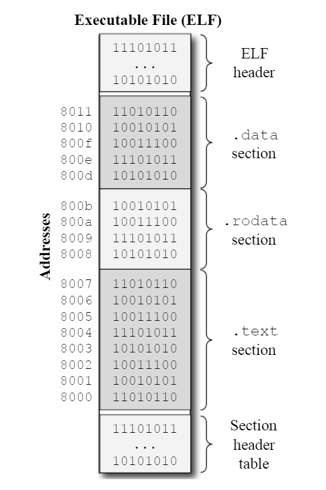

# RISC-V Unprivileged ISA

## 1 Basic

### Registers Convents

|   寄存器    |  ABI 名称  | 用途描述                             | caller-saved | callee-saved |
|:--------:|:--------:|:---------------------------------|:------------:|:------------:|
|   `x0`   |  `zero`  | 硬件 0                             |              |              |
|   `x1`   |   `ra`   | 返回地址（return address）             |     yes      |              |
|   `x2`   |   `sp`   | 栈指针（stack pointer）               |              |     yes      |
|   `x3`   |   `gp`   | 全局指针（global pointer）             |              |              |
|   `x4`   |   `tp`   | 线程指针（thread pointer）             |              |              |
|   `x5`   |   `t0`   | 临时变量/备用链接寄存器（alternate link reg） |     yes      |              |
|  `x6-7`  | `t1-t2`  | 临时变量                             |              |     yes      |
|   `x8`   | `s0/fp`  | 需要保存的寄存器/帧指针（frame pointer）      |              |     yes      |
|   `x9`   |   `s1`   | 需要保存的寄存器                         |              |     yes      |
| `x10-11` | `a0-a1`  | 函数参数/返回值                         |     yes      |              |
| `x12-17` | `a2-a7`  | 函数参数                             |     yes      |              |
| `x18-27` | `s2-a11` | 需要保存的寄存器                         |              |     yes      |
| `x28-31` | `t3-t6`  | 临时变量                             |     yes      |              |
|   `pc`   |   `pc`   | 程序计数器（program counter）           |              |              |

### Instruction and its Formats

[//]: # (<table>)

[//]: # (<tr>)

[//]: # (  <td colspan="10">  Instruction Class </td>)

[//]: # (  <td> 31 </td>)

[//]: # (  <td colspan="5"> </td>)

[//]: # (  <td> 25 </td>)

[//]: # (  <td> 24 </td>)

[//]: # (  <td colspan="3"> </td>)

[//]: # (  <td> 20 </td>)

[//]: # (  <td> 19 </td>)

[//]: # (  <td colspan="3"> </td>)

[//]: # (  <td> 15 </td>)

[//]: # (  <td> 14 </td>)

[//]: # (  <td colspan="1"> </td>)

[//]: # (  <td> 12 </td>)

[//]: # (  <td> 11 </td>)

[//]: # (  <td colspan="3"> </td>)

[//]: # (  <td> 7  </td>)

[//]: # (  <td> 6  </td>)

[//]: # (  <td colspan="5"> </td>)

[//]: # (  <td> 0  </td>)

[//]: # (</tr>)

[//]: # ()
[//]: # (<tr> )

[//]: # ()
[//]: # (  <td> <strong> R </strong> </td>)

[//]: # (  <td> </td> )

[//]: # (</tr>)

[//]: # ()
[//]: # ()
[//]: # (</table>)


### Immediate Values

与正常无异，十六进制数前加 `0x`，二进制数前加 `0b`，十进制数直接写或者在前面加 `0`。用单引号括起来的字母数字字符/Alphanumeric Characters 会根据 ASCII 表转化为相应的数值，比如 `'a'` 会转化为 `97`。

```asm
li a0, 0x42     # load value sixty-six into a0
li a1, 0b1010   # load value ten into a1
li a2, 42       # load value forty-two into a2
li a3, -'a'     # load value negative ninety-seven into a3
```

### Symbol Names and Labels

符号是和数值联系在一起的名字，标签会自动地转化为符号，我们也可以使用 `.set` 指令显式地声明一个符号。符号名可以包含数字、字母与下划线，但是不能以数字开头。符号名是大小写敏感的。在下面的程序中，我们就定义了一个符号 `max_temp`，并且将其值设置为 `100`。

```asm
.set max_temp, 100      # set the max_temp limit

check_temp:
    li t0, max_temp     # load the max_temp value into t0
    ble a0, t0, ok_temp # branch to ok_temp if a0 <= t0
    jal alarm           # else, call the alarm routine
ok_temp:
    ret                 # return from the routine
```

标签是表示程序位置的一个记号，可以被汇编指令（Instructions and Directives）引用并且在汇编与链接过程之中翻译为地址。GNU 汇编器一般会接受两种类型的标签：符号标签/Symbolic Labels 和数字标签/Numeric Labels。符号标签以符号存储在符号表中，一般用来表示全局变量与某个过程，使用标识符加上冒号 `name:` 来定义，标识符的命名与符号的命名一样。

数字标签通过单独一位数字加上冒号来定义，一般用于局部的引用，并且也不会存储在可执行文件的符号表之中。数字标签可以在同一个汇编程序之中重复定义，但是符号标签不能。

对数字标签的引用需要加上后缀 `b` 或 `f`来表明是引用前边定义的标签 `b` 还是后边定义的标签 `f`。下面是对标签的一个例子：

```asm
# set age to 20
age: .word 20        # define a global variable age
set_age:
    la t0, age       # load the address of age into t0
    lw a0, 0(t0)     # load the value of age into a0
    ret

# pow function -- compute a^b
# Inputs: a in a0, b in a1
# Outputs: a^b in a0
pow:
    mv a2, a0        # copy a0 to a2
    li a0, 1         # set a0 to 1
1:
    beqz a1, 1f      # if a1 == 0, goto 1f/done
    mul a0, a0, a2   # a0 *= a2
    addi a1, a1, -1  # a1--
    j 1b             # goto 1b/repeat
1:
    ret             # done and return
```

### Location Counter and Assembling Process


### Assembly Directives

汇编指令（Directives）用来控制汇编器，比如 `.section .data` 就是用来告诉汇编器接下来的指令将放到 `.data` 部分之中；`.word 10` 则告诉汇编器分配一个 32 位的值并且将其放到当前部分之中。

一般的汇编指令被编码成一个字符串，包含着指令名与指令参数。在 GNU 汇编器上，汇编名以一个点 `.` 作为前缀，比如 `.section`，`.word`，`.globl` 等等。

下面是一些最常用的汇编指令：

- 向程序中添加值的指令：
    - `.dword arg_expr [, arg_expr]*`： 添加一个或多个以逗号分隔的 64 位值到程序中；
    - `.word arg_expr [, arg_expr]*`： 添加一个或多个以逗号分隔的 32 位值到程序中；
    - `.half arg_expr [, arg_expr]*`： 添加一个或多个以逗号分隔的 16 位值到程序中；
    - `.byte arg_expr [, arg_expr]*`： 添加一个或多个以逗号分隔的 8 位值到程序中；
    - `.string string`： 添加一个以 `NULL` 结尾的字符串到程序中；
    - `.ascii string`： 添加不以 `NULL` 结尾一个字符串到程序中。
    - `.asciz string`：这是 `.string` 的别名；
- 切换程序部分
- 向 `.bss` 部分添加值
- 向符号表添加符号
- 定义一个全局符号
- 对齐指令


## 2 RV32I Base Integer Instruction Set

### Logic Instructions

- 逻辑指令：`and`，`or`，`xor`，`andi`，`ori`，`xori`，均执行按位运算；
- 指令格式：`#!asm lop dest, src1, src2`，`#!asm lopi dest, src1, imm`；
- 指令类型：

```asm
and   rd, rs1, rs2   # rd = rs1 & rs2
or    rd, rs1, rs2   # rd = rs1 | rs2
xor   rd, rs1, rs2   # rd = rs1 ^ rs2
andi  rd, rs1, imm   # rd = rs1 & imm
ori   rd, rs1, imm   # rd = rs1 | imm
xori  rd, rs1, imm   # rd = rs1 ^ imm
```

### Shift Instructions

- 移位指令：`sll`，`srl`，`sra`，`slli`，`srli`，`srai`，算数移位和逻辑移位根据 `a` 和 `l` 区分；
- 指令格式：`#!asm sop dest, src1, src2`，`#!asm sopi dest, src1, imm`；
- 指令类型：
- Tip：注意一般使用小端序存储，即低位在低地址，高位在高地址。

```asm
sll  rd, rs1, rs2   # rd = rs1 << rs2
srl  rd, rs1, rs2   # rd = rs1 >> rs2 (logical)
sra  rd, rs1, rs2   # rd = rs1 >> rs2 (arithmetic)
slli rd, rs1, imm   # rd = rs1 << imm
srli rd, rs1, imm   # rd = rs1 >> imm (logical)
srai rd, rs1, imm   # rd = rs1 >> imm (arithmetic)
```

### Arithmetic Instructions with M Extension


```asm
add    rd, rs1, rs2   # rd = rs1 + rs2
sub    rd, rs1, rs2   # rd = rs1 - rs2
addi   rd, rs1, imm   # rd = rs1 + imm
mul    rd, rs1, rs2   # rd = rs1 * rs2
riv{u} rd, rs1, rs2   # rd = rs1 / rs2
rem{u} rd, rs1, rs2   # rd = rs1 % rs2 
```

### Data Transfer Instructions

- 语法：`#!asm memop reg, off(addr)`
  - `memop` 为指令名，`reg` 为指令的目标/源寄存器，`off` 为偏移量，`addr` 为基址寄存器/Base Address。
  - 通过 `off(addr)` 可以计算地址为 `addr + off` 的内存位置，按字节寻址。

```asm
lw  rd, off(rs1)   # rd = M[rs1 + off] (signed word)
lh  rd, off(rs1)   # rd = M[rs1 + off] (signed half)
lhu rd, off(rs1)   # rd = M[rs1 + off] (unsigned half)
lb  rd, off(rs1)   # rd = M[rs1 + off] (signed byte)
lbu rd, off(rs1)   # rd = M[rs1 + off] (unsigned byte)
sw  rs1, off(rs2)  # M[rs2 + off] = rs1
sh  rs1, off(rs2)  # M[rs2 + off] = rs1 (16 least significant bits)
sb  rs1, off(rs2)  # M[rs2 + off] = rs1 (8 least significant bits)
# pseudo-instructions
mv  rd, rs         # rd = rs
li  rd, imm        # rd = imm
la  rd, symbol     # rd = symbol
l*  rd, label      # rd = M[label] (* = w, h, hu, b, bu)
s*  rd, label      # M[label] = rd (* = w, h, b)
```

### Control Transfer Instructions

`branch` 类条件跳转指令：

```asm
beq   rs1, rs2, offset  # if rs1 == rs2, pc += offset
bne   rs1, rs2, offset  # if rs1 != rs2, pc += offset
blt   rs1, rs2, offset  # if rs1 < rs2, pc += offset
bltu  rs1, rs2, offset  # if rs1 <(unsigned) rs2, pc += offset
bge   rs1, rs2, offset  # if rs1 >= rs2, pc += offset
bgeu  rs1, rs2, offset  # if rs1 >=(unsigned) rs2, pc += offset
# pseudo-instructions
beqz  rs, offset        # if rs == 0, pc += offset
bnez  rs, offset        # if rs != 0, pc += offset
```

`jump` 类无条件跳转指令：

```asm
jal  rd, offset      # rd = pc + 4; pc += offset
jalr rd, imm(rs1)    # rd = pc + 4; pc = (sext(imm) + rs1) & ~1
# pseudo-instructions
j    offset          # pc += offset, x0 = pc + 4
jr   rs              # pc = rs, x0 = pc + 4
jal  offset          # pc += offset, x1 = pc + 4
jalr rs              # pc = rs, x1 = pc + 4
ret                  # pc = x1, x0 = pc + 4
```

注意到，我们这时候我们在这里用的是 `offset` 而不是 `label`，这就必须要说一下**直接目标地址的编码**了。当我们想要跳转到某个地址的时候，第一个反应都是直接在指令之中塞进去这个地址，但是在 RV32I 之中，我们使用的是 32 位的地址，而 RV32I 的指令都是 32 位编码的，所以将一个 32 位的地址塞到一个 32 位的指令中是不可能的，而对于一个经典的 `beq` 指令而言，除去 7 位的 `opcode` 与 3 位的 `funct3`，还有 5 位的 `rs1` 与 `rs2` 之外，我们只剩下 12 位留给 `label`/`offset` 了。

为了克服这个限制，直接目标地址其实会编码成相对于**在这条指令执行时相对于程序计数器的偏移量**，本质上是一个立即数，这样我们就可以用一个 12 位的偏移量来表示跳转目标的地址了，这也阻止了指令跳转到太过于远的地方，只能跳转到 ±4KiB 范围之内。

注意到我们这里用到了**直接目标地址/Direct Target Address** 这个词，这种情况下，目标地址会直接编码到指令之中。相对地就有**间接目标地址/Indirect Target Address**，这种情况下，目标地址会存储在一个寄存器或者内存之中，指令会跳转到这个地址之中，典型例子就是 `#!asm jr rs1`。

`jal` 指令其实是 Jump and Link 的缩写，表示跳转并链接，连接的是返回地址，它会将下一条指令的地址存到 `rd` 寄存器之中，然后跳转到 `offset` 之后的地址。想象一下函数调用的情景，我们跳转到函数的地址之后，根据现有寄存器的内容进行操作，然后再返回，也就是跳回来，这就需要我们提前就将返回的地址 `pc + 4` 存到一个规定好了的寄存器之中，下面是一个例子：

```asm
jal ra, FOO       # invoke the FOO routine
sub a0, a1, a2    # do something
jal ra, FOO       # invoke the FOO routine
mul a0, a1, a2    # do something

FOO:
    add a0, a0, a1
    jr ra         # return to the caller
```

这里的 `jr ra` 就是返回到函数调用前下一个命令的地址——它的任务就是返回，自然也没有 link 的职责，RISC-V 只提供了 `jalr` 指令，所以我们看到 `jr` 其实是将存储链接地址的寄存器换成了硬件零寄存器 `x0`/`zero`，也就是 `#!asm jalr zero, 0(ra)`。

当我们不显式指定存储返回地址的寄存器时，比如 `#!asm jal offset`，我们就将返回地址存储在 `x1`/`ra` 之中，`ret` 指令就是读取 `x1` 之中的地址并跳转回去的。

### System Calls and Breaks

### Conditional set Instructions

```asm
slt   rd, rs1, rs2   # rd = (rs1 < rs2) ? 1 : 0
slti  rd, rs1, imm   # rd = (rs1 < sext(imm)) ? 1 : 0
sltu  rd, rs1, rs2   # rd = ((unsigned)rs1 <(unsigned) rs2) ? 1 : 0
sltui rd, rs1, imm   # rd = ((unsigned)rs1 <(unsigned)sext(imm)) ? 1 : 0
# pseudo-instructions
seqz  rd, rs         # rd = (rs == 0) ? 1 : 0
snez  rd, rs         # rd = (rs != 0) ? 1 : 0
sltz  rd, rs         # rd = (rs < 0)  ? 1 : 0
sgtz  rd, rs         # rd = (rs > 0)  ? 1 : 0
```

### Detecting Overflow

### Arithmetic with Multi-Word Variables

### Dealing with Large Immediate Values

### Pseudo-Instructions

!!! note "CS61C"
    But sometimes, for the programmer’s benefit, it’s useful to have additional instructions that aren't really implemented by the hardware but translated into real instructions.

| 伪指令                         | 实际指令                                                                                                | 意义                             |
|:----------------------------|:----------------------------------------------------------------------------------------------------|:-------------------------------|
| `la/lla rd, symbol`         | `auipc rd, off[31:12] + off[11]`<br/>`addi rd, rd, off[11:0]`                                       | 加载绝对地址<br/>`off = symbol - pc` |
| l\{b\|h\|w\} rd, symbol     | auipc rd, delta[31:12] + delta[11]<br/>l\{b\|h\|w\} rd, delta\[11:0](rd)                            | 加载全局变量                         |
| s\{b\|h\|w\} rd, symbol, rt | auipc rt, delta[31:12] + delta[11]<br/>s\{b\|h\|w\} rd, delta\[11:0](rt)                            | 保存全局变量                         |
| `nop`                       | `addi x0, x0, 0`                                                                                    | 不进行任何操作                        |
| `li rd, imm`                | `addi rd, imm` if $imm \in [0, 4096]$ <br/> `lui rd, (imm >> 12)`<br/> `addi rd, rd, (imm & 0xFFF)` | 将立即数加载到 `rd` 中                 |
| `mov rd, rs`                | `addi rd, rs, 0 `                                                                                   | 从 `rs` 拷贝到 `rd`                |
| `not rd, rs`                | xori rd, rs, -1                                                                                     | rd = ~rs 按位取反                  |
| neg rd, rs                  | sub rd, x0, rs                                                                                      | rd = -rs                       |
| seqz rd, rs                 | sltiu rd, rs, 1                                                                                     | set rd if rs == 0              |
| snez rd, rs                 | sltu rd, x0, rs                                                                                     | set rd if rs != 0              |
| sltz rd, rs                 | slt rd, rs, x0                                                                                      | set rd if rs < 0               |
| sgtz rd, rs                 | slt rd, x0, rs                                                                                      | set rd if rs > 0               |
| `beqz rs, offset`             | `beq rs, x0, offset`                                                                                  | branch if rs == 0              |
| bnez rs, offset             | bne rs, x0, offset                                                                                  | branch if rs != 0              |
| blez rs, offset             | bge x0, rs, offset                                                                                  | branch if rs <= 0              |
| bgez rs, offset             | bge rs, x0, offset                                                                                  | branch if rs >= 0              |
| bltz rs, offset             | blt rs, x0, offset                                                                                  | branch if rs < 0               |
| bgtz rs, offset             | blt x0, rs, offset                                                                                  | branch if rs > 0               |
| `bgt rs, rt, offset`        | blt rt, rs, offset                                                                                  | branch if rs > rt              |
| `ble rs, rt, offset`        | bge rt, rs, offset                                                                                  | branch if rs <= rt             |
| `bgtu rs, rt, offset`       | bltu rt, rs, offset                                                                                 | branch if > unsigned           |
| `bleu rs, rt, offset`       | bgeu rt, rs, offset                                                                                 | branch if <= unsigned          |
| `j offset`                  | jal x0, offset                                                                                      | 无条件跳转，不存返回地址                   |
| `jal offset`                | jal x1, offset                                                                                      | 无条件跳转，返回地址存到 x1                |
| `jr rs`                     | jalr x0, 0(rs)                                                                                      | 无条件跳转到 rs 位置，忽略返回地址            |
| `jalr rs`                   | jalr x1, 0(rs)                                                                                      | 无条件跳转到 rs 位置，存返回地址             |
| `ret`                       | jalr x0, 0(x1)                                                                                      | 通过返回地址 x1 返回                   |
| `call offset`               | `auipc x1, offset[31 : 12] + offset[11]`<br/>`jalr x1, offset\[11:0](x1)`                           | 远调用                            |
| `tail offset`               | `auipc x6, offset[31 : 12] + offset[11]`<br/>`jalr x0, offset\[11:0](x6)`                           | 忽略返回地址远调用                      |


## 4 Program Sections and Examples

### Labels and Symbols

**标签/Label** 其实是表示程序某个位置的符号，一般通过 `name:` 来定义，并且可以插入一个汇编程序之中来表征一个位置，这样就可以被别的汇编指令引用。**符号/Symbols** 是与数值相联系的名字，**符号表/Symbol Table** 是一个将符号与其值联系起来的映射表。汇编器将标签自动地转化成符号，并且将其与其地址联系起来，还将所有的符号放到符号表之中。使用 `riscv64-unknown-elf-nm` 可以查看某个目标文件的符号表。

符号/Symbol 可以分为全局符号/Global Symbols 和局部符号/Local Symbols。全局符号可以使用连接器在其他的目标文件中解析未定义引用，局部符号只在当前文件之中可见，也就是不可以用来解析其他文件之中的未定义引用。

> Symbols are classified as local or global symbols. Local symbols are only visible on the same file, i.e. the linker does not use them to resolve undefined references on other files. Global symbols, on the other hand, are used by the linker to resolve undefined reference on other files.

默认来讲，汇编器会将标签/Label 作为局部符号，但是可以通过 `.globl` 指令来声明全局符号。程序的入口和出口都需要定义全局符号，比如：

```asm
# contents of the exit.s file
.globl exit
exit:
    li a7, 93
    li a0, 0
    ecall
```
### Program Entry Point

每一个可执行文件都有一个包含了程序的信息的文件头，其中的一个字段就存储了程序的入口地址/Entry Point Address。一旦操作系统将整个程序加载进主存，就将程序计数器的值设置成程序的入口地址，这样程序就开始执行了。

连接器负责设置可执行文件的入口地址字段。它首先会寻找一个全局符号 `start`（某些连接器会寻找 `_start`），如果找到了，就将程序的入口字段设置为 `start` 的地址。如果没有找到，就将入口地址设置为一个默认的值，一般是整个程序的第一个指令的地址。比如：

```asm
# contents of the main.s file
.global _start
_start:
    li a0, 42
    li a7, 93
    jal exit
```

使用下面指令进行编译：

```Bash
$ riscv64-unknown-elf-as -march=rv32im main.s -o main.o
$ riscv64-unknown-elf-as -march=rv32im exit.s -o exit.o
$ riscv64-unknown-elf-ld -m elf32lriscv exit.o main.o -o main.x
```

在链接的时候，我们将 `exit.o` 放在了 `main.o` 的前面，这样 `exit.o` 的内容就会放在 `main.o` 的前面，使用 `riscv64-unknown-elf-objdump` 就能发现这一点，但是程序仍然以 `main.o` 的 `_start` 作为入口。使用 `riscv64-unknown-elf-readelf` 可以查看程序的入口地址，这就可以验证程序的入口地址是 `_start`。

### Program Sections

无论是可执行文件、目标文件还是汇编程序，他们都是按照不同的部分组织的，每个部分都包含了数据或者指令，并且都映射到内存中一段连续的区域。Linux 系统的可执行文件中，一般会出现下面四个部分：

- `.text`：包含了程序的指令；
- `.data`：包含了程序中**初始化过**的全局变量，这些全局变量的值需要在程序开始执行之前就初始化掉；
- `.bss`：包含了程序中**未初始化**的全局变量；
- `.rodata`：包含了程序中的只读数据/常量，比如字符串常量，这些数值在程序执行过程中不能修改。

<div class="result" markdown>

{ align=right width=45% }

> When linking multiple object files, the linker groups information from sections with the same name and places them together into a single section on the executable file. For example, when linking multiple object files, the contents of the `.text` sections from all object files are grouped together and placed sequentially on the executable file on a single section that is also called `.text`. The following figure shows the layout of an `RV32I` executable file that was generated by the `riscv64-unknown-elf-ld` tool, and is encoded using the Executable and Linking Format. This file contains three sections: the `.data`, the `.rodata`, and the `.text` sections. The contents of section `.text` are mapped to addresses `8000` to `8007`, while the contents of section `.data` are mapped to addresses `800d` to `8011`.

</div>

当链接不同的文件的时候，连接器会将相同名字的部分合并到可执行文件的一个部分之中。比如，当链接多个目标文件的时候，所有的 `.text` 部分都会被顺序地合并到一个叫 `.text` 的部分之中。默认情况下，GNU 汇编器会将所有的信息都放到 `.text` 部分之中。如果想要将信息放到其他部分，可以使用 `.section secname` 指令，这个指令会告诉汇编器将接下来的信息放到叫 `secname` 的部分之中。

```asm
    .section .data
x:  .word 10
    .section .text
update_x:
    la t1, x
    sw a0, 0(t1)
    ret
    
    .section .data
y:  .word 12
    .section .text
update_y:
    la t1, y
    sw a0, 0(t1)
    ret
```

这里的第二行包含了一个标签 `x:` 和一个 `.word` 指令，它们一起使用可以声明一个全局变量 `x`，并且初始化为 `10`。这个全局变量会被放到 `.data` 部分之中。接下来的指令将下面的部分存回 `.text` 部分之中。连接器通过不同部分的分块与重定位，避免了将指令与数据混在一起的冲突。

