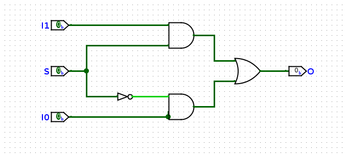

# Verilog

## Chapter 1 Basic Knowledge

### 1.1 FPGA

**FPGA/Field Programmable Gate Array/现场可编程门阵列**：FPGA器属于专用集成电路/ASIC的一种半定制电路，是可以编程的逻辑列阵，可以按照设计人员的需求配置指定的电路结构，让客户不必依赖于芯片制造商设计和制造的专用集成电路就可以实现所需要的功能，同时实现非常高效的逻辑运算。其基本结构包括可编程输入输出单元，可配置逻辑块，数字时钟管理模块，嵌入式块RAM，布线资源，内嵌专用硬核，底层内嵌功能单元。

### 1.2 Verilog

Verilog HDL是一种硬件描述语言，用于从算法级、门级到开关级的多种抽象设计层次的数字系统建模。Verilog HDL提供了编程语言接口，通过这个接口可以在模拟、验证期间从设计外部访问设计，包括模拟的具体控制和运行。


### 1.3 数字电路

根据逻辑电路的不同特点，数字电路可以分为**组合逻辑**和**时序逻辑**。其中：

- 组合逻辑的特点是在任意时刻，模块的**输出仅仅取决于此时刻的输入**，与电路原本的状态无关。电路逻辑中不牵涉边沿信号的处理，也没有记忆性。
- 时序逻辑的特点是在任意时刻，模块的输出不仅取决于此时刻的输入，而且**还和电路原来的状态有关**。电路里面有存储元件用于保存信息。**一般仅当时钟的边沿到达时**，电路内部存储的信息才有可能发生变化。

```Verilog
module main(
    input I0,
    input I1.
    input I2,
    output O
);
```

**wire**的电器特性：

- wire必须被**有且仅有**一个`assign`输入；
- wire可以有0个或者多个`assign`输出.

## Chapter 2 Basic Syntax

### 2.1 数值系统

Verilog 这种硬件描述语言都基于基本的硬件逻辑之上，因此 Verilog 具有一套独特的基于电平逻辑的数值系统，使用下面四种基本数值表示电平逻辑：

- 0：表示低电平或者 False；
- 1：表示高电平或者 True；
- X：表示电平未知，实际情况可能是高电平或者低电平，甚至都不是；
- Z：表示高阻态，这种情况就是来源于信号没有驱动.

我们还经常用到整数，可以**简单使用十进制表示**，也可以使用**立即数**表示，基于如下的基数规则表示:`<bits>'<radix><value>`，其中 `<bits>` 表示二进制位宽，空缺不填就会根据后边的数值自动分配；`<radix>` 表示进制， `<radix>` 可以是 b/o/d/h，分别是二进制，八进制，十进制以及十六进制；`<value>` 表示数值，插入下划线 `_` 可以有效提升可读性。

### 2.2 标识符与变量类型

- **`wire`**
  用于声明线网型数据。`wire` 本质上对应着一根没有任何其他逻辑的导线，仅仅将输入自身的信号原封不动地传递到输出端。该类型数据用来表示以 `assign` 语句内赋值的组合逻辑信号，其默认初始值是 Z（高阻态）。

  `wire` 是 Verilog 的默认数据类型。也就是说，对于没有显式声明类型的信号，Verilog 一律将其默认为 `wire` 类型。

- **`reg`**
  用于声明在 `always` 语句内部进行赋值操作的信号。一般而言，`reg` 型变量对应着一种存储单元，其默认初始值是 X（未知状态）。为了避免可能的错误，凡是在 `always` 语句内部被赋值的信号，都应该被定义成 `reg` 类型。

  如果 `always` 描述的是组合逻辑，那么 `reg` 就会综合成一根线，如果 `always` 描述的是时序逻辑，那么 `reg` 才会综合成一个寄存器。

### 2.3 运算符

按位运算符：

- `&`：按位与；
- `|`：按位或；
- `^`：按位异或；
- `~`：按位取反；
- `~^` 或者 `^~`：按位同或；
- **Note**：如果运算符的两个操作数位宽不相等，则利用 0 向左扩展补充较短的操作数.

算数运算符：

### 2.4 Verilog 语句

#### 2.4.1 连续赋值 `assign`

#### 2.4.2 过程赋值 `always`/`initial`

除了直接使用信号作为敏感变量，Verilog 还支持通过使用 `posedge` 和 `negedge` 关键字将电平变化作为敏感变量。其中 `posedge` 对应上升沿，`negedge` 对应下降沿。我们将电平从低电平变成高电平的时刻称为**上升沿**，从高电平变为低电平的时刻称为**下降沿**.

#### 2.4.3 阻塞赋值与非阻塞赋值

- 阻塞赋值

  阻塞赋值是顺序执行的，即下一条语句执行前，当前语句一定会执行完毕。这与 C 语言的赋值思想是一致的。阻塞赋值语句使用等号 = 作为赋值符。

- 非阻塞赋值

  非阻塞赋值属于并行执行语句，即下一条语句的执行和当前语句的执行是同时进行的，它不会阻塞位于同一个语句块中后面语句的执行。非阻塞赋值语句使用小于等于号 <= 作为赋值符。

#### 2.4.4 `generate`语句


## Example

### 1.1 2-to-1 Multiplexer

我们首先以一种特别的角度看与门：与的运算的作用之一就是**屏蔽**，当某个输入的值为零时，与的输出就是零，不管另一个输入是什么。这就使得我想要的数据都未被屏蔽，不想要的都被屏蔽为0。比如对于运算$A\land S$，$S$可以看作一个选择子，当$S=T$的时候，输出就是$A$，不论$A$的真值为多少，输出的值就是$A$的值；当$S=F$的时候，输出就是$F$，这时候$A$就被**屏蔽**了。

二路选择器的逻辑就是“屏蔽”，对于下面的二路选择器，最重要的结构就是**上下两个与门**和**中间一个非门**，选择信号$S$分成两份，通过非门变成两个不同的信号，分别接向两个与门，如果$S$的信号为$1$/$T$，那么就将下面的门屏蔽，输出上边的门信号；反之亦然。


=== "结构化描述"
    这里边利用了Verilog内置的一些门，比如`AND`和`OR`门。这种描述方式的优点就是可以很好的与真实的电路相对应，但是缺点就是不够简洁，写起来很坐牢。
    ```Verilog
    module Mux2to1 (
        input I0,
        input I1,
        input S,
        output O
        );
        wire S0_n;
        NOT not0 (S0_n, S);
        // assign S0_n = ~S;
        wire and0_s;
        wire and1_s;
        AND and0(and0_s, I0, S0_n);
        AND and1(and1_s, I1, S);
        OR or0(O, and0_s, and1_s);
    ```

=== "数据流描述"
    这种描述方法充分利用了与`&`、或`|`、非`~`以及异或`^`等运算符代替了`AND`、`OR`、`NOT`等门的描述，使得描述更加简洁。忍不住了，直接写数组。
    ```Verilog
    module Mux2to1 (
        input [1:0] I,
        input S,
        output O
        );
        assign O = I[0] & ~S | I[1] & S;
    ```
    并且这种写法还需要注意优先级的问题，Verilog的优先级是`~`>`&`>`|`，所以这里的写法是正确的。

    我们还应该知道：
    
    - **一个类C的运算符其实是一个简化描述的电路**；
    - 一个运算符的操作数是这个电路的输入；
    - 一个运算符运算表达式的值是这个电路的输出；
    - 运算表达式的嵌套是门电路的级联；

=== "行为描述"
    这种描述方法是最简洁的，但是也是最抽象的，使用了大量的高度抽象的类C语句来提升编程的灵活性：
    ```Verilog
    module Mux2to1 (
        input I0,
        input I1,
        input S,
        output O
        );
        assign O = S ? I1 : I0;
    ```

    Verilog利用了C中的三目运算符来实现了二路选择器，语法是这样的`exp0 ? exp1 : exp2`，这里的赋值语句并不是表示*如果选择子$S$是$1$，我就把`I0`和`I1`连上*，实际上**这就是一个二路选择器**，`exp0`是**构造选择子电路的输出**，真不是不连电路啊……


if-else 必须在always块中使用，并且输出必须是reg类型。但是在`always@(*)`中，内部的reg被综合成wire类型

### 1.2 复合多路选择器/Cascaded Mux

多路选择器可以根据选择子从**多个单bit**输入中选择**单bit**输出，但是如果我们需要从**多个多bit**输入中选择**多bit**输出，那么就需要使用复合多路选择器。复合多路选择器在硬件实现上其实是由多个单路选择器级联而成的。


### 1.3 七段数码管译码器/Seven-Segment Decoder

七段数码管的显示译码的对应关系如下，使用复合多路选择器，就不难得到下面源码。解释源码的方法很简单，把它的接口`a`到`g`分开，当卡诺图写就好了。


=== "与或版本"
    这个是对应的图片，非常的朴素。
    
    但是这个是老实人写法，就直接按照真值表画电路硬刚，千万别这么写，丑死了。
    ```verilog
    module SegDecoder (
        input wire [3:0] data,
        input wire point,
        input wire LE,
        output wire a,
        output wire b,
        output wire c,
        output wire d,
        output wire e,
        output wire f,
        output wire g,
        output wire p
    );
    
        assign a = LE | ( data[0] &  data[1] & ~data[2] &  data[3] | 
                          data[0] & ~data[1] &  data[2] &  data[3] | 
                         ~data[0] & ~data[1] &  data[2] & ~data[3] | 
                          data[0] & ~data[1] & ~data[2] & ~data[3] );
        assign b = LE | ( data[0] &  data[1] &  data[3] | 
                         ~data[0] &  data[2] &  data[3] |
                         ~data[0] &  data[1] &  data[2] | 
                          data[0] & ~data[1] &  data[2] & ~data[3] );
        assign c = LE | ( data[1] &  data[2] &  data[3] |
                         ~data[0] &  data[1] & ~data[2] & ~data[3] |
                         ~data[0] &  data[2] &  data[3] );
        assign d = LE | (~data[0] &  data[1] & ~data[2] &  data[3] |
                          data[0] &  data[1] &  data[2] |
                         ~data[0] & ~data[1] &  data[2] & ~data[3] |
                          data[0] & ~data[1] & ~data[2] & ~data[3] );
        assign e = LE | ( data[0] & ~data[1] & ~data[2] |
                         ~data[1] &  data[2] & ~data[3] |
                          data[0] & ~data[3] );
        assign f = LE | ( data[0] &  data[1] & ~data[3] |
                          data[1] & ~data[2] & ~data[3] |
                          data[0] & ~data[2] & ~data[3] |
                          data[0] & ~data[1] &  data[2] &  data[3] );
        assign g = LE | (~data[0] & ~data[1] &  data[2] &  data[3] |
                          data[0] &  data[1] &  data[2] & ~data[3] |
                         ~data[1] & ~data[2] & ~data[3] );
        assign p = ~point;

    endmodule //SegDecoder
    ```

=== "index版本"

    好看一点了。
    ```verilog 
    module SegDecoder_new (
        input wire [3:0] data,
        input wire point,
        input wire LE,
        output wire a,
        output wire b,
        output wire c,
        output wire d,
        output wire e,
        output wire f,
        output wire g,
        output wire p
    );
    
        wire [6:0] segs [15:0];
        assign segs[0] = 7'b0000001;
        assign segs[1] = 7'b1001111;
        assign segs[2] = 7'b0010010;
        assign segs[3] = 7'b0000110;
        assign segs[4] = 7'b1001100;
        assign segs[5] = 7'b0100100;
        assign segs[6] = 7'b0100000;
        assign segs[7] = 7'b0001111;
        assign segs[8] = 7'b0000000;
        assign segs[9] = 7'b0000100;
        assign segs[10] = 7'b0001000;
        assign segs[11] = 7'b1100000;
        assign segs[12] = 7'b0110001;
        assign segs[13] = 7'b1000010;
        assign segs[14] = 7'b0110000;
        assign segs[15] = 7'b0111000;

        assign {a, b, c, d, e, f, g} = {7{LE}} | segs[data];

        assign p = ~point;

    endmodule //SegDecoder
    ```

### 1.4 全加器(Full Adder)


=== "1-bit full adder"
    ```verilog
    module Adder(
        input a,
        input b,
        input c_in,
        output s,
        output c_out
    );
        
        assign s = a ^ b ^ c_in;
        assign c_out = a & b | a & c_in | b & c_in;

    endmodule 
    ```

=== "ripple-carry adder"

    ```verilog
    module Adders #(
        parameter LENGTH = 32
    )(
        input [LENGTH-1:0] a,
        input [LENGTH-1:0] b,
        input c_in,
        output [LENGTH-1:0] s,
        output c_out
    );
    
        wire c[LENGTH:0];
        assign c[0] = c_in;

        genvar i;
        generate
            for(i = 0; i < LENGTH; i = i + 1)begin
                Adder adder(.a(a[i]), .b(b[i]), .c_in(c[i]), .s(s[i]), .c_out(c[i+1]));
            end      
        endgenerate
        assign c_out = c[LENGTH];
    
    endmodule
    ```

=== "4-bit lookahead adder"

    ```verilog
    module Lookahead_Adder4(
        input [3:0] a,
        input [3:0] b,
        input c_in,
        output [3:0] s,
        output c_out
    );

        wire [3:0] G;
        wire [3:0] P;
        wire [4:0] c;

        genvar i;
        generate
            for(i = 0; i<4; i=i+1)begin
                assign G[i] = a[i] & b[i];
                assign P[i] = a[i] ^ b[i];
            end
        endgenerate

        assign c[0] = c_in;
        assign c[1] = G[0] | P[0] & c[0];
        // assign c[2] = G[1] | P[1] & c[1];
        assign c[2] = G[1] | P[1] & G[0] | P[1] & P[0] & c[0] ;
        assign c[3] = G[2] | P[2] & G[1] | P[2] & P[1] & G[0] | 
                      P[2] & P[1] & P[0] & c[0] ;
        assign c[4] = G[3] | P[3] & G[2] | P[3] & P[2] & G[1] | 
                      P[3] & P[2] & P[1] & G[0] | P[3] & P[2] & P[1] & P[0] & c[0];
        assign c_out = c[4];

        generate
            for(i = 0; i<4; i=i+1)begin
                assign s[i] = P[i] ^ c[i];
            end
        endgenerate
    
    endmodule
    ```
