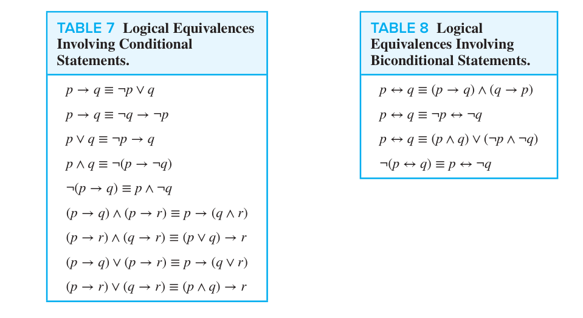
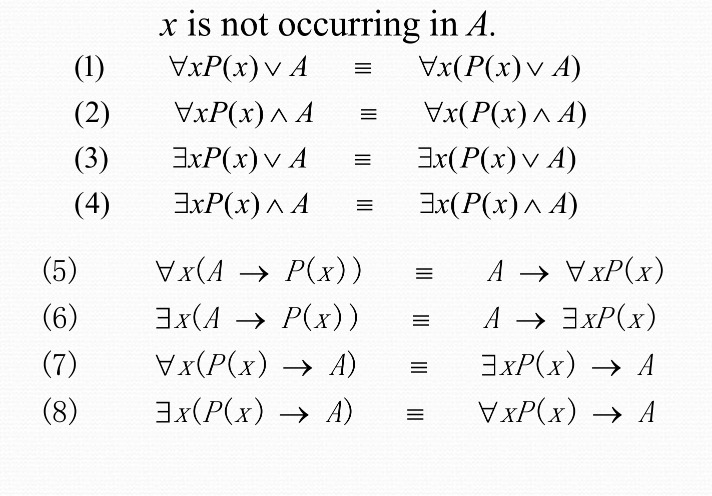
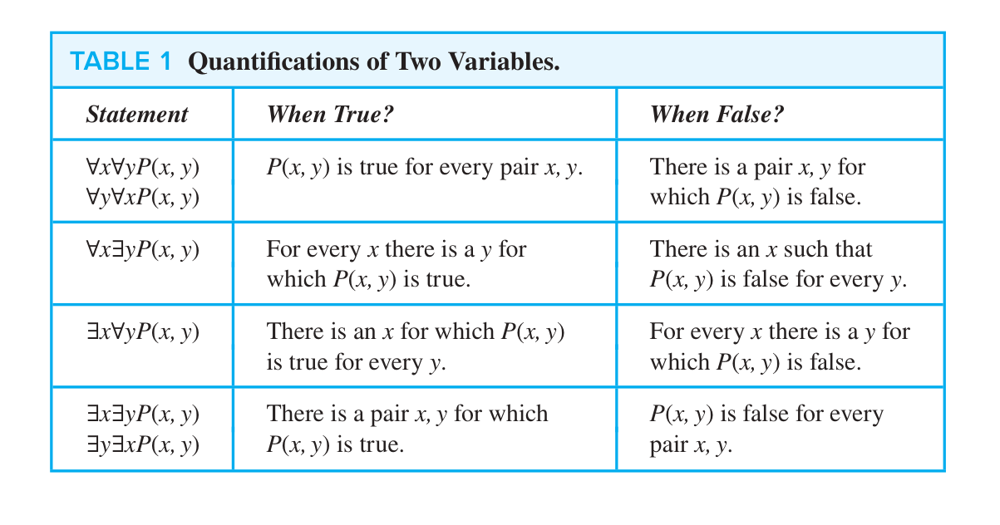

# Part 01 Propositional Logic

## 1.1 Propositions

A **proposition** is a declarative sentence that is either true or false, but not both. We use letters to denote **propositional variables**, or sentential variables, i.e. variables that represent propositions. The **truth value** of a proposition is true, denoted by **T**, if it is a true proposition, and similiarly, the truth value of a proposition is false, denoted by **F**, if it is a false proposition.Propositions that cannot be expressed in terms of simpler propositions are called **atomic propositions**.

We can form new propostions from existing ones using **logical connectives**. Here are six useful logical connectives: Negation/NOT ($\neg$), Conjunction/AND ($\land$), Disjunction/OR ($\lor$), Exclusive Or/XOR ($\oplus$), Conditional/IF-THEN ($\to$), and Biconditional/IFF AND ONLY IF ($\leftrightarrow$).

**More on IMPLICATION**: 

- In $p\to q$, $p$ is the **hypothesis/antecedent前件/premise前提**, and $q$ is the **conclusion/consequent后件**.
- In $p\to q$ there does not need to be any connection between the antecedent or the consequent. The “meaning” of $p\to q$ **depends only on the truth values** of $p$ and $q$.

From $p\to q$, we can form the **converse** $q\to p$, the **inverse** $\neg p\to \neg q$, and the **contrapositive** $\neg q\to \neg p$. The **converse** and the **inverse** are not logically equivalent to the original conditional, but the **contrapositive** is.

Construction of a **truth table**:

- Rows: Need a row for every possible combination of values for the atomic propositions.
- Columns.1: Need a column for the compound proposition (usually at far right)
- Columns.2: Need a column for the truth value of each expression that occurs in the compound proposition as it is built up. (This includes the atomic propositions.)

The truth value of $p\leftrightarrow q$ is the same as the truth value of $(p\to q)\land (q\to p)$, that is to say, $p\leftrightarrow q$ is true if and only if $p$ and $q$ have the same truth value.

**Precedence of Logical Operators**: From highest to lowest, the precedence of logical operators is $\neg$, $\land$, $\lor$, $\to$, and $\leftrightarrow$.

## 1.3 Logical Equivalence

Basic terminology and its concepts:

- **Tautologies/永真式**: A tautology is a proposition which is always true, e.g. $p\lor \neg p$;
- **Contradictions/矛盾式**: A contradiction is a proposition which is always false, e.g. $p\land \neg p$;
- **Contingencies/可能式**: A contingency is a proposition which is neither a tautology nor a contradiction, e.g. $p$.

Two compound propositions $p$ amd $q$ are **logically equivalent** if $q\leftrightarrow q$ is a tautology. We denote this by $p\equiv q$ or $p\Leftrightarrow q$.

Compound propositions that have the same truth values for all possible cases, in other words, the columns in a truth table giving their truth values agree, are called **equivalent**.

**(Important) Conditional-disjunction equivalence** states that for any propositions $p$ and $q$, we have

$$p\to q\equiv \neg p\lor q.$$

**Absorption laws** states that for any propositions $p$ and $q$, we have

$$p\lor (p\land q)\equiv p.$$

$$p\land (p\lor q)\equiv p.$$

**De Morgan's Laws** states that for any propositions $p$ and $q$, we have 

$$\neg(p\land q)\equiv \neg p\lor \neg q$$

$$\neg(p\lor q)\equiv \neg p\land \neg q.$$

**Distribution laws** states that for any propositions $p$, $q$, and $r$, we have

$$p\lor (q\land r)\equiv (p\lor q)\land (p\lor r).$$

$$p\land (q\lor r)\equiv (p\land q)\lor (p\land r).$$

**Identity Laws** states that for any propositions $p$, we have

$$p\land T\equiv p.$$

$$p\lor F\equiv p.$$

**Domination Laws** states that for any propositions $p$, we have

$$p\lor T\equiv T.$$

$$p\land F\equiv F.$$

**Idempotent Laws** states that for any propositions $p$, we have

$$p\lor p\equiv p.$$

$$p\land p\equiv p.$$

Moreover, **Commutative Laws** and **Associative Laws** are also valid for logical connectives: for any propositions $p$, $q$, and $r$, we have

$$p\lor q\equiv q\lor p.$$

$$p\land q\equiv q\land p.$$

$$(p\lor q)\lor r\equiv p\lor (q\lor r).$$

$$(p\land q)\land r\equiv p\land (q\land r).$$

Involving Conditional and Biconditional statements, we have

<!-- $$p\to q\equiv \neg q\lor p.$$

$$p\to q\equiv \neg q\to \neg p.$$

$$(p\to q)\land (p\to r)\equiv p\to (q\land r).$$

$$(p\to q)\lor (p\to r)\equiv p\to (q\lor r).$$

$$(p\to r)\land (q\to r)\equiv (p\lor q)\to r.$$

$$(p\to r)\lor (q\to r)\equiv (p\land q)\to r.$$

$$p\leftrightarrow q\equiv (p\to q)\land (q\to p).$$

$$p\leftrightarrow q\equiv \neg p\leftrightarrow \neg q.$$

$$p\leftrightarrow q\equiv (p\land q)\lor (\neg p\land \neg q).$$

$$\neg(p\leftrightarrow q)\equiv p\leftrightarrow \neg q.$$ -->

The **Dual** of compound proposition that contains only the logic operators $\land$, $\lor$, and $\neg$ the proposition obtained by replacing each $\land$ by $\lor$, each $\lor$ by $\land$, each $T$ by $F$, and each $F$ by $T$. The dual of $S$ is denoted by $S^*$. For example, the dual of $p\lor (q\land \neg r)$ is $\neg p\land (q\lor \neg r)$.

We already know that only two logical operators $\{\neg,\land\}$ or $\{\neg,\lor\}$ are enough to express all logical propositions. Thus, a collection of logical operators is called **functionally complete** if every possible logical proposition is logically equivalent to a compound proposition involving only these operators. 

The **Sheffer Stroke/与非** is a functionally complete set of logical operators. It is denoted by $p|q$, and $p|q$ is false when both $p$ and $q$ are true, and true otherwise. The **Peirce Arrow/或非** is also a functionally complete set of logical operators. It is denoted by $p\downarrow q$, and $p\downarrow q$ is true when both $p$ and $q$ are false, and false otherwise.

A compound proposition is **satisfiable** if there is an assignment of truth values to its variables that makes it true. When no such assignments exits, the compound proposition is **unsatisfiable**.

A compound proposition is unsatisfiable if and only if it is a contradiction or its negation is a tautology.

## 1.4 Applications of Propositional Logic

A list of propositions is **consistent** if it is possible to assign truth values to the proposition variables so that each proposition is true.

## 1.5 Propositional Normal Forms

**Propositional formula/命题公式** is a compound proposition that is built up from atomic propositions using logical connectives with the following criteria:

- Each propositional variable is a formula, and the truth values T and F are formulas.
- If $A$ is a formula, then $\neg A$ is a formula.
- If $A$ and $B$ are formulas, then $(A\land B)$, $(A\lor B)$, $(A\to B)$, and $(A\leftrightarrow B)$ are formulas.
- A string of symbols is a formula if and only if it is determined by (**finitely** maly applications of) the above three rules.

Formulas can be transformed into **standard forms** so that they become more convenient for symbolic manipulations and make identification and comparison of two formulas easier. There are two types of normal forms in propositional calculus:

- the **Disjunctive Normal Form/DNF/析取范式**: A formula is said to be in DNF if it written as a disjuction, in which all terms are conjunctions of literals.   
  For example, $(p\land q)\lor (\neg p\land r)$, $p\lor (q\land r)$, $\neg p\lor T$ are in DNF, and the disjunction $\neg(p\land q)\lor r$ is not.

- the **Conjunctive Normal Form/CNF/合取范式**: A formula is said to be in CNF if it written as a conjunction, in which all terms are disjunctions of literals.

We can introduce the concept of **Clauses/子句** to simplify the concept of DNF and CNF. A disjunction/conjunction with literials as disjuncts/conjuncts are called a **Disjunctive/Conjunctive clause/析取子句/合取子句**. Disjunctive/conjunctive clauses are simply called **clauses**. Moreover, conjunctive clause is also called **Basic product** and disjunctive clause is also called **Basic addition**.

Thus, a CNF is a **conjunction of disjunctive clauses**, and a DNF is a **disjunction of conjunctive clauses**.

A **Midterm/极小项** is a **conjunction** of literials in which each variable is represented **exactly once**.

**(IMPORTANT)** There are $2n$ different minterm for $n$ propositional variables. For example there $4$ different minterm for $p$, $q$, they are $p\land q$, $p\land\neg q$, $\neg p \land q$, $\neg p\land\neg q$. For the sake of simplification, we use $m_j$ denote the minterms. Where $j$ is a integer, **its binary representation corresponds the evaluation of variables that make $m_j$ be equal to T**.

If a proposition form is denoted by: $f=m_j\lor m_k\lor\cdots\lor m_l$, then we simply denote 

$$f=\sum m(j,k,\cdots,l).$$

Properties of minterms:

- Each minterm is true for exactly one assignment.
- The conjunction of two different minterm is always false.
- The disjunction of all minterms is T.
- A disjinction of minterms is true only if at least one of the constituent minterms is ture.

If a function, as $f$, is given by truth table, we know exactly for which assignments it is true. Consequently, we can select the minterms that make the function true and form the disjunction of these minterms.

If a Boolean function is expressed as a disjunction of minterms, it is said to be in **full disjunctive form**.

All above is the concept of DNF and the concept and use of minterms. Now we turn to CNF.

A compound proposition is in CNF if it is a conjunction of disjunctive clauses. **Every proposition can be put in an equivalent CNF**. CNF is useful in the study of resolution theorem proving used in AI.

A compound proposition can be put in conjunctive normal form through repeated application of the logical equivalences covered earlier.

A **Maxterm/极大项** is a **disjunction** of literials in which each variable is represented **exactly once**. If a Boolean function is expressed as a conjunction of maxterms, it is said to be in **full conjunctive form**.

We can get the full conjunctive form of a Boolean function from its full disjunction form: Let $f=\sum f(j,k,\cdots,l)$, $g=\sum m(\{0,1,2,\cdots,2^{n-1}\}-\{j,k,\cdots,l\})$, then $f\lor g = T$, $f\land g = F$.

$$f = \neg g = \prod M(\{0,1,2,\cdots,2^{n-1}\}-\{j,k,\cdots,l\}).$$

The $M_i$ is a maxterm defined by $M_i=\neg m_i$.

## 1.6 Predicates and Quantifiers

In this section, we will introduce **Predicate logic/谓词逻辑**. A predicate refers to a property that the subject of the statement can have. We can denote the statement "$x$ is greater than $3$" by $P(x)$, where $P$ denotes the predicate "is greater than $3$" and $x$ is the variable. The statement $P(x)$ is also said to be the value of the **propositional function** $P$ at $x$.

Propositional functions become propositions when their variables are each replaced by a value from the domain.

We need **quantifiers/量词** to express the meaning of English words including *all* and *some*. Two most important quantifiers are:

- **Universal Quantifier**: $\exists$ means "There exists";
- **Existential Quantifier**: $\forall$ means "For all".

Domain/domain or discourse/universe of discourse: the range of the possible values of the variable.

Given the domain as $\{x_1, x_2, \cdots, x_n\}$, the proposition $\forall xP(x)$ is equivalent to $P(x_1)\land P(x_2)\land\cdots\land P(x_n)$, and the proposition $\exists xP(x)$ is equivalent to $P(x_1)\lor P(x_2)\lor\cdots\lor P(x_n)$.

**Uniqueness Quantifier**: $\exists !$ means "There exists a unique", that is $P(x)$ is true for **one and only one** $x$ in the domain. The uniqueness quantifier can be expressed without the symbol $!$ : $\exists x(P(x)\land \forall y(P(x)\to y=x))$.

**Precedence of Quantifiers**: The quantifiers $\forall$ and $\exists$ have higher precedence than the logical connectives $\neg$, $\land$, $\lor$, $\to$, and $\leftrightarrow$. For example, $\forall xP(x)\land Q(x)$ means $(\forall xP(x))\land Q(x)$. 

**Bound Variable**: A variable is bound if it is known or quantified. A variable is free if it is neither quantified or specified with a value.

All the variables in a propositional function must be quantified or set equal to a particular value to turn it into a proposition.

**Scope** of a quantifier: the part of a logical expression to which the quantifier is applied

**Logical Equivalence with Logical Quantifiers**: 

**De Morgan's Laws for Quantifiers**: 

$$\neg\forall xP(x)\equiv \exists x\neg P(x).$$

$$\neg\exists xP(x)\equiv \forall x\neg P(x).$$

## 1.7 Nested Quantifiers

**Nested Quantifiers**: Two quantifiers are nested if one is within the scope of the other. For example, $\forall x\exists yP(x,y)$ means "For every $x$, there exists a $y$ such that $P(x,y)$ is true".

**Order of Quantifiers**: Only both quantifiers are universal or both are existential, the order of quantifiers can be changed. 

**Distributions for Quantifiers over Logical Connectives**: Here I list two examples: $\forall x(P(x)\land Q(x))\equiv \forall xP(x)\land \forall xQ(x)$ is True, whereas $\forall x(P(x)\to Q(x))\equiv \forall xP(x)\to \forall xQ(x)$ is False.

## 1.8 Rules of Inference

**Valid Argumemts**:An argument in propositional logic is a sequence of propositions. All but the final proposition are called **premises/前提**. The last statement is the **conclusion/结论**. The argument is **valid/有效** if the premises imply the conclusion. An argument form is an argument that is valid no matter what propositions are substituted into its propositional variables.

If the premises are $p_1, p_2,\dots, p_n$ and the conclusion is $q$ then $(p_1\land p2 \land \cdots\land p_n )\to q$ is a tautology.

**Inference Rules** are all argument simple argument forms that will be used to construct more complex argument forms.

**Modus Ponens/假言推理**: If $p\to q$ and $p$ are true, then $q$ is true. Corresponding Tautology: $(p\land (p\to q))\to q$.

**Modus Tollens/取拒式**: If $p\to q$ and $\neg q$ are true, then $\neg p$ is true. Corresponding Tautology: $((p\to q)\land \neg q)\to \neg p$.

**Hypothetical Syllogism/假言三段论**: If $p\to q$ and $q\to r$ are true, then $p\to r$ is true. Corresponding Tautology: $((p\to q)\land (q\to r))\to (p\to r)$.

**Disjunctive Syllogism/析取三段论**: If $p\lor q$ and $\neg p$ are true, then $q$ is true. Corresponding Tautology: $((p\lor q)\land \neg p)\to q$.

**Addition/附加律**: If $p$ is true, then $p\lor q$ is true. Corresponding Tautology: $p\to (p\lor q)$.

**Simplification/简化律**: If $p\land q$ is true, then $p$ is true. Corresponding Tautology: $(p\land q)\to p$.

**Conjunction/合取律**: If $p$ and $q$ are true, then $p\land q$ is true. Corresponding Tautology: $(p\land q)\to (p\land q)$.

**Resolution/消解律**: If $p\lor q$ and $\neg p\lor r$ are true, then $q\lor r$ is true. Corresponding Tautology: $((p\lor q)\land (\neg p\lor r))\to (q\lor r)$.

**Universal Instantiation/全称实例**: If $\forall xP(x)$ is true, then $P(c)$ is true for any $c$ in the domain. Corresponding Tautology: $\forall xP(x)\to P(c)$.

**Universial Generalization/全称引入**: If $P(c)$ is true for any $c$ in the domain, then $\forall xP(x)$ is true. Corresponding Tautology: $P(c)\to \forall xP(x)$.

**Existential Instantiation/存在实例**: If $\exists xP(x)$ is true, then $P(c)$ is true for some $c$ in the domain. Corresponding Tautology: $\exists xP(x)\to P(c)$.

**Existential Generalization/存在引入**: If $P(c)$ is true for some $c$ in the domain, then $\exists xP(x)$ is true. Corresponding Tautology: $P(c)\to \exists xP(x)$.

**Universial Modus Ponens/全称假言推理**: If $\forall x(p(x)\to q(x))$ and $p(a)$ are true, then $q(a)$ is true. Corresponding Tautology: $(\forall x(p(x)\to q(x))\land p(a))\to q(a)$.

## 1.9 Introduction to Proofs

A **proof** is a valid argument that establishes the truth of a statement. In math, CS, and other disciplines, informal proofs which are generally shorter, are generally used.

A **theorem/定理** is a statement that can be shown to be true using: definitions, other theorems, axioms (statements which are given as true), rules of inference.

A **lemma/引理** is a 'helping theorem' or a result which is needed to prove a theorem.

A **corollary/推论** is a result which follows directly from a theorem.

Less important theorems are sometimes called **propositions/命题**.

A **conjecture/猜想** is a statement that is being proposed to be true. Once a proof of a conjecture is found, it becomes a theorem. It may turn out to be false.

**Direct Proof**: Assume that $p$ is true. Use rules of inference, axioms, and logical equivalences to show that $q$ must also be true.

Proof by **Contraposition/反证法**: Assume $\neg q$ and show $\neg p$ is true also. This is sometimes called an **indirect proof method**. If we give a direct proof of $\neg q\to\neg p$ then we have a proof of $p\to q$.

Proof by **Contradiction/归谬证明法/Reductio ad absurdum**: To prove $p$, assume $\neg p$ and derive a contradiction such as $r\land \neg r$. (an indirect form of proof). Since we have shown that $\neg p\to F$ is true , it follows that the contrapositive $T\to p$ also holds.

## 1.10 Proof Method and Strategy

**Proof by cases**: To prove $(p_1\lor p_2\lor \cdots\lor p_n)\to q$, using the tautology $(p_1\to q)\land (p_2\to q)\land\cdots\land (p_n\to q)\leftrightarrow (p_1\lor p_2\lor \cdots\lor p_n)\to q$, we need to prove $p_1\to q$, $p_2\to q$, $\cdots$, and $p_n\to q$.

**Existence Proofs/存在性证明**,**Without Loss of Generality/不失一般性**,**Nonconstructive Proofs/非构造性证明**,**Proof by Counterexample/反例证明**,**Uniqueness Proofs/唯一性证明**,**Backward Proof/逆向证明**.