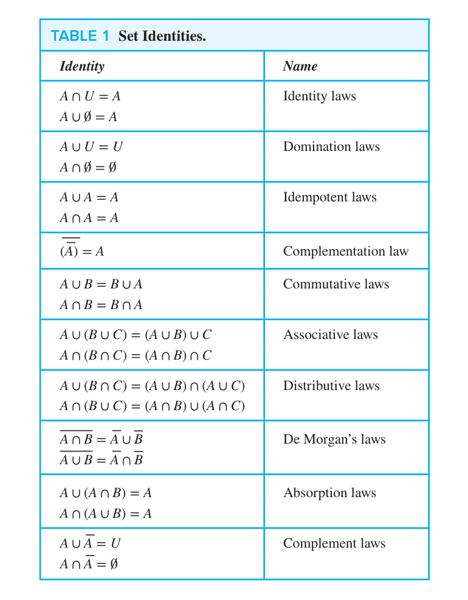

# Basic Structures: Sets, Functions, Sequences, Sums, and Matrices

## 2.1 Sets

A **set** is an unordered collection of distinct objects, called **elements** or members of the set. A set is said to contain its elements. We write $a\in A$ to denote that $a$ is an element of the set $A$. The notation $a\notin A$ denotes that $a$ is not an element of the set $A$.

**Roster method**: A set can be described by listing its elements between braces. For example, the set of vowels in the English alphabet can be written as $V=\{a,e,i,o,u\}$. Listing an element more than once does not change the set. The set $\{a,e,i,o,u\}$ is the same as the set $\{a,e,i,o,u,u\}$.

**Set-builder notation**: A set can be described by specifying a property that its members must satisfy, for example $\{x:x\equiv 0\pmod 2\}$

**Universal Set**: The set $U$ containing all the objects currently under consideration.

**Empty Set**: The set containing no elements, denoted by $\emptyset$ or $\{\}$.

**Set Equality**: Two sets are equal if and only if they have the same elements. i.e. 

$$\forall x(x\in A\leftrightarrow x\in B)$$

**Subset**: A set $A$ is a subset of a set $B$ if every element of $A$ is also an element of $B$. We write $A\subseteq B$.

$$\forall x(x\in A\rightarrow x\in B)$$

**Proper Subset**: If $A\subseteq B$ and $A\neq B$, then $A$ is a proper subset of $B$, denoted by $A\subset B$.

**Set Cardinality**: If there are exactly $n$ distinct elements in a set $A$, where $n$ is a nonnegative integer, then $A$ is a finite set otherwise it is an infinite set. The cardinality of a finite set $A$, denoted by $|A|$, is the number of elements in $A$.

**Power Sets**: The set of all subsets of $A$, denoted by $\mathcal{P}(A)$ is called the power set of $A$. If $|A|=n$, then $|\mathcal{P}(A)|=2^n$.

**Tuples**: The **ordered** $n$-tuple $(a_1,a_2,\cdots,a_n)$ is the ordered collection that has $a_1$ as its first element, $a_2$ as its second element, and so on. Two $n$-tuples are equal if and only if their **corresponding** elements are equal. $2$-tuple is called an **ordered pair/序偶**.

**Cartesian Product**: The **Cartesian product** of sets $A$ and $B$, denoted by $A\times B$, is the set of all ordered pairs $(a,b)$ where $a\in A$ and $b\in B$. Similarly, the Cartesian product of $n$ sets $A_1,A_2,\cdots,A_n$ is the set of all ordered $n$-tuples $(a_1,a_2,\cdots,a_n)$ where $a_i\in A_i$ for $i=1,2,\cdots,n$.

$$A\times B=\{(a,b):a\in A\land b\in B\}$$

**Relation**: A subset $R$ of the Cartesian product $A\times B$ is called a **relation** from $A$ to $B$.

**Truth Set**: Given a predicate $P$ and a domain $D$, the truth set of $P$ is the set of all elements in $D$ for which $P$ is true.

$$\{x\in D:P(x)\}$$

## 2.2 Set Operations

**Union**: The union of sets $A$ and $B$, denoted by $A\cup B$, is the set containing all elements that are in $A$ or in $B$ or in both.

$$A\cup B=\{x:x\in A\lor x\in B\}$$

**Intersection**: The intersection of sets $A$ and $B$, denoted by $A\cap B$, is the set containing all elements that are in both $A$ and $B$.

$$A\cap B=\{x:x\in A\land x\in B\}$$

**Difference**: The difference of sets $A$ and $B$, denoted by $A-B$, is the set containing all elements that are in $A$ but not in $B$.

$$A-B=\{x:x\in A\land x\notin B\}$$

**Symmetric Difference**: The symmetric difference of sets $A$ and $B$, denoted by $A\oplus B$, is the set containing all elements that are in $A$ or in $B$ but not in both. Remember the **XOR**/$\oplus$ operation.

$$A\oplus B=\{x:x\in A\oplus x\in B\}=(A-B)\cup(B-A)$$

**Complement**: The complement of a set $A$ with respect to the universal set $U$, denoted by $\overline{A}$ or $A^c$, is the set $U-A$.

$$\overline{A}=\{x:x\in U\land x\notin A\}$$

**Includsion-Exclusion Principle**: For anzy two sets $A$ and $B$,

$$|A\cup B|=|A|+|B|-|A\cap B|$$

To prove set identies, the most effective way is to show that each side of the identity is a subset of the other side, builder notation and propositional logic are also used in our proof.

## 2.3 Functions

**Function**: Let $A$ and $B$ be nonempty sets. A **function** $f$ from $A$ to $B$ denoted by $f:A\rightarrow B$ is an assignment of exactly one element of $B$ to each element of $A$. We write $f(a)=b$ if $b$ is the unique element of $B$ assigned by $f$ to the element $a$ of $A$. Functions are sometimes called **mappings** or **transformations**.

$$\forall a(a\in A\rightarrow \exists!b(b\in B\land f(a)=b))$$

A function $f:A\rightarrow B$ can also be defined as a subset of the Cartesian product $A\times B$, that is a relation. This subset is restricted be a relation where no two elements of the relation have the first element. 

$$\forall x(x\in A\to\exists y(y\in B\land (x,y)\in f))$$

$$\forall x,y_1,y_2((x,y_1)\in f\land (x,y_2)\in f\to y_1=y_2)$$

**Domain**: The set $A$ is called the **domain** of the function $f:A\rightarrow B$.

**Codomain**: The set $B$ is called the **codomain** of the function $f:A\rightarrow B$.

**Range**: The set of all images of elements in the domain is called the **range** of the function.

Two functions are **equal** if and only if they have the same domain, the same codomain, and assign the same value to each element in their domain.

Definitions of **Injection** **Surjection** **Bijection** **Inverse Function** **Composition** and **Graph of Function** are omitted, because I assume you know them well.

## 2.4 Sequences and Summations

## 2.5 Cardinality of Sets

**Cantor Diagonalization Method**: The set of real numbers is uncountable.

**Proof**: To show that the set of real numbers is uncountable, we suppose that the set of real numbers is countable and arrive at a contradiction. Then, the subset of all real numbers that fall between $0$ and $1$ would also be countable (because any subset of a countable set is also countable). Under this assumption, the real numbers between $0$ and $1$ can be listed in some order, say, $r_1$, $r_2$, $r_3$, $\dots$. Let the decimal representation of these real numbers be

$$r_1=0.d_{11}d_{12}d_{13}\cdots$$

$$r_2=0.d_{21}d_{22}d_{23}\cdots$$

$$r_3=0.d_{31}d_{32}d_{33}\cdots$$

$$\vdots$$

where $d_{ij}$ is the $j$th digit in the decimal representation of $r_i$. We construct a real number $r$ between $0$ and $1$ as follows: We choose the first digit of $r$ to be different from the first digit of $r_1$, the second digit of $r$ to be different from the second digit of $r_2$, and so on. In general, we choose the $i$th digit of $r$ to be different from the $i$th digit of $r_i$. The real number $r$ is different from every real number in the list, so the list does not contain all real numbers between $0$ and $1$. This contradiction shows that the set of real numbers between $0$ and $1$ is uncountable, which finishes the proof.

Moreover, we can prove a stronger result: The set of all real numbers with decimal representations consisting only of $0$ and $1$ is uncountable. This comes from the observation that the Cantor diagonalization method only need two distinct digits to construct a real number that is different from every real number in the list.

