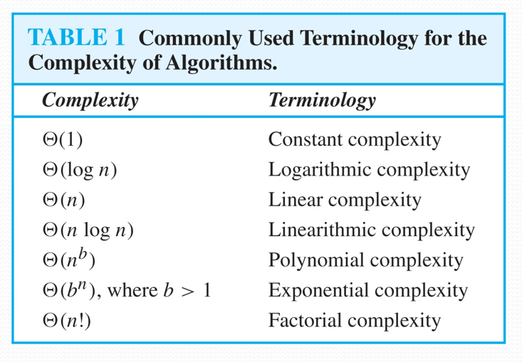

# Part 3 Algorithms

??? tip
    This part should be trivial and useless for ALL students learning computer science, and it is covered in the course *Foundamental Data Structures*. 

## 3.1 Introduction to Algorithms

**Properties of Algorithms**: Input, Output, Definiteness (每一步都有明确定义), Finiteness (有限步出结果), Effectiveness (有限时间), Correctness, Generality.

## 3.3 Complexity of Algorithms

We will measure time complexity in terms of the number of operations an algorithm uses and we will use big-O and big-Theta notation to estimate the time complexity.

If there exists a constant $c > 0$ and a positive integer $n_0$ such that $\vert f(n) \vert \leqslant c \cdot \vert g(n) \vert$ for all $n \geqslant n_0$, then $f(n)$ is said to be $O(g(n))$.

If there exists a constant $c > 0$ and a positive integer $n_0$ such that $\vert f(n) \vert \geqslant c \cdot \vert g(n) \vert$ for all $n \geqslant n_0$, then $f(n)$ is said to be $\Omega(g(n))$.

If there exists two constant $c_1, c_2 > 0$ and a positive integer $n_0$ such that $c_1 \cdot \vert g(n) \vert \leqslant \vert f(n) \vert \leqslant c_2 \cdot \vert g(n) \vert$ for all $n \geqslant n_0$, then $f(n)$ is said to be $\Theta(g(n))$.

- **Tractable/易解 Problem**: There exists a polynomial time algorithm to solve this problem. These problems are said to belong to the **Class P**.
- **Intractable/难解 Problem**:  There does not exist a polynomial time algorithm to solve this problem.
- **Unsolvable Problem**: No algorithm exists to solve this problem, e.g., halting problem.
- **Class NP**: Solution can be checked in **polynomial** time. But **no polynomial time algorithm** has been found for finding a solution to problems in this class. 
- **NP Complete Class**: If you find a polynomial time algorithm for one member of the class, it can be used to solve all the problems in the class.  

P Versus NP Problem: Go to ADS.