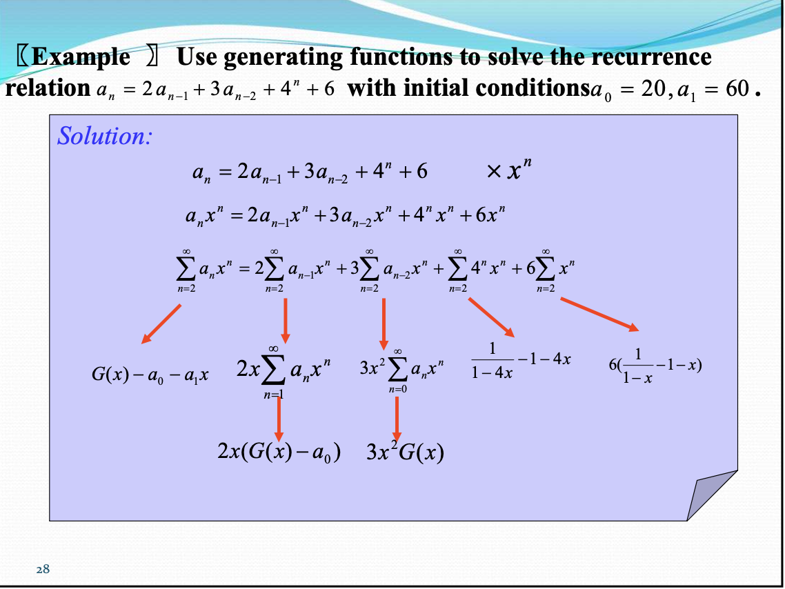

# Part 8 Advanced Counting Techniques

## 8.1 Applications of Recurrence Relations

**A solution of a Recurrence Relation** is a sequence that satisfies the recurrence relation.

Normally, there are infinitely many sequences which satisfy a recurrence relation. We distinguish them by the initial conditions, the values of $a_1$, $a_2$, $\cdots$, $a_k$ to uniquely identify a sequence.

The **Degree of a Recurrence Relation**: $a_n = a_{n-1} + a_{n-5}$ is a recurrence relation with degree 5.

## 8.2 Solving Linear Recurrence Relations

**Linear Homogeneous Recurrence Relations**: A **Linear Homogeneous Recurrence Relation** of degree $k$ with constant coefficients is a recurrence relation of the form $a_n = c_1a_{n-1} + c_2a_{n-2} + \cdots + c_ka_{n-k}$, where $c_1, c_2, \cdots, c_k$ are constants and $c_k \neq 0$.

- It is linear because the right-hand side is a linear combination of the previous terms.
- It is homogeneous because no terms occur that are not multiples of $a_j$s and each coefficient is a constant.
- The degree is $k$ because the relation involves $k$ previous terms.

**Solving Linear Homogeneous Recurrence Relations**: The general solution of a linear homogeneous recurrence relation of degree $k$ with constant coefficients $a_n = c_1a_{n-1} + c_2a_{n-2} + \cdots + c_ka_{n-k}$ can be obtained by:

- Solving the characteristic equation $x^k - c_1x^{k-1} - c_2x^{k-2} - \cdots - c_k = 0$, with roots $r_1, r_2, \cdots, r_l$ of multiplicity $m_1, m_2, \cdots, m_l$.
- The general solution is $a_n = P_1(n)r_1^n + P_2(n)r_2^n + \cdots + P_l(n)r_l^n$, where $P_i(n)$ is a constant coefficient polynomial of degree $m_i - 1$.

**Linear Nonhomogeneous Recurrence Relations with Constant Coefficients**: A **Linear Nonhomogeneous Recurrence Relation with Constant Coefficients** is a recurrence relation of the form $a_n = c_1a_{n-1} + c_2a_{n-2} + \cdots + c_ka_{n-k} + f(n)$, where $f(n)$ is a function of $n$. The general solution of a linear nonhomogeneous recurrence relation with constant coefficients is in the form of

$$a_n = P_1(n)r_1^n + P_2(n)r_2^n + \cdots + P_l(n)r_l^n + g(n),$$

where $g(n)$ is a particular solution of the nonhomogeneous recurrence relation for $f(n)$.

Theorem: For $a_n = c_1a_{n-1} + c_2a_{n-2} + \cdots + c_ka_{n-k} + F(n)$ and $F(n) = (b_tn^t + b_{t-1}n^{t-1} + \cdots + b_1n + b_0)s^n$, then:

- If $s$ is not a root of the characteristic equation, then $g(n) = (p_tn^t + p_{t-1}n^{t-1} + \cdots + p_1n + p_0)s^n$.
- If $s$ is a root of the characteristic equation with multiplicity $m$, then $g(n) = n^m(p_tn^{t+1} + p_{t-1}n^t + \cdots + p_1n + p_0)s^n$.

## 8.3 Divide-and-Conquer Algorithms and Recurrence Relations

## 8.4 Generating Functions

**Generating Functions**: The **Generating Function** of a sequence $a_0, a_1, a_2, \cdots$ is the formal power series

$$G(x) = a_0 + a_1x + a_2x^2 + \cdots = \sum_{n=0}^{\infty}a_nx^n.$$

Generating functions can be used to solve a wide variety of counting problems, such as

- Count the number of combinations from a set when repetition is allowed and additional constraints exist.
- Count the number of permutations.

??? info "Using generating functions to solve recurrence relations"
    

## 8.5 Inclusion-Exclusion

**Principle of Inclusion-Exclusion**: For any two sets $A$ and $B$,

$$\left\vert A \cup B\right\vert = \vert A\vert + \vert B\vert - \left\vert A \cap B\right\vert.$$

**Generalized Principle of Inclusion-Exclusion**: For any $n$ sets $A_1, A_2, \cdots, A_n$,

\[ \begin{aligned} \left\vert A_1 \cup A_2 \cup \cdots \cup A_n\right\vert &= \sum_{i=1}^{n}\left\vert A_i\right\vert - \sum_{1 \leq i < j \leq n} \left\vert A_i \cap A_j\right\vert + \sum_{1 \leq i < j < k \leq n}\left\vert A_i \cap A_j \cap A_k\right\vert - \cdots \\
&+ (-1)^{n-1}\left\vert A_1 \cap A_2 \cap \cdots \cap A_n\right\vert. \end{aligned} \]

## 8.6 Applications of Inclusion-Exclusion

**Derangements**: A derangement is a permutation of objects that leaves no object in the original position.

**Theorem**: The number of derangements of a set with n elements is

\[ D_n = n! \left(1 - \frac{1}{1!} + \frac{1}{2!} - \frac{1}{3!} + \cdots + (-1)^n\frac{1}{n!}\right). \]

**The Hatcheck Problem**: A new employee checks the hats of n people at restaurant, forgetting to put claim check numbers on the hats. When customers return for their hats, the checker gives them back hats chosen at random from the remaining hats. What is the probability that no one receives the correct hat.