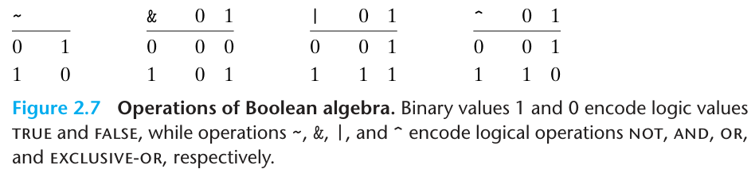

# Chapter 2 Representing and Manipulating Information

??? note "CMU 15-213"
    **Why Bits?**

    Because of electronic implementation: Easy to store bistable elements, and reliable transmitted on noisy and inaccurate wires. 

## 2.1 Information Storage

### 2.1.6 Introduction to Boolean Algebra

十九世纪中期，布尔通过将逻辑值`TRUE`和`FALSE`编码为二进制值`1`与`0`，能够设计为一种代数，以研究逻辑推理的基本原则，这种代数叫做**布尔代数/Boolean algebra**。

布尔代数有四种基本运算`~`、`&`、`|`、`^`，分别对应于逻辑运算**NOT**、**AND**、**OR**与**EXCLUSIVE-OR**，我们可以列出简单的真值表如下：

接下来，我们将上述四个布尔运算推广到**位向量/Bit vectors**的运算，所谓位向量就是固定长度$w$，由`0`与`1`组成的串。所谓的推广也非常简单，就是将上述四个布尔运算应用到位向量的每一位上，得到的结果也是一个位向量。换句话说，就是我们在C语言中学的按位运算。

### 2.1.9 Shift Operations in C

C语言提供了一组移位运算，右移有两种，算数右移与逻辑右移，算数右移在左侧补上**最高位有效值/符号位**，逻辑右移在左侧补上**0**。左移就简单的多，就是在右侧补上**0**。

为什么会有两种右移呢？因为两种右移对应着两种不同的数据类型的计算：算数右移对应的是有符号数的计算，逻辑右移对应的是无符号数的计算，这在下面会讲到。

## 2.2 Integer Representations

### 2.2.1 Unsigned Encodings

无符号数的编码就是经典的二进制编码，假设一个无符号整数数据有$w$位，我们可以将位向量写作$\vec{x}$，也就是$[x_{w-1},x_{w-2},\cdots,x_0]$来表示向量的每一位。我们用一个函数$B2U_w$（是Binary to Unsigned的缩写）来表示二进制向无符号整数的转换：

$$B2U_w(\vec{x}) = \sum_{i=0}^{w-1}x_i2^i.$$

我们很容易可以得知：

- 用$w$位能表示的无符号整数的范围为$[0,2^w-1]$；
- 函数$B2U_w$是一个双射。$B2U_w$将每一个长度为$w$的位向量映射为唯一的无符号整数，相对地，每一个在区间$[0,2^w-1]$内的整数都可以唯一表示为一个长度为$w$的位向量。

### 2.2.2 Two's-Complement Encodings

最常见的有符号整数编码是**补码/Two's-complement**编码。在补码编码中，一个$w$位的有符号整数$\vec{x}$的值可以表示为：

$$B2T_w(\vec{x}) = -x_{w-1}2^{w-1}+\sum_{i=0}^{w-2}x_i2^i.$$

最高有效位也称为符号位，其权重为$-2^{w-1}$，其余位的权重和无符号整数编码一样。同样，我们可以得知：

- 用$w$位能表示的有符号整数的范围为$[-2^{w-1},2^{w-1}-1]$；
- 函数$B2T_w$是一个双射。

类似的，我们可以定义四进制与十六进制的编码。

补码编码有十分有趣的特性：

- 补码的范围是**不对称**的，负数的范围比整数的范围大1，也就是说编码的最小值$T_{{Min}}$没有与之对应的整数。
- 最大的无符号数值刚刚好比最大值的两倍多一点点$U{{Max}}_w=2T{Max}_w+1$。补码的负数的位模式在无符号表示中都变成了比原补码整数大的正数。

??? note "C库里的整数类型"
    在C库中的`limits.h`中定义了一些常用的整数的最大值与最小值，用来限制编译器运行的不同整型数据的取值范围，例如`INT_MAX`、`INT_MIN`、`UINT_MAX`等。
    
    在C库中的`stdint.h`中定义了一些固定大小的整数类型，例如`int8_t`、`uint8_t`、`int16_t`、`uint16_t`等，这些类型很好地提升了程序的可移植性。

有符号数还有下面两种其他的表示方法：

- **反码/Ones'-complement**：除了最高位有效的权是$-(2^{w-1}-1)$，其余和补码是一样的：

$$B2O_w(\vec{x}) = -x_{w-1}(2^{w-1}-1)+\sum_{i=0}^{w-2}x_i2^i.$$

- **原码/Sign-magnitude**：最高位是符号位，用来确定剩下的位应该取正权还是取负权，其余位表示数值的绝对值：

$$B2S_w(\vec{x}) = (-1)^{x_w-1}\cdot\left(\sum_{i=0}^{w-2}x_i2^i\right).$$

这两种编码方式都有统一的缺点：对于数字`0`，有两种完全不同的表示方法，并且这两种编码不能很好地支持算数运算，因而，我们现在开始使用更加方便的补码编码。

??? note "Numbers to Memory"
    对于32位的整型，下面的几个数还是很重要的：`U{Max}=4294967295`，`T{Max}=2147483647`，`T{Min}=-2147483648`。

    另外，`T{Min}`被定义为`-T{Max}-1`而不是`-2147483648`，这是因为`-2147483648`在C语言中是对`2147483648`取负号，而`2147483648`超出了32位正整型的范围，所以只好用`-T{Max}-1`来表示。

## 2.3 Integer Arithmetic

### 2.3.1 Unsigned Addition

## 2.4 Floating Point

### 2.4.2 IEEE 

**Case 1**：规格化值

这种情况下阶码的位表示不全为 `0` 或 `1`，

**Case 2**：非规格化值

阶码的位表示全为 `0`，尾数的位表示不全为 `0`，这时指数 $E = 1 - \mathrm{bias} = -2^{k-1} + 2$，尾数 $1$，这时数值表示为 $1$。

**Case 3**：特殊值

- 阶码全为 `1`，尾数全为 `0`，表示无穷大；
- 阶码全为 `1`，尾数非全为 `0`，表示 `NaN`；
- 阶码全为 `0`，尾数全为 `0`，表示 `0`。

