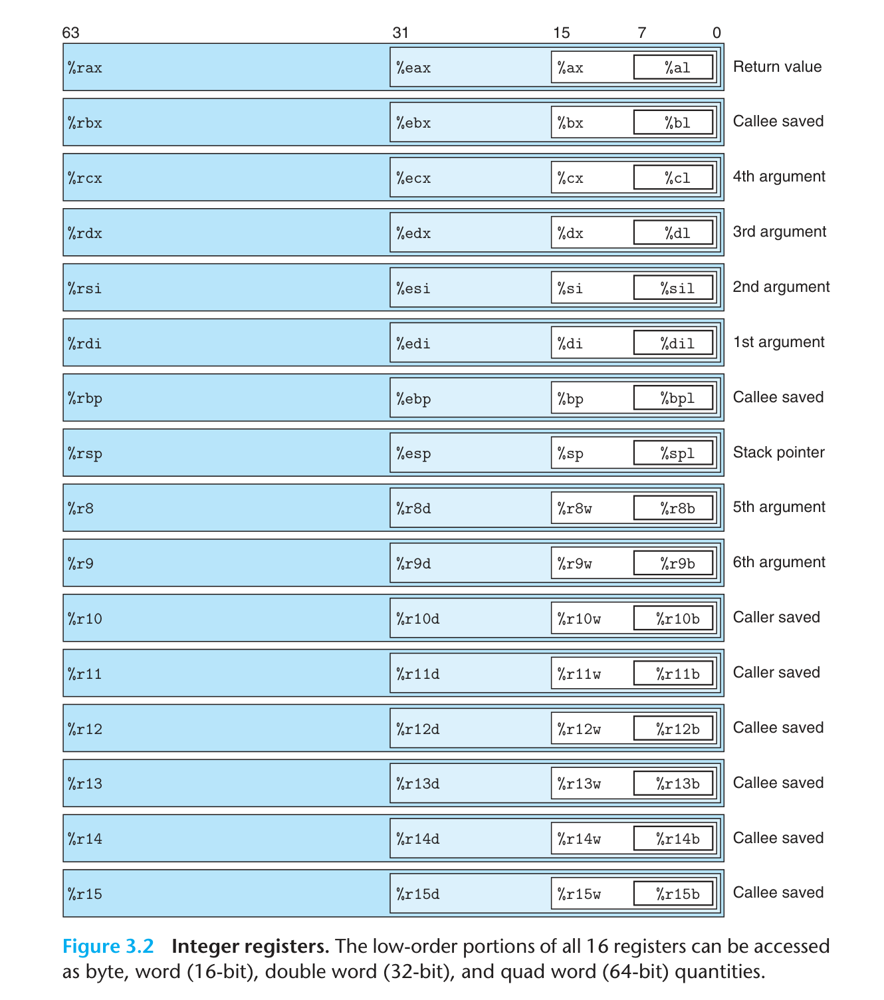

# Chapter 3 Machine-Level Representation of Programs

!!! info "CMU 15-213"
    这里使用的 x86-64 汇编的形式是 AT&T 语法，而不是 Intel 语法。AT&T 语法与 Intel 语法的区别在于操作数的顺序，AT&T 语法是 `source, destination`，而 Intel 语法是 `destination, source`。这种描述的语法会用在 Linux 系统之中，但是当我们阅读 Intel 和 Microsoft 的代码与文档的时候，就要换换脑筋了。


??? info "Tools: Disassembler"


## 3.4 Accessing Information

一个 x86-64 的 CPU 包含一组 16 个存储 64 位值的**通用目的寄存器/General-Purpose Registers**，这些寄存器可以用来存储整数数据和指针。这些寄存器用来存储整数数据和指针。由于指令集与处理器架构的历史演化，它们的长度从 16 位逐渐变成 64 位，名字也并不规则，但是寄存器的分布保证了令人震惊的向下兼容性。虽然他们的名字是**通用目的**的，但是根据 x86-64 规定的使用惯例，每个寄存器都有一定的**特殊用途**，这样就保证了后调用的进程可以接受传递过来的参数，同时运行的过程之中不会覆盖调用进程的寄存器的值。



## 3.5 Arithmetic and Logical Operations

## 3.6 Control

### 3.6.1 Conditional Codes

除了整数寄存器，CPU 还维护着一组**单个位**的**条件码/Conditional Code** 寄存器，他们描述了最近一次算术或者逻辑操作的结果。这些条件码寄存器包括：

- **CF/Carry Flag**：进位标志。如果最近一次的操作导致了一个无符号数的溢出，这也就是进位，那么 CF 就会被设置为 1。
- **ZF/Zero Flag**：零标志。如果最近一次的操作的结果为 0，那么 ZF 就会被设置为 1。
- **SF/Sign Flag**：符号标志。如果最近一次的操作的结果为负数，那么 SF 就会被设置为 1。
- **OF/Overflow Flag**：溢出标志。如果最近一次的操作导致了一个有符号数/补码的溢出，那么 OF 就会被设置为 1。

以算数操作 `t = a + b` 举例，设置条件码的操作与逻辑类似于下面的 C 代码：

- CF：`(unsigned) t < (unsigned) a`
- ZF：`t == 0`
- SF：`t < 0`
- OF：`((a < 0 ) == (b < 0)) && ((a < 0) != (t < 0))`

除了 `leaq` 指令类以外——因为 `leaq` 是用来完成地址计算的——所有操作都会**隐式的**设置操作码。对于逻辑操作而言，进位标志与溢出标志都会被设置成 `0`。对于移位操作，进位标志被设置成为最后一个被移出的位，溢出标志设置成 `0`. `inc` 和 `dec` 指令会会设置溢出标志和零标志，但是不会改变进位标志。

`cmp`和`test`指令类会设置条件码，但是不会改变目的寄存器的值。`cmp`指令会计算第二个操作数减去第一个操作数的结果，但是不会存储结果。`test`指令会计算两个操作数的按位与，但是不会存储结果。

### 3.6.2 Accessing the Conditional Codes

条件码一般不会直接读取，常用的使用方法有三种：

- 根据条件码的某种组合，将一个字节设置为 0 或者 1，这类指令就是 `set` 指令。
- 可以条件跳转到程序的某个其他的部分。
- 可以有条件地传送数据。

### 3.6.3 Jump Instructions

`jmp` 指令会导致程序执行切换到程序中的一个全新的位置，这些跳转的目的地通常用一个标号来标识。`jmp` 指令可以是直接跳转，亦即跳转目标是作为指令的一部分编码的，直接在跳转指令后边跟上一个标号作为跳转目标；也可以是间接跳转，亦即跳转目标是从寄存器或者内存之中读出来的。我们还允许有条件的跳转，这就可以对程序进行控制。

### 3.6.4 Implementing Conditional Branches

#### 3.6.4.1 Conditional Control

#### 3.6.4.2 Conditional Move

实现条件操作的传统方法就是通过使用**控制**的条件转移，当条件满足的时候，就沿着一条路径进行运行，不满足就使用另一种路径。这种策略简单而通用，但是在现代计算机上可能很低效，原因就是现代计算机使用**流水线/Pipelining**来获得高性能，流水线中，每条指令的处理都被分为了多个小阶段，每个阶段执行操作的一小个部分，通过重叠连续指令的方法来获得高性能，比如在取一条指令的同时，执行前面一条指令的算数运算。要做到这一点，就需要实现确定要执行的指令序列，这样才能保持整个流水线充满了指令，进而保持最优的性能。

一旦遇到条件跳转了（也就是分支），流水线处理器就会采用**分支预测**，猜测每条跳转指令是否会执行，猜对了还好，猜错了就会遇到招致很严重的惩罚，会浪费大约 15~30 个时钟周期，程序性能会大幅下降。为了减少这种性能损失，除了不断提升分支预测的正确率之外，现代处理器会使用**条件传送**指令，这种指令会根据条件码的值来决定是否传送数据，这样就可以避免分支预测错误的惩罚，并且极大避免随机情况下分支预测的错误。

但是条件传送也不总是好的，下面三种情况会让条件传送变得难办：

- 两个计算都很难办，比如对于：`val = Test(x) ? Hard1(x) : Hard2(x);`，这样我们就要算两个很难算的东西，反而更加浪费时间；
- 计算有可能出错，比如对于：`val = p ? *p : 0;`，这样就有可能会出现段错误；
- 计算有副作用，比如对于：`val = x > 0 ? x*=7 : x+=13;`，这样算出来的结果就不对了。

所以我们的编译器（gcc）当分支的计算比较简单（至少多算一个花费的时间要比预测错误惩罚低）、比较安全并且没有副作用的时候，才会使用条件传送进行优化。

### 3.6.5 Loop

??? info "Aside: Reverse engineer loops"
    


### 3.6.6 Switch

`switch` 语句可以根据一个整数索引值来进行多重分支，我们使用**跳转表/Jump Table** 这种数据结构来让实现更加高效。跳转表是一个数组，数组的每一个元素都是一个代码段的地址，在代码段内实现当开关的索引值等于 `i` 的时候程序应该采取的动作。当开关情况值的数量比较大而且跨度比较小的情况下，跳转表是一个很好的选择。

下面是描述 `switch` 的实现的一个例子，右侧依赖了 gcc 对跳转表语法的支持

```C title="Original Code"
void switch_eg(long x, long n, long *dest){
    long val = x;
    switch (n) {
        case 100:
            val *= 13;
            break;
        case 102:
            val += 10; // Fall through
        case 103:
            val += 11;
            break;
        case 104:
        case 106:
            val *= val;
            break;
        default:
            val = 0;
    }
    *dest = val;
}
```

```C title="Implemented with Jump Table"
void switch_eg_impl(long x, long n, long *dest){
    static void *jt[7] = {&&loc_A, &&loc_def, &&loc_B, &&loc_C, &&loc_D, &&loc_def, &&loc_D};
    unsigned long index = n - 100;
    long val;
    if (index > 6) goto loc_def;
    goto *jt[index];
    loc_A: val = x * 13; goto done; // case 100
    loc_B: val = x + 10; // case 102
    loc_C: val = x + 11; goto done; // case 103
    loc_D: val = x * x; goto done; // case 104, 106
    loc_def: val = 0; // default case
    done: *dest = val;
}
```

## 3.7 Procedures

### 3.7.1 The Run-Time Stack

### 3.7.2 Control Transfer

### 3.7.3 Data Transfer

在 x86-64 中，绝大多数的过程之间的数据传送是通过寄存器实现的，我们可以将被调用过程需要用到的参数**按照约定的顺序**塞到**某些特定的**寄存器之中，这样被调用的过程就可以使用这些参数了。类似地，当被调用过程返回的时候，要先将返回值放到特定的寄存器 `%rax` 之中，这样就可以让调用者使用这个返回值了。

在 x86-64 之中，我们可以使用寄存器最多传送 6 个整型（包括整数和指针）参数，寄存器的使用是有特殊顺序的，使用的名字取决于要传递的数据类型的大小，比如 64 位的指针类型就可能用到寄存器 `%rdi`，并且这个还是作为第一个参数传递，而 32 位的整数就可能用到寄存器 `%esi`，并且这个还是作为第二个参数传递。下边这个表还是记一下，不然查表很痛苦 ~~（谁愿意看代码的时候被打断呢）~~，不过看多了汇编就会形成肌肉记忆了。

::spantable::

|   操作数大小(位) @span   | 参数数量  @span |        |        |        |        |        |
|:------------------:|:-----------:|:------:|:------:|:------:|:------:|:------:|
|                    |      1      |   2    |   3    |   4    |   5    |   6    |
|         64         |   `%rdi`    | `%rsi` | `%rdx` | `%rcx` | `%r8`  | `%r9`  |
|         32         |   `%edi`    | `%esi` | `%edx` | `%ecx` | `%r8d` | `%r9d` |
|         16         |    `%di`    | `%si`  | `%dx`  | `%cx`  | `%r8w` | `%r9w` |
|         8          |   `%dil`    | `%sil` | `%dl`  | `%cl`  | `%r8b` | `%r9b` |

::end-spantable::

如果有超过 6 个参数，我们就需要使用栈来传递参数了，前 6 个参数照常被复制到寄存器传递，后边的参数依次被**放入**栈中，参数 7 置于栈顶，所有的数据大小都向着 8 的倍数**对齐**，所以一般我们不使用 `pushq` 指令，而是使用 `subq` 指令来调整栈的大小，然后使用 `movq` 指令来将参数放入栈中。

### 3.7.4 Local Storage on the Stack

有些时候，局部数据必须存储在内存之中，常见的情况包括：

- 寄存器不足够存放所有的本地数据；
- 代码之中对某一个局部变量使用了取地址操作 `&`，而寄存器是没有地址而言的；
- 某些局部变量是一个数组或者结构体，这样就需要通过数组和结构引用来访问。

可以通过减小栈指针 `%rsp` 的方法来在栈上分配空间，一般分配的空间都是 8 字节的倍数，分配的结果作为栈帧的一部分，标号为局部变量。局部变量的存储不需要考虑向 8 的倍数对齐，能存下就行。在程序结束之前，需要将栈指针恢复，释放掉局部变量的空间。

### 3.7.5 Local Storage in Registers

### 3.7.6 Recursive Procedures


## 3.8 Array Allocation and Access

### 3.8.1 Basic Principles

### 3.8.2 Pointer Arithmetic

### 3.8.3 Nested Arrays

没啥好说的，多维数组其实就是数组的数组，数组的分配和引用的一般原则也成立，并且会在内存里面分配连续的空间。比如对于声明成 `ElementType D[R][C]` 的数组，它的数组元素 `D[i][j]` 的地址就是 `&D[i][j] = D + L(C * i + j)`，其中 `L=sizeof(ElementType)`。

### 3.8.4 Fixed-Size Arrays

### 3.8.5 Variable-Size Arrays

## 3.9 Heterogeneous Data Structures

### 3.9.1 Structures

结构的所有组成部分都存放在内存的一段连续的区域内，指向结构的指针就是结构第一个字节的地址。

也没啥好说的，只需要知道编译器维护每个字段的字节偏移量进而产生内存引用指令的位移，从而产生对结构元素的引用，进而操纵字段。值得注意的是，结构之中的数组等元素是嵌入在结构之中的，而不是存储指向数组的指针，所以产生结构体 `struct {int* i; long array[2];}` 需要分配 24 字节的空间，而不是 16 字节。

最需要注意的是对齐的问题，下边马上就讲了。

??? info "CMU 15-213"

    1. Structure represented as block of memory, which is big enough to hold all the fields.
    2. Field are ordered according to declaration, even if another order could yeild a more compact representation.
    3. Compiler	determines	overall	size + positions of	fields. Machine-level program has no understanding of the structures in the source code.

### 3.9.2 Unions

联合可以有效规避 C 的类型系统。一个联合的总的大小等于它的最大字段的大小，而不是所有字段的大小之和。联合的字段是共享存储空间的，所以修改一个字段会影响到其他字段。联合的字段的地址都是相同的，所以可以通过一个字段来访问其他字段。联合还可以用来实现类型转换，换句话说就是访问不同数据类型的位模式，比如在联合可以包含一个长整形 `long` 和一个整数数组 `int [2]`，这样就可以令两个 `int` 的位组合来表示一个 `long`。

### 3.9.3 Data Alignment

数据对齐要求对基本数据类型的合法地址进行了一些限制，要求地址必须是某个值的倍数，这个值一般是 2、4 或 8。这是为了提升内存访问的效率，并且还可以简化处理器和内存之间的接口的硬件设计。基本原则是**任何 K 字节的基本对象的地址必须是 K 的倍数**。比如 4 字节的整数 `int` 的地址必须是 4 的倍数，8 字节的双精度浮点数 `double` 的地址必须是 8 的倍数。编译器会在汇编代码中放入命令，指明全局数据要求的对齐，比如在跳转表前放入伪指令 `.align 8`，这样就可以保证**后边紧接着的的数据的起始地址是 8 的倍数**，因为每个表项都长为 8 个字节，所以后边的元素就都遵守 8 字节对齐的限制了，自然而然就对齐了。

对于含有结构体的数据，编译器会在字段的分配之中加入间隙，保证每个字段元素都满足对齐要求，并且结构对本身的地址也有一些要求，对齐要求是结构体中最大的字段的对齐要求，比如一个结构体 `struct {char c; int i;}`，`c` 的对齐要求是 1，`i` 的对齐要求是 4，所以整个结构体的对齐要求是 4，结构体的地址就要是 4 的倍数。

??? info "Aside: Mandatory Alignment"

    如果数据没有对齐，某些行好的处理器对于某些实现多媒体操作的 SSE 指令就无法正确执行，这些指令对 16 字节数据块进行操作，在 SSE 单元和内存之间传送数据的指令要求内存地址必须是 16 的倍数，任何以不满足对齐要求的资质访问内存就会导致异常。所以任何针对 x86-64 处理器的编译器和运行时系统都必须保证分配用来保存可能会被 SSE 寄存器读或写的数据结构的内存，都必须满足 16 字节对齐，所以就有下面两个后果：

    - 任何内存分配函数，比如 `malloc` 分配的内存块的起止地址都要是 16 的倍数；
    - 大多数函数的栈帧边界都必须是 16 的倍数。

    这其实也解释了有一些“莫名其妙”在栈上多分配 8 字节内存的现象，这是为了保证栈帧的对齐要求。

## 3.10 Combining Control and Data in Machine-Level Programs

### 3.10.1 Understanding Pointers

指针类型只不过是 C 提供的一种类型抽象，并不是机器代码的一部分。这里只是介绍一些基本原则：

- 每个指针都对应一个类型，虽然存在通用指针 `void *`；
- 每个指针都有一个值，这个值是某个指定类型的地址，地址可以为 0，也就是 `NULL`；
- 指针通过对左值使用 `&` 操作符来获得，反过来，通过对指针使用 `*` 操作符来间接引用指针；
- 将一种指针转换为另外一种指针，只改变它的类型，并不改变它的值；
- 甚至存在函数指针，函数指针的值是函数机器代码中第一条指令的地址，对于函数 `int func(int x, int* y)`，可以令一个函数指针 `int (*fp)(int, int*) = func`，这样就可以通过 `fp(1, &x)` 来调用函数 `func`。

### 3.10.2 Using the GDB Debugger

!!! info "Important Tool"


### 3.10.3 Out-of-Bounds Memory References and Buffer Overflow

在 Linux 的存储结构之中，栈位于最顶部，尽管 64 位允许访问的空间非常大，由于硬件与 ISA 设计因素，当时（CMU 15-213 fa15 上课时）只能使用 47 位的地址空间，栈底的地址因此是 `0x7fffffffffff`，并且栈的空间是有限的，一般只有 8MB，我们使用 `limit` 命令可以查看栈的大小。

### 3.10.4 Thwarting Buffer Overflow Attacks

### 3.10.5 Supporting Variable-Length Stack Frames

## 3.11 Floating-Point Code

### 3.11.1 Floating-Point Movement and Conversion Operations

### 3.11.2 Floating-Point Code in Procedures

### 3.11.3 Floating-Point Arithmetic Operations

### 3.11.4 Defining and Using Floating-Point Constants

### 3.11.5 Using Bitwise Operations in the Floating-Point Code

### 3.11.6 Floating-Point Comparison Operations

### 3.11.7 Observations about Floating-Point Code