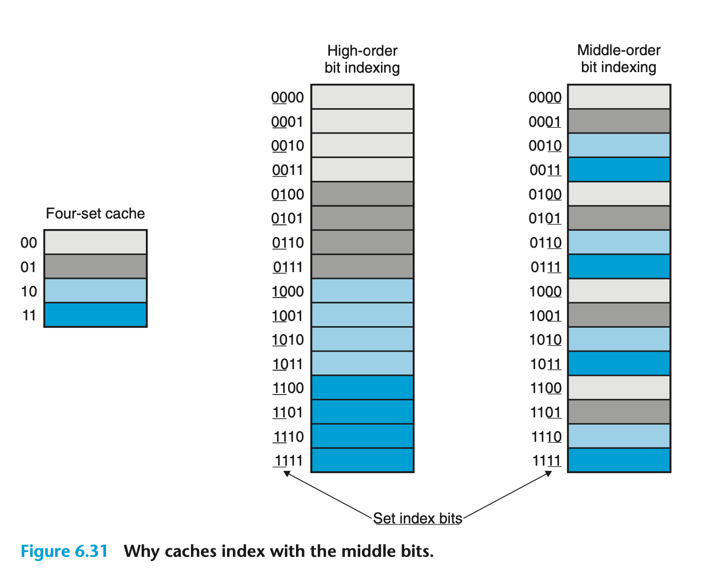

# Chapter 6 The Memory Hierarchy

## 6.1 Storage Technologies

### 6.1.1 Random-Access Memory (RAM)

随机访问寄存器/RAM 分为 静态/SRAM 和 动态/DRAM 两种。SRAM 速度会比 DRAM 更快，并且更加昂贵，可以用来作为高速缓存存储器，DRAM 则常作为主存或者图形系统的帧缓冲区。

SRAM 的每个单元由六个晶体管组成，电路满足**双稳态**性质，只要是有电的状态，就可以无限期地保持在两个不同的电压状态之一，但是其他的任何状态都是不稳定的，不稳定状态会迅速转移到两个稳定状态之一。即使有例如电子噪音的干扰来扰乱电压，当干扰消除的时候，SRAM 就会恢复到原来的状态。

DRAM 将每个位存储为一个极其微小的电容的充电，每个存储单元由一个电容和一个晶体管组成。与 SRAM 不同，DRAM 对于干扰非常敏感，并且经常会有漏电的情况，DRAM 会在 10ms 到 100ms 的时间内丢失电荷，因此需要定期刷新。

对于传统的 DRAM 芯片，每个单元被分为 d 个超单元/supercell，每个超单元都由 w 个 DRAM 单元组成，一个 d×w 的 DRAM 就存储了 dw 位信息。书上给出了一个 16×8 的 DRAM 芯片组织，总共有 16 个 8 位的超单元，超单元被排列成 4×4 的矩形，信息经过引脚/pin 流入流出芯片。

DRAM 都被连接到内存控制器/Memory Controller 上，内存控制器一次传输一个超单元大小的数据，如果要读数据，就将超单元的**行地址/行访问选通脉冲/Row Access Strobe** 与**列地址/列访问选通脉冲/Column Access Strobe** 依次发到 DRAM，这两个请求共享一个地址引脚，然后 DRAM 首先相应 RAS，将该行的整个数据都复制到内部行缓冲区，然后响应 CAS，从行缓冲区复制出一个超单元，发送到内存控制器，内存控制器再拿数据做别的事情。

### 6.1.2 Disk Storage

从磁盘上读信息的时间为毫秒级。

磁盘由**盘片/Platter** 组成，每个盘片有两个表面/Surface，表面覆盖着磁性记录材料，盘片中间是可以旋转的主轴/Spindle，让盘片以固定的旋转速率/Rotational Rate 旋转。磁盘表面被划分为一系列的同心圆——**磁道/Track**，磁道被划分为一组扇区/Sector，每个扇区存储一个固定大小的数据块，扇区大小通常为 512 字节，扇区之间会被间隙/Gap 分隔开。

磁盘使用读/写头 (Read/Write Head) 来读写存储在磁性表面上的位，读写头连接到传送臂的一端，传送臂驱动读写头定位在盘面的磁道上，这个过程叫寻道/Seek，多盘面的磁盘有多个读写头，这些读写头垂直排列，保证在任何时刻所有的读写头都在同一个柱面上。

决定对扇区的访问时间/Access Time 有三个部分组成：

- 寻道时间/Seek Time：移动传送臂定位到目标磁道的时间被称为寻道时间 $T_{seek}$，现代驱动器的寻道时间是通过几千次对随机扇区的寻道求平均时间来测量的，一般在 3ms 到 9ms 之间，最高可达 20ms。
- 旋转时间/Rotational Latency：在定位到目标磁道后，读写头需要等待目标扇区的第一个位旋转道读写头下，这个时间就是旋转时间，最大旋转延迟为 $T_{\text{max}\ \text{rotation}} = \dfrac{1}{\text{RPM}}\times\dfrac{60\text{s}}{1\text{min}}$。
- 传送时间/Transfer Time：当目标扇区的第一个位位于读写头下的时候，驱动器就可以开始读写扇区的内容了，扇区的平均传送时间可以粗略估计如下：$T_{\text{avg}\ \text{transfer}} = \dfrac{1}{\text{RPM}}\times\dfrac{1}{\text{average sectors per track}}\times\dfrac{60\text{s}}{1\text{min}}$。

现代磁盘与操作系统会将磁盘映射到相对简单的**逻辑块**序列，磁盘封装着一个小的硬件设备——**磁盘控制器**，用来维护逻辑块编号与物理磁盘扇区之间的映射关系。当需要读取某个磁盘扇区的数据到主存的时候，操作系统会发射一个命令到磁盘控制器，控制器进行一个快速的查找，将逻辑块号翻译成（盘面，磁道，扇区）的三元组，然后就可以读数据了。

### 6.1.3 Solid State Disks (SSD)

## 6.2 Locality

## 6.3 The Memory Hierarchy

### 6.3.1 Caching in Memory Hierarchy

**高速缓存/Cache** 是一个小而快速的存储设备，作为**存储在更大也更慢的设备中的数据对象的缓冲区域**，使用高速缓存的过程称为**缓存/Caching**。

存储器层次结构的核心思想是：对于每个 k，位于 k 层的更快更小的存储设备作为位于下一层的更大更慢的存储设备的缓存。也就是说，层次结构的每一层都缓存来自于较低一层的数据对象。

第 k+1 层的存储器被划分成连续的**数据对象组块/Chunk**，也被称为**块/Block**，块的大小可变可不变。第 k 层的存储器被划分为较少的块的集合，每个块的大小和 k+1 层的块的大小相同，在任何情况下，第 k 层的缓存都包含着第 k+1 层块的一个子集的副本。数据总是以块为大小作为**传输单元/Transfer Unit** 在层与层之间来回复制的。虽然在相邻层之间的块的大小是固定的，但是在其他层之间的块可以大小不一样。比如 L0 与 L1 之间会以字为单位传输，L1 与 L2 之间会以几十个子节为单位传输，更远可能以几百或几千字节为单位传输。

**缓存命中/Cache Hit**：当程序需要在 k+1 层的某个数据对象 d 时，首先会在第 k 层的缓存寻找，如果正好找到了，就称为缓存命中，这种情况就会直接读取数据。一个具有良好时间局部性的程序可以使得缓存命中率非常高，这样就可以减少访问较慢存储器的次数，提高程序的性能。

**缓存不命中/Cache Miss**：如果在第 k 层的缓存中没有找到数据对象 d，就称为缓存不命中，这种情况下，第 k 层的缓存从第 k+1 层的缓存中取出包含 d 的那个块，如果第 k 层的缓存已经满了，就可能会覆盖现存的一个块，这个过程被称为**替换/Replacing** 或**驱逐/Evicting** 这个块，被驱逐的块有时候被称为**牺牲块/Victim Block**。**替换策略**决定该替换哪个块，替换策略的目标是尽量减少缓存不命中率，常见的替换策略有**最近最少使用/LRU**、**先进先出/FIFO**、**随机/Random** 等。

缓存不命中也有很多种类：如果第 k 层的缓存是空的，那么对任何数据对象的访问都会不命中，这种空的缓存被称为**冷缓存/Cold Cache**，这样的不命中被称为**强制性不命中/Compulsory Miss** 或者**冷不命中/Cold Miss**。冷不命中通常是短暂的事件，不会在反复访问存储器使得**缓存暖身/Cache Warmup** 之后的稳定状态下出现。

高层缓存是用硬件来实现的，并且由于随机放置块的代价很高，通常使用的是更加严格的放置策略，将第 k+1 层的某个块限定在第 k 层的块的一个小的子集之中（甚至这个子集只有一个块）。限制性放置策略会引起**冲突不命中/Conflict Miss**，这种情况下，缓存足够大，可以保存被引用的数据对象，但是由于这些对象会映射到同一个缓存块中，缓存就一直会不命中。

程序通常会按照一系列阶段来运行，每个阶段访问缓存块的某个比较稳定不变的集合，这个块的集合被称为这个阶段的**工作集/Working Set**，当工具集的大小超过缓存的大小时，就一定会发生不命中，这种不命中被称为**容量不命中/Capacity Miss**，这样的不命中不会在每次读内存都会发生，只是说在取数据的整个过程中一定会发生，这是简单的鸽笼原理。

缓存管理

### 6.3.2 Summary of Memory Hierarchy Concepts

简而言之，基于缓存的存储器层次结构行之有效的原因不仅仅来自于较慢的存储设备比较快的存储设备廉价，还因为程序倾向于展示局部性：

- **时间局部性/Temporal Locality**：
- **空间局部性/Spatial Locality**：

## 6.4 Cache Memories

### 6.4.1 Generic Cache Memory Organizations

考虑存储器地址有 $m$ 位的计算机系统：我们将高速缓存组织成 $S = 2^s$ 个高速缓存组/Cache Set，每个组分为 $E$ 个**高速缓存行/Cache Line**，每个行由一个 $B = 2^b$ 子节的**数据块**、一个指明该行是否包含有意义的信息的**有效位/Valid Bit**，与 $t = m - s - b$ 个**标记位**组成。高速缓存的大小指的是所有块大小的和，也就是 $C = S\times E\times B$。而缓存将一个 $m$ 位地址位划分成了三部分，从高到低分别是**标记位**、**组索引位**和**块偏移位**，在寻找对应的缓存位置的时候会按照这三部分的翻译来找到对应的缓存。

当我们要在缓存中读取地址对应的数据时，首先通过组索引位确定需要查找的缓存组，再通过标记位确定要读取哪个缓存行，最后通过块偏移确定从缓存块的哪个位置读起。

### 6.4 2 Direct-Mapped Caches

对于每一组只有一行/E 为 1 的高速缓存，我们称之为**直接映射高速缓存/Direct-Mapped Cache**。

还是像上面所说，高速缓存确定一个度内存字 w 的请求是否命中，然后抽出被请求的字的过程分为三步：**组选择**、**行匹配**、**字抽取**，这里拿直接映射高速缓存举例子，只是因为在这种情况下，这三个步骤是最简单的，并且推广到一般的缓存也不困难。

- **组选择**：高速缓存从该字 w 的地址中取出 s 位组索引位，解释组索引位为一个对应于组号的无符号整数，然后访问这个高速缓存组。
- **行匹配**：直接映射高速缓存中的行匹配很容易，因为只有一行，所以这一步要干的只有两个部分：首先确定有效位是否被设置，只有有效位被设置之后，标记位和块中的数据才是有意义的；其次确定该缓存行中的标记位于地址中的标记位是否匹配，如果匹配，就说明缓存命中，不然就得到一个缓存不命中。
- **字选择**：一旦缓存命中，我们就知道要读的字 w 就在这个块中的某个地方，最后一步就确定这个字是在块的哪个位置开始的。其实就是将数据块看成一个子节数组，子节偏移是到这个数组的一个索引。教材上的例子是数据块有八个子节，偏移量是 4，所以要读的字是从索引为 4 的子节开始的。
- **行替换**：如果缓存不命中，就需要从存储器体系结构的下一层去除被请求的块，然后将新的块存储在组索引位指示的组的一个**高速缓存行**之中。这个过程被称为**行替换**，直接映射高速缓存中的行替换是最简单的，因为只有一行，所以只有一种选择，就是替换这一行；对于一般的缓存，当所有组中都是有效的高速缓存行，就需要额外的替换策略。

教材上给的例子是描述为 $(S, E, B, m) = (4, 1, 2, 4)$ 的缓存组，换句话说就是有四个缓存组，每个组有一个缓存行，一个缓存行塞两个字节的数据块，地址却是四位的，所以一共有 16 字节个对应的内存，记为 8 个内存块，每个内存块对应 2 个字节，但是这超出了缓存的大小，所以就一定会有某两个内存块映射到同一个缓存组，反正就是换啊换的。

相较于取高的有效位作组索引位，取中间位当组索引位看起来有一些怪，但是对缓存的利用会更加均匀。就比如顺序扫描一个数组，取自高位当组索引位的缓存就一直只会保存一个组的元素，不能让缓存尽可能的满起来，而取中间位当组索引位的缓存就会让缓存有较高的使用效率。

### 6.4.3 Set-Associative Caches
