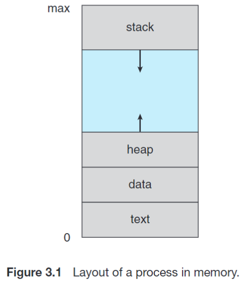

# Process, Thread and Concurrency

## 进程/Process

### 1. 基本概念

**进程/Process** 是被加载到内存中、正在运行的程序，**是资源的分配和保护的单元/A Unit of Resource Allocation and Protection**。包括以下部分：

<div class="result" markdown>

{ align=right width=35% }

- Code or Text：文本段，存放可执行代码，最开始存放在硬盘内的可执行文件里；
- Data Section：数据段，存放全局变量（比如 `.bss` 段和 `.data` 段）；
- Program Counter：程序计数器，存放下一条执行的指令的地址；
- Content of Process's Registers：寄存器内容，进程之间切换的时候需要保存寄存器的值，以便下次运行使用；
- Stack and Heap：栈和堆，存放调用函数时候的临时数据和动态分配的内存。

</div>

对于 C 语言的内存布局，从高地址到低地址简单概述如下：

- 高端内存：内存位置最高的地方单独用于传递参数 `argc` 和 `argv` 到 `main()` 函数；
- 栈和堆：分别向低地址和高地址增长；
- 未初始化的全局变量（`.bss` 段）；
- 初始化的全局变量（`.data` 段）；
- 程序代码（`.text` 段）。

运行时栈/Runtime Stack：A stack on which items can be pushed or popped。

- 运行时栈的条目被称为激活记录/Activation Record；
- 激活记录内保存了调用函数时的函数参数、局部变量、返回地址与返回值，调用者和被调用者也需要遵循调用惯例柏村寄存器的值；
- 栈完全由用户本身操控，编译器代表用户生成代码来操作栈。
- 运行时栈也会向下增长，递归调用过深就会爆掉（Runtime Stack Overflow），这时候就产生一个陷阱/Trap，操作系统内核就会终止程序。

进程控制块/Process Control Block/PCB/Task Control Block：保存与每个进程有关的信息。

- 每个进程有且只有一个 PCB，PCB 会在新进程被创建的时候分配，在进程终止的时候被释放；
- 进程状态/Process State：可以包含新建、就绪、运行、等待、停止等状态；
- 程序计数器/Program Counter：该进程将要执行的下条指令的地址；
- CPU 寄存器：所有和进程相关的寄存器的值，比如累加器、索引寄存器、堆栈指针和通用寄存器等等；
- CPU 调度信息：包括进程的优先级、调度队列指针、进程状态等；
- 内存管理信息：包括数据的基址和界限、页表、段表等；
- 记账信息/Accounting Information：包括 CPU 使用时间、实际使用时间、时间期限等；
- I/O 状态信息：分配给进程的 I/O 设备列表、打开文件列表等。

进程的状态：

- 新建/New：进程正在被创建；
- 就绪/Ready：进程已经准备好运行，等待分配处理器；
- 运行/Running：进程正在被执行；
- 等待/Waiting：进程正在等待某个事件发生；
- 终止/Terminated：进程已经执行完毕。


### 2. 进程的创建

当某个进程创建新进程的时候，有两种执行可能：

- 父进程继续执行（父进程和子进程并发执行）；
- 父进程等待子进程执行完毕之后再继续执行；

被创建的子进程的地址空间也有两种可能：

- 子进程是父进程的副本/Clone，具有和父进程同样的程序和数据；
- 子进程加载另一个新程序。

UNIX 系统使用 `fork()` 系统调用来创建新进程，创建的新进程基本完全是父进程的副本，子进程地址空间完全复制了父进程的地址空间，但是别的地方有一些区别：

- 子进程和父进程的 `pid` 和 `ppid` 是不一样的；
- 子进程拥有父进程文件描述符的副本，这些描述符指向同样的底层对象、共享文件指针位置，便于使用管道等设施完成进程间通信；
- 子进程的资源计数被设置为 0。

当调用 `fork()` 失败的时候

一般来说，`fork()` 过后的子进程会使用 `exec()` 系统调用家族来加载新程序，`exec()` 系统调用会将子进程的地址空间替换为新程序的地址空间，但是子进程的 `pid` 和 `ppid` 会保持不变。在调用 `exec()` 的时候，可以指定可执行文件的路径、传入的命令行参数和环境变量列表。因为 `exec()` 完全将新进程的地址空间覆盖掉了，所以 **`exec()` 系统调用只会在发生错误的时候返回，这时候返回值为 -1**，同时全局变量 `errno` 会被设置为相应的错误码。也就是说下面的第 14 和 15 行代码不会被执行。

```c
#include <stdio.h>
#include <sys/types.h>
#include <sys/wait.h>
#include <unistd.h>

int main() {
    pid_t pid = fork();
    int status = 10086;
    if (pid < 0) {
        printf("Error\n");
    } else if (pid == 0) {
        pid_t ppid = getppid();
        execlp("/bin/ls", " ls", NULL);
        printf("Child process: with parent pid %d\n", ppid);
    } else {
        pid_t terminated = wait(&status);
        printf("Parent process: with child pid %d teriminated\n", pid);
        printf("with exit status %d/%d and pid %d\n", WEXITSTATUS(status), status, terminated);
    }
}
```

注意！如果没有这个 `wait()` 函数，那么这个程序的输出**不是确定的/Deterministic**。在子进程被创建之后，我们就需要关注两个活动进程了，但是是 CPU 调度程序决定了在某个时刻哪个进程被执行，这个调度程序复杂，不能假设某个进程先于另一个进程被执行。

### 3. 进程的终止

上面的代码其实还包含了更多内容，但是都和进程的终止有关。

当进程执行完最后一条语句并且通过系统调用 `exit()` 请求操作系统删除自身的时候，进程终止。`exit()` 系统调用接受整数参数作为这个进程的返回码（Exit/Error/Return Code）。C 语言 `main` 函数也会隐式调用 `exit()` 函数。进程终止的时候，可以将状态值（一般是整数）通过 `wait()` 函数传递到父进程，所有的进程资源会由操作系统释放并且回收。

别的时候也会出现进程终止，通过适当系统调用，比如 `kill()` 来终止另一个进程。但是通常只有父进程才能终止子进程，而且终止子进程需要知道这些进程的 `pid`，所以在创建进程的时候需要将新创建进程的 `pid` 传递给父进程。

在上面这个程序中，父进程通过 `wait()` 系统调用等待子进程终止，`wait()` 函数会**阻塞**父进程，直到**任何一个**子进程终止。仔细来看，`wait()` 系统调用的原型为 `pid_t wait(int *stat_loc)`，也就是接受参数为一个指向整数的指针，这个整数（程序中为 `status`）会被设置为子进程的退出状态，并且返回子进程的 `pid`。这样父进程就可以知道是哪个进程终止了，并且通过退出状态处理异常。后面的宏 ·`WEXITSTATUS(status)` 可以从 `status` 中提取出子进程的退出状态。同时，`WIFEXITED(status)` 宏可以判断子进程是否正常终止，`WIFSIGNALED(status)` 宏可以判断子进程是否因为信号终止。

`pid_t waitpid(pid_t pid, int *stat_loc, int options)` 函数可以指定等待哪个子进程终止，`pid` 参数指定等待哪个子进程，当其为 0 的时候等待与调用进程在同一进程组中的任何子进程，当其为 -1 的时候等待任何子进程，当其为负数的时候等待进程组号为 `-pid` 的子进程，正号不多赘述。`option` 可以指定为 `WNOHANG`，表示非阻塞模式：如果没有子进程状态变化，立即返回 0；`WUNTRACED`：报告因信号停止（如 `SIGSTOP`）的子进程。

我们又提到了**信号**，信号是一种特殊的软件中断/Software Interruptions，可以被进程接收，也是一种异步事件，程序在接收到信号时必须以某种方式进行处理或响应。操作系统定义了很多信号，每个信号对应着名字、数字与含义，每个信号都在进程中都有默认行为。比如 `SIGKILL` 信号会立即终止进程。大多数信号可以被忽略或者呗用户定义的处理程序/handler 处理，但是有一些信号是不能被忽略的，比如 `SIGKILL` 和 `SIGSTOP`。

`signal()` 系统调用允许进程指定如何处理信号：

- `signal(SIGINT, SIG_IGN)`：忽略 `SIGINT` 信号；
- `signal(SIGINT, SIG_DFL)`：恢复 `SIGINT` 信号的默认行为；
- `signal(SIGINT, my_handler)`：指定 `SIGINT` 信号的处理程序为 `my_handler`，其函数原型需要为 `void my_handler(int sig)`。

```c
#include <stdio.h>
#include <signal.h>

void my_handler(int sig) {
    fprintf(stdout, "I don't want to die");
    return;
}

int main() {
    signal(SIGINT, my_handler);
    while (1) ; // infinite loop
}
```

回到进程的终止，父进程终止子进程的原因有很多：

- 子进程使用了超过它所分配的资源（父进程需要有检查子进程状态的机制）；
- 分配给子进程的任务不再需要；
- 父进程正在退出，且操作系统不允许无父进程的子进程继续执行。对于这类系统，如果一个进程终止（无论是正常还是不正常终止），那么它的子进程都应该被终止，这种现象被称为级联终止/Cascading Termination。

我们经常谈论僵尸进程/Zombie Process 和孤儿进程/Orphan Process。当一个进程终止的时候，操作系统会释放其资源，但是有一个资源不会被释放：进程的 PCB，这是因为进程表包含进程的退出状态，父进程需要读取其退出状态来处理可能的异常。当进程终止的时候，其在进程表中的条目依然存在，这时候这个进程变为僵尸进程，**直到父进程调用 `wait()` 系统调用来获取子进程的退出状态**，**或者父进程结束掉了**，这时候进程表中的条目才会被释放。所有的进程结束之后都会过度到僵尸进程这种状态，但是一般而言僵尸进程都是短暂存在的。再说僵尸进程并不是真正意义上的进程（回忆：进程是被加载到内存中、正在运行的程序），僵尸进程只是在内存中的一个 PCB，不消耗 CPU 资源，但是不处理的话会大量占用内存资源，甚至导致 `fork()` 系统调用失败。

还可以通过 Signal 来结束僵尸进程，当子进程结束的时候，会发一个 `SIGCHLD` 信号给父进程，父进程可以通过处理这个信号来调用 `wait()` 系统调用来处理僵尸进程。

当父进程没有调用 `wait()` 就终止，那么这个进程就会变成孤儿进程，孤儿进程会被 `pid` 为 `1` 的进程收养，比如 `init` 会定期的调用 `wait()`，收集孤儿进程的退出状态，并释放进程表条目。

孤儿进程这个东西甚至是有用的：如果我们想要创建一个守护进程/Daemon Process，我们可以 `fork()` 两次，让孙子进程执行对应任务，而子进程直接终止，这样孙子进程就会成为孤儿进程从而被 `init` 收养。我们就得到了一个在后台运行的、生存期长的进程，这样的进程就是守护进程。

### 4. 进程的通信

好抽象。。。

## 线程/Thread

