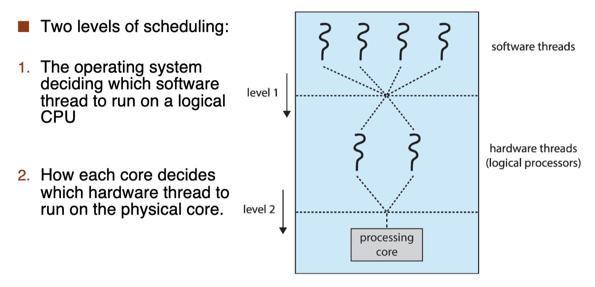

# CPU Scheduling

## 基本概念

多道程序/Multiprogramming 的设计目标是无论何时都有进程运行，进而最大化 CPU 的利用率。分时系统的目标是在进程之间快速切换 CPU，以便用户在运行的时候可以与其进行交互。进程调度器/Process Scheduler 会在多个可用进程的集合之中选择一个可用进程到 CPU 核心上运行。

CPU 的成功调度取决于如下观察到的进程属性：进程执行包括周期性进行的 CPU 执行和 I/O 等待，进程在这两个状态之间不断切换。进程执行从 CPU 突发/CPU Burst 开始，之后 I/O 突发/I/O Burst，接着再次 CPU 突发，以此类推，最后的 CPU 突发通过系统请求结束，进程终止。

通常，大多数进程可以被分为两类：

- I/O Bound Process：花费在 I/O 上的时间多于花费在计算上的时间，只会有很少的 CPU 突发；
- CPU Bound Process：花费在计算上的时间多于花费在 I/O 上的时间，如果存在 I/O 突发，那么会很短，大多很少生成 I/O 突发。

CPU 调度需要维护进程的调度队列，进程会在不同的队列之间移动：

- 就绪队列/Ready Queue：包含所有驻留在主存中，处于就绪状态准备运行的进程；
- 等待队列/Waiting Queues：存放等待着某个事件发生的进程；
- Device Queues：存放等待某个 I/O 设备的进程。
- ...

这些队列都使用链表实现，头结点都有着两个指针，分别指向链表的第一个和最后一个 PCB 块，每个 PCB 块也包含一个指针，用于指向队列的下一个 PCB 块。

就绪队列只有一个，但是等待队列一般有多个，因为等待队列等待的事件有很多种，比如等待 I/O 完成、等待子进程终止，等待中断等等：

- 发出 I/O 请求的进程就会放在 I/O 等待队列中；
- 进程可能创建一个新的子进程，这时候就放在子进程等待队列中，等待子进程终止；
- 进程可能由于中断或者时间片到期，被强制释放 CPU，这时候也被放在等待队列中。

我们把多个等待执行的进程都存放在主存中，很多操作系统还有另外一种形式的调度：交换/Swap。主要思想是：有时从主存中（以及从对 CPU 的争用中）删除一个进程是有利的，这时就可以降低多道程序的度/Degree（即当前在内存中的进程数量）。这种情况下，我们将进程的当前状态保存，将其换到硬盘上，知道被调度的时候才会换入内存、恢复状态，从停止执行的地方继续执行。

Swap 其实就提到了**上下文切换/Context Switch**：举一个中断的例子，当中断发生的时候，系统需要保存当前运行在 CPU 上的进程的上下文，以便处理终断之后可以恢复上下文。进程的上下文使用 PCB 表示，包含 CPU 寄存器的值、进程的状态和内存管理信息等。通常，通过执行状态保存保存 CPU 当前状态（包含内核模式和用户模式），之后通过状态恢复恢复 CPU 当前状态。

上下文切换也分为自愿的和非自愿的：

- 当进程放弃对 CPU 的控制的时候，会发生资源上下文切换，这是因为它需要当前不可用的资源；
- 非资源上下文切换发生在 CPU 已从进程中取出的时候，比如当前时间片到期或者被更高优先级的进程抢占的时候。

上图的过程就是一个上下文切换的过程，微观上看，将状态存到 PCB 和从 PCB 恢复状态的过程就是右边的过程，这也就是分派器/Dispatcher 的职责。从前一个进程暂停运行到下一个进程开始运行的时间叫做 **Dispatch Latency**。

操作系统的设计强调机制/Machanism 与策略/Policy 分离，这里谈到的机制就是分配器、队列与上下文切换，策略就是调度策略。上文基本已经阐述清楚了 CPU 调度的机制，下面我们将以几个调度策略来考虑如何设计优秀的调度策略。

## 调度准则

## 调度策略

总的来说，设计调度策略是复杂的：因为我们需要平衡不同目标，比如想要最大化吞吐量就不能有过多的上下文切换、有过少的上下文切换就会提升响应时间。同时，调度策略也不能过于复杂，这样调度时间就会变长，也会增加系统开销。

### 1. 调度策略的分类

需要进行 CPU 调度的情况可以分为下面四种：

1. 当前进程从运行状态/Running 切换到等待状态/Waiting 时；
2. 当前进程从运行状态/Running 切换到就绪状态/Ready 时；
3. 当前进程从等待状态/Waiting 切换到就绪状态/Ready 时；
4. 当前进程从运行状态/Running 切换到终止状态/Terminated 时；

而调度策略可以按照发生调度的时机进行分类：

- 非抢占式调度/Nonpreemptive Scheduling/Cooperative：只有当进程自愿放弃 CPU 的时候，才会发生调度，着眼当前 CPU 正在执行的进程，调度只有可能发生在第一种和第四种情况下，因为只有这时的调度原因是该进程自愿放弃 CPU；
- 抢占式调度/Preemptive Scheduling：进程可以被别的进程抢占执行，尽管别的进程可以继续执行下去，也就是在上面的任何时候都有可能发生调度，若以下面的优先级调度为例，有可能有某个新建的进程优先级很高，就直接把当前 CPU 上的进程抢占下来。

在非抢占调度下，如果某个进程被分配到 CPU，这个进程就会一直使用 CPU，直到它终止或等切换到等待状态。

我们认为抢占式调度是更好的，因为可以使操作系统对程序有更多的控制，尽管我们有时钟中断等手段来获得 CPU 的控制权；也可以提升系统的响应性。但是抢占式调度确是复杂的，其会引入很多有关于进程同步的话题，可以简单考虑共享数据访问/Access to shared data，内核态的抢占/Preemption while in the kernel mode，以及重要操作系统活动中的中断/Interrupts occurring during crucial OS activities 这些问题。

### 2. First-Come, First-Served (FCFS)

策略很简单：先请求 CPU 的进程会首先被分配到 CPU。FCFS 策略可以通过 FIFO 队列简单实现。下图是一个简单的例子：

FCFS 的缺点是平均等待时间往往很长。并且如果进程的 CPU 突发时间变化很大，那么平均等待时间的变化也会很大。另外，**FCFS 是一种非抢占调度**，就很有可能出现一种情况：有一个长时间的 CPU 密集型进程后边跟着很多 I/O 密集型进程，这时很多端的进程都等待着一个长的进程，这种情况被称为**护航效应/Convoy Effect**。

### 3. Shortest-Job-First (SJF)

该策略将每个进程与该进程下一个 CPU 突发的长度联系起来，当 CPU 变得空闲的时候，就会选择下一个 CPU 突发时间最短的进程，如果两个进程有相同的 CPU 长度，那么就需要用 FCFS 来决定。因此这个策略有时候也被称为**最短下次 CPU 突发调度/Shortest-Next-CPU-Burst Scheduling**。

事实证明 SJF 算法确实是最优的，因为对于任意给定的一组进程，SJF 算法总是会生成最小的平均等待时间。但是 SJF 算法是不可行的，我们不能在 CPU 调度上加以实现，因为我们没有办法知道下一个 CPU 突发的长度。一种方法是使用前面观测到的 CPU 突发时间的指数平均值来预测下一个 CPU 突发的长度。

$$
\tau_{n+1} = \alpha t_n + (1 - \alpha) \tau_n
$$

这里的 $\tau_{n+1}$ 是预测的下一个 CPU 突发的长度，$t_n$ 是实际观测到的 CPU 突发的长度，$\tau_n$ 是上一个预测的 CPU 突发的长度，$\alpha$ 是一个在 0 和 1 之间的值，控制我们所预测的近期和过去历史的相对权重，通常是 0.5，表示最近的历史和过去的历史同等重要。

上个式子通过递归定义，将其 $\tau_n$ 展开，可以得到

$$
\tau_{n+1} = \alpha t_n + (1 - \alpha) \alpha t_{n-1} + (1 - \alpha)^2 \alpha t_{n-2} + \cdots + (1 - \alpha)^{n+1} \tau_0
$$

SJF 算法有两种形式：抢占的和非抢占的。当一个新进程到达就绪队列但是有一个进程正在执行的时候，这两种策略就产生了差别：

- 若是非抢占的 SJF，尽管可能新进程的 CPU 突发时间比当前进程**剩下**的 CPU 时间短，新进程仍然会等待当前进程执行完毕，并将新进程放在就绪队列的顶部；
- 在上面的情况下，抢占 SJF 调度会停止当前进程，将新进程放在 CPU 上执行。抢占 CPU 调度有时候也被称为**最短剩余时间优先调度/Shortest-Remaining-Time-First Scheduling**。

### 4. Round-Robin (RR)

**轮转调度/Round-Robin Scheduling** 类似于 FCFS 算法，但是为了避免护航效应，轮转调度增加了抢占以切换进程。基本思想是：我们给每个进程一小段执行的时间单元，这个时间单元被称为**时间片/Time Slice** 或者**时间配额/Time Quantum**，当进程用完了时间片，就被踢下去，等待下一次调度。这时候就绪队列也就成为了一个循环队列。

具体而言，我们再次将就绪队列视为进程的 FIFO 队列，新进程添加到就绪队列的尾部，调度程序从就绪队列中选择第一个进程，将定时器设置在这个进程的时间片后中断，然后分派这个进程。接下来有可能发生两种事情：

- 进程的 CPU 突发时间短于时间片，进程在时间片结束之前自动释放 CPU，调度程序直接选择下一个进程就可以了；
- 进程的 CPU 突发事件长于时间片，那么定时器就会中断，进而中断操作系统，操作系统会让分配器进行上下文切换，将当前进程放在就绪队列的尾部，然后选择下一个进程。

### 5. Priority Scheduling

最短作业优先调度/SJF 是**优先级调度/Priority Scheduling** 的一个特例。对优先级调度而言，我们将每一个进程分配一个优先级，具有最高优先级的进程优先分配 CPU 执行。优先级可以是内部的和外部的：

- 内部的：比如一些测量数据，SJF 策略以预测的 CPU 突发时间作为优先级；
- 外部的：用户可以指定任务的重要程度。

值得注意的是，优先级其实就是在某个范围内的一个数字，但是数字大小对应的优先级是不确定的，低的数字可以对应高的或者低的优先级，并没有一个统一的标准。但是教材、PPT 都是使用小数字来表示高优先级的。

优先级调度可以是抢占的和非抢占的。当一个进程到达就绪队列的时候，就比较它的优先级和当前正在进行的进程的优先级，如果新到达的进程的优先级高于当前运行的进程的优先级，抢占式调度就会抢占 CPU，非抢占式调度就只会将该进程放在就绪队列的顶部（或者说应该放的位置）。优先级调度很容易实现，只需要将就绪队列实现成优先队列/堆就可以了。

优先级调度的一个问题是**无穷阻塞/Indefinite Blocking**，也被称为**饥饿/Starvation**。有可能一个低优先级进程一直都得不到 CPU，很可能是因为一直都有高优先级的进程在运行。低优先级进程无穷等待的解决方法之一好似老化/Aging，老化逐渐增加在系统中等待很长时间的进程的优先级，这样低优先级进程不久就可以拥有高优先级，进而很快被执行。另一种方法是将轮询和优先级调度结合起来，系统执行最高优先级的进程并且使用轮询运行具有相同优先级的进程，下面是一个简单的例子：

### 6. Multi-Level Queue Scheduling

### 7. Multi-Level Feedback Queue Scheduling

???- Info "What's a Good Scheduling Algorithm?"
    省流：几乎没有可用的分析结果和理论结果，只能通过模拟或者实现来评估调度算法。

    

## 多处理器调度

如果有多个 CPU，一方面负载均衡成为了可能，另一方面我们也需要更为复杂的调度策略。但是多 CPU 调度和单 CPU 调度一样，没有一个最佳的解决方案。

现代计算系统中，多处理器/Multiprocessor 已经适用于以下系统架构：

- 多核 CPU/Multi-core CPU；
- 多线程核/Multi-threaded cores；
- MUMA 系统；
- 异构多处理。

### 1. 多处理器调度方法

对于多处理器系统调度，根据调度的对称性可以分为两种：

- **非对称多处理/Asymmetric Multiprocessing**：一个处理器是主服务器，处理所有调度决定、I/O 处理以及其他系统活动，其他的处理器只是执行用户代码；
- **对称多处理/Symmetric Multiprocessing**：每个处理器都是自调度的，通过让每个处理器的调度程序检查就绪队列，并且选择要运行的线程来进行调度。

非对称多处理由于只有一个处理核访问系统数据结构，减少了数据共享，所以很简单；但是有一个缺点：主服务器可能成为降低整体系统性能的瓶颈。支持多处理器的**标准方法**是对称多处理/**SMP**。SMP 提供了两种可能的策略来组织符合调度条件的线程：

- 每个线程都在一个共同的就绪队列中；
- 每个处理器有自己的私有线程队列。

两者相对比可以很容易发现他们的优缺点：

- 如果每个线程都在一个共同的就绪队列中，很可能会在共享就绪队列中出现竞争条件，因此必须确保两个处理器不会选择调度同一个线程，并且线程不会在队列中丢失。我们可以通过上锁来保护就绪队列，但是锁是高度竞争的，因为对队列的每个访问都需要锁定所有权，并且访问共享队列可能会成为性能瓶颈。
- 若是每个处理器都有自己的线程队列，那么就不会有竞争条件，因此这成为 **SMP 的首选方法**。这样的系统实际上很可能会更有效地利用缓存，但是处理器之间的负载均衡可能会变得更加困难。

### 2. 多核处理器

SMP 系统拥有多个物理处理器，因此允许多个线程同时运行。现代做法是将多个处理器核心集成到一个物理芯片上，从而产生多核处理器/Multicore Processor。多核处理器的优点是运行快速，功耗更低。

多核处理器的调度问题更为复杂，，一个原因就是**内存停顿/Memory Stall**。内存停顿的原因多种多样，比如缓存不命中。严重情况下，处理器可能花费高达一半的时间等待内存可用。

为了解决内存停顿，现代设计采用了多线程的处理器核，每个核都会分配到两个或多个**硬件线程**，这样，如果一个线程因为内存停顿等待内存，该核心就可以切换到另一个线程。从操作系统来看，每一个硬件线程作为一个**逻辑**处理器运行软件线程，这种多线程称为**芯片多线程/Chip MultiThreading/CMT**。

Intel 使用术语**超线程/HyperThreading** 来描述将多个硬件线程分配给单个硬件核心的技术，这种技术也被称为**同时多线程/Simultaneous Multithreading/SMT**。

但是，硬件核心/物理核的资源必须在其上的所有硬件线程之间共享，因此一个处理核质可以一次执行一个硬件线程，因此多线程、多核处理器需要两个不同级别的调度策略：

<!--  { width="600" } -->

- 第一级别的调度策略由操作系统作出，用于选择哪个软件线程在哪个硬件线程/逻辑处理器上运行。
- 第二级别的调度策略指定每个核该如何决定运行哪个硬件线程。

这两个级别的调度并不是相互排斥的，如果操作系统调度程序意识到处理器资源的共享，就可以做出更好的调度决策。比如我们有一个双核四线程的处理器，如果该核心上运行着两个软件线程，这两个软件线程可以在同一个核心的两个硬件线程上运行，也可以在两个核心的两个硬件线程上运行。显然分配到不同核心的硬件线程会更好。

### 3. 负载均衡与处理器亲和性

对于 SMP 系统，最重要的是保持所有处理器的负载平衡，以便充分利用多处理器系统的优势。负载平衡/Load Balance 设法将负载平均分配到系统的所有处理器上。

对于处理器具有私有的可执行队列的系统，负载平衡是必须的；对于共享就绪队列的系统，负载平衡是不必要的，因为一旦某个处理器空闲，就会从共享队列中选择一个可执行进程。

负载平衡有两种方法：

- 推迁移/Push Migration：一个特定的任务周期性检查每个处理器的负载，一旦发现不平衡，通过将**线程超载**的处理器推到一个**空闲的或者不太忙的**处理器，进而平均负载；
- 拉迁移/Pull Migration：**空闲的**处理器从一个**忙的**处理器拉一个等待任务。

拉迁移和推迁移并不是相互排斥的，事实上，在负载平衡系统中，它们经常被同时使用。另外，负载平衡很可能有不同的含义，一种是要求所有队列拥有大致相同数量的线程，一种是在所有队列中平均分配线程优先级。但是在 PPT 中，我们只考虑让所有 CPU 有负载。

站在缓存的角度上考虑：进程最近访问的数据会更新其处理器的缓存，如果线程移到别的处理器上，首先线程之前运行的处理器的缓存内容会被判为无效，第二个处理器的缓存应该重新填充。由于缓存无效和重新填充的代价很大，大多数 SMP 系统试图避免将进程从一个处理器移到另一个处理器，而是试图将进程运行在同一个处理器上，这称为**处理器亲和性/Processor Affinity**。

处理器亲和性有两种：

- **软亲和性/Soft Affinity**：操作系统试图将进程运行在同一个处理器上，但是不确保一定会这样做。
- **硬亲和性/Hard Affinity**：操作系统强制将进程运行在某个处理器子集上。

很多操作系统同时提供软亲和性和硬亲和性，比如 Linux 就首先软亲和性，但是可以通过 `sched_setaffinity` 系统调用来设置硬亲和性。

组织调度线程队列的策略也会影响亲和性：

- 如果使用公共就绪队列，任何处理器都可以选择一个线程来执行，如果在新处理器上调度线程，就必须重新填充该处理器的缓存，这样就会降低性能；
- 如果使用私有就绪队列，线程总是被调度到同一个处理器上，这样就可以从暖缓存中受益。本质上每个处理器就绪队列免费提供处理器亲和性。

### 4. 异构多处理
