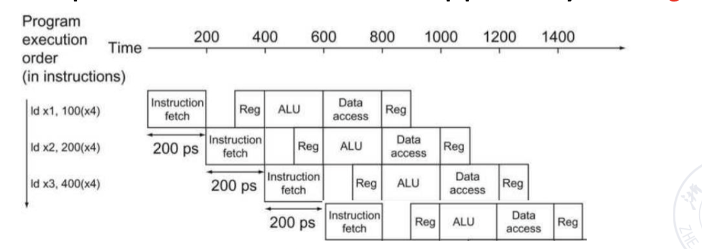

# ZJU Computer Systems II: Processor

!!! Abstract 
    在本篇笔记中，图片大多来自于 [浙江大学计算机系统 II](https://zju-turing.github.io/TuringCourses/major_basic/computer_system2/) 的课程课件，也有参考 [xg 的笔记]()，在此表示对老师和学长的诚挚感谢。

> Pipelining is an implementation technique whereby multiple instructions are overlapped in execution; it takes advantage of parallelism that exists among the actions needed to execute an instruction.

## 流水线概述与分类

对于只区分 IF、ID 和 EX 的处理器与其配套的指令集，顺序执行的定义是很清晰的，下面可以讨论重叠执行：

- 单重叠执行：在执行第 k 个指令的时候，第 k+1 个指令的 IF 阶段就可以开始执行。提升了一点效率，但不多。
- 双重叠执行，在第 k 个指令的 ID 阶段，第 k+1 个指令的 IF 阶段就可以开始执行；在第 k 个指令的 EX 阶段，第 k+1 个指令的 ID 阶段就可以开始执行，同时执行第 k+2 个指令的 IF 阶段。

单重叠执行可以将执行时间缩短 1/3，双重叠执行可以将执行时间缩短 2/3，虽然效率提升显著，但是处理器的元件需要分开，也需要更多的控制单元。

总的来说，流水线是指：指令的执行过程可以被分为 $m$ 个子过程，每个子过程的时间相等，且相邻的 $m$ 条指令的处理子过程在同一时间内错开并重叠执行。流水线可以看作重叠执行的一种扩展，每个子过程与其在流水线中的元件被称为**阶段/Stages/段/Segments**。流水线阶段的数目被称为流水线的**级数/Depth**。

- **进入时间/Pass Time**：第一个任务从进入流水线到结束的时间；
- **排空时间/Empty Time**：最后一个任务进入流水线到获得结果的时间。

单周期处理器的时钟周期是最长的指令的运行时间，流水线处理器的时钟周期是流水线最长的阶段的运行时间，将流水线分成相对均匀的段是非常重要的，执行时间最长的段往往会成为流水线的瓶颈。

流水线的分类（按功能分）：

- **单功能流水线/Single Function Pipeline**：只能执行一个固定功能的流水线；
- **多功能流水线/Multi Function Pipeline**：流水线的每个阶段可以根据需要连接不同的功能，以实现多种不同的功能。

多功能流水线还能继续分类：

- **静态流水线/Static Pipeline**：在相同时间内，多功能流水线的每个阶段只能按照相同功能的连接模式工作。
- **动态流水线/Dynamic Pipeline**：在相同时间内，多功能流水线的每个阶段可以以不同方式连接，并同时执行多种功能。


按流水线层面分类：

- 组件级流水线/Component Level Pipeline：处理器的算术和逻辑操作组件被分割成多个阶段，以便可以通过流水线方式执行各种类型的操作。
- 处理器级流水线/Processor Level Pipeline：通过流水线方式实现指令的解码和执行。指令的执行过程被划分为多个子过程，每个子过程由独立的功能单元执行。
-	处理器间流水线/Inter Processor Pipeline/Macro Pipeline：两个或多个处理器串联连接以处理相同的数据流，每个处理器完成整个任务的一部分。

按照流水线的拓扑结构分：

- 线性流水线/Linear Pipeline：每个流水线阶段按照串行方式连接，无反馈回路。当数据通过流水线的每个阶段时，每个阶段只能最多流过一次。
-	非线性流水线/Nonlinear Pipeline：除了串行连接外，流水线中还存在反馈回路。非线性流水线需要确定何时在流水线中引入新任务，以确保新任务不会与先前进入流水线的任务发生冲突。这类调度问题会在后面讲。

按照有序性分类：

- 顺序流水线/循序流水线/Ordered Pipeline：在流水线中，任务的输出顺序与输入顺序完全相同。每个任务按顺序在流水线的每个阶段流动。
- 乱序流水线/Disordered Pipeline：在流水线中，任务的输出顺序可能与输入顺序不同，允许后进入的任务先完成。这在解决冒险的时候有用处。

按照并行性分类：

- 标量处理器/Scalar Processor：处理器不具有向量数据表示和向量指令，只处理标量数据的流水线处理。
- 向量处理器/Vector Processor：支持向量数据表示和向量指令，将向量数据表示与流水线技术相结合，以实现更高效的数据处理。
- 超标量处理器/Super Scalar Processor：可以在一个周期中并行执行多个指令，完全通过硬件实现并行化。

## 效率估算

1. **吞吐量/Throughput/TP**：运行总**指令条数**与**运行时间**之比

    $$
    \mathit{TP} = \frac{\mathrm{Total\ Instructions}}{\mathrm{Run\ Time}} = \frac{n}{T}
    $$
    
    实际情况下很有可能运行时间不同，根据流水线处理器的时钟周期是流水线最长的阶段的运行时间，取一个 $\max$ 就行了。

2. **加速比/Speedup/SP**：流水线处理器的运行时间与单周期处理器的运行时间之比

    $$
    \mathit{SP} = \frac{\mathrm{Run\ Time_{\mathrm{non-pipelined}}}}{\mathrm{Run\ Time_{\mathrm{pipelined}}}} = \frac{T_{\mathrm{SC}}}{T_{\mathrm{P}}}
    $$

    如果流水线被足够合适地进行阶段划分，那么加速比就会趋近于流水线的级数，下面的效率也会趋近于 1。

3. **效率/Efficiency/**$\eta$：流水线处理器的**加速比**与流水线的**级数**之比

    $$
    \eta = \frac{\mathit{SP}}{m} = \frac{T_{\mathrm{SC}}}{m \cdot T_{\mathrm{P}}}
    $$

???- Info "Example"
    对一个 $m$ 级的流水线，执行 $n$ 条指令，流水线的时钟周期为 $\Delta t_0$，那么可以计算下面内容：

    

    - 运行时间：$T = (m + n - 1) \times \Delta t_0$；
    - 吞吐量：$\mathit{TP} = \dfrac{n}{T} = \dfrac{n}{(m + n - 1) \times \Delta t_0}$；
    - 最大吞吐量：$\mathit{TP_{\mathrm{max}}} = \dfrac{1}{\Delta t_0}$；
    - 加速比：$\mathit{SP} = \dfrac{m\times n\times \Delta t_0}{(m + n - 1) \times \Delta t_0} = \dfrac{m\times n}{m + n - 1}$；
    - 效率：$\eta = \dfrac{\mathit{SP}}{m} = \dfrac{n}{m + n - 1}$。

对于现实的流水线，如果有某一个阶段的时间特别长，我们就需要尝试解决瓶颈，一般解决瓶颈的方式有两种：

- Subdivision：将这个阶段再分成几个子阶段，再进行流水线；
- Repetition：考虑并行，一看图就懂。

???- Info "Graphs"
    
    


## 流水线冒险

如果在数据通路中仅仅添加了流水线寄存器，流水线并不一定一直可以正常工作，这是因为出现了下面的问题：

- **结构冒险**：A required resource is busy，硬件限制导致流水线不能正常工作，比如两个指令同时需要访问同一个资源。
- **数据冒险**：不同指令间可能出现数据的依赖，需要等待先前的指令完成数据读写。
- **控制冒险**：流水线的指令需要访问同一控制信号，后续的指令流需要依赖前面的指令。

### 结构冒险

对于一段连续的指令序列，如果整个流水线只有一个内存的话，在某个周期内，我们需要同时读数据和读指令，这样就会出现结构冒险。

<!--  -->

对于冯诺伊曼架构的计算机，如果只有一个主存，那么很有可能两个指令的 IF 段和 MEM 段会出现冲突。解决方法也很简单：

- 添加额外的硬件，比如加一个 cache 或者独立的指令内存，像哈弗架构的计算机就不会出现上面的这个问题；
- 通过流水线暂停/Stall，等待资源空闲。

一直可以通过添加硬件来解决结构冒险；Stall 的操作也很简单，可以利用 `nop` 指令来实现，在《计算机组成与设计：硬件软件接口》一书中说：通过识别 ID 阶段的冒险，我们可以通过将 ID/EX 流水线寄存器中 EX、MEM 和 WB 的控制字段设置为 0 来向流水线中插入一个气泡。这些不会产生负面作用的控制值在每个时钟周期向前传递并产生适当的效果：在控制值均为 0 的情况下，不会有寄存器或者存储器被写入数据。

### 数据冒险
 
数据冒险来自于：流水线的指令需要访问同一数据，后面指令需要的数据可能被前面的指令修改或加载。


对于上面的例子，首先我们还是可以通过 Stall 来解决数据冒险，直到 ID 在 WB 后（也就是等到数据可用），但是对于五级流水线，我们需要 Stall 三个周期，这样会大幅度降低流水线的效率，接近单周期处理器，所以我们需要更好的解决方案。

前递/Forwarding 是更好的解决方案：


如果我们在 ID 段访问的数据在 EX 段被修改，那么我们就直接从 EX 的结果中取出数据，而不是从寄存器文件中取数据，这样就可以避免**一部分的**数据冒险。

但是前递并不能解决所有的数据冒险，比如下面的 load-use 的例子：


我们要前递至少需要再隔一个周期，从 MEM 阶段的数据前递到 EX 阶段，这样就需要在中间 stall 一个周期，这样就不能完全解决数据冒险。虽然可以解决，但是还是需要多避免 stall 的出现，就需要在软件编译的时候进行一些优化，调整指令的顺序，比如将 `add` 和 `load` 的顺序调换，这样就可以避免数据冒险。


常瑞老师在课上提到过三种数据相关：写后读相关（write-after-read）、写后写相关（write-after-write）和读后写相关（read-after-write）。对我们实现的五级流水线来说，由于不涉及乱序执行，所以只有写后读相关会产生数据冒险。

### 控制冒险

简单来说，如果指令流里边出现一个 `beq`，后边的指令可能会出现跳转而不是顺序执行，这就出现控制冒险。解决方法有三种：

- Stall：等待分支的结果，在 ID 阶段加入判断模块，提前计算好分支结果、分支的地址并更新 PC，这样只需要一次 Stall 就可以在下一个周期取得正确的指令
    

- 分支预测：
    - 简单版本：一直预测不跳转，不采用分支。如果预测错误，就需要清空流水线，重新开始。
    - 复杂版本：根据情况进行预测，比如一个循环最后的分支语句总是预测发生跳转。
    - 动态预测：根据历史记录进行预测。
- 延迟预测/Delayed Decision：将 branch 前的无关指令移动到 branch 之后的 bubble 处（分支延迟槽）执行，减少为了等待而插入的无意义 bubble 代码。
    

## 数据通路设计

简单实现：在五个阶段中间加入寄存器，每组寄存器保存上一个阶段传入的数据与信号，这样就可以实现流水线的功能。观察流水线结构和数据流动，我们发现流水线中有且仅有两个信号是向后（从右向左）传递的：

- 多路选择器选择下一个 PC 的值，这个信号可能会引起控制冒险；
- 在 MEM 阶段从数据内存中读取数据写回到寄存器文件，这个信号可能会引起数据冒险。
 
可以在流水线中加入**前递单元**、**冒险检测单元**来处理数据冒险和控制冒险。

## 冒险处理

### 数据冒险

最经典的是写后读冒险，若前一条指令写回的寄存器正好是下一条指令需要读的寄存器，若是例如 `add`-`sub` 类型的，写回的值正好是上条指令在 EX 阶段计算出来的结果，我们使用前递单元就可以解决，将 EX 计算的结果直接传递给下一条指令，不过需要在 EX 阶段添加多路选择器来选择 ALU 来源。


这种 use-use 类型冒险不仅仅在于连续两个指令之间，也可能隔一个指令出现，下面一个图中，蓝色的线表示正常的数据流，红色的线表示前递的数据流。


可以看见，第一个 `sub` 指令和第三个 `or` 指令间出现了数据冲突，而检测数据冒险的方式是：

- 相邻指令/EX Hazard：
    - `EX/MEM.RegWrite == 1`：即前一条指令写入了寄存器；
    - `EX/MEM.Rd != 0`：即前一条指令写入的不是 x0（如果是 x0 则不会发生任何变化）；
    - `EX/MEM.Rd == ID/EX.Rs1` 或 `ID/EX.Rs2`：即前一条指令写入的寄存器与后一条指令某一操作数相同。
- 隔一条指令/MEM Hazard：
    - `MEM/WB.RegWrite == 1`；
    - `MEM/WB.Rd != 0`；
    - `MEM/WB.Rd == ID/EX.Rs1` 或 `ID/EX.Rs2`。

<!--  -->

<!--  -->

但是这样的判断不适合连续的数据冒险，比如下面的双重冒险/Double Hazard：

```asm
add x1, x1, x2
add x1, x1, x3
add x1, x1, x4
```

Naive 的情况是，第一条指令和第三条指令会被看成 MEM Hazard，进而导致第三条指令读的 `x1` 是第一条指令算出来的 `x1`，我们将这样的连续数据冒险看成一对一对的 EX Hazard，进而需要在 MEM Hazard 的判断上加一点限制，亦即存在 EX Hazard 的时候不认为存在 MEM Hazard：

- `MEM/WB.RegWrite == 1`；
- `MEM/WB.Rd != 0`；
- `MEM/WB.Rd == ID/EX.Rs1` 或 `ID/EX.Rs2`；
- `not (EX/MEM.RegWrite == 1 and EX/MEM.Rd != 0 and (EX/MEM.Rd == ID/EX.Rs1 or EX/MEM.Rd == ID/EX.Rs2))`：即不存在 EX Hazard。

这这种 use-use 的情况也可以通过 Stall 来解决，检测方式也和上面的一样：

- `EX/MEM.RegWrite == 1`：即前一条指令写入了寄存器；
- `EX/MEM.Rd != 0`：即前一条指令写入的不是 x0（如果是 x0 则不会发生任何变化）；
- `EX/MEM.Rd == ID/EX.Rs1` 或 `ID/EX.Rs2`：即前一条指令写入的寄存器与后一条指令某一操作数相同。

Stall 的方式也很直接，在检测到冒险的时钟周期内：

- 强制 ID/EX 流水线寄存器中的控制字段为 0：后续 EX、MEM 和 WB 阶段就都执行 nop 操作；
- 阻止 PC 和 IF/ID 流水线寄存器的更新：正在解码的指令会再解码一次，正在取指的指令会再取一次。

这样 Stall 的结果就相当于在下一个周期将 EX/MEM 流水线寄存器中的控制字段设置为 0，同时保持阻止 PC、IF/ID 和 ID/EX 流水线寄存器的更新。

但是 use-use 的处理方式一般都使用 Forwarding，而 load-use 的处理就不得不用到 Stall 后 Forwarding 的方式。检测方式也相较于 use-use 有差别：

- `ID/EX.MemRead == 1`（`ID/EX.MemWrite == 0`）：前一条指令需要从 Data Memory 读取数据；
- `ID/EX.Rd == IF/ID.Rs1` 或 `IF/ID.Rs2`：前一条指令写入的寄存器与后一条指令某一操作数相同。


Stall 一个周期之后就正常接收到 MEM Hazard 数据冒险，直接按照 MEM Hazard 进行前递，硬件实现和前面类似，通过 Hazard Detection Unit 来检测 load-use 冒险，接收它需要的值，输出 PCWrite、IF/IDWrite 控制信号（新增）以及一个控制信号用来选择 ID/EX 阶段寄存器的控制信号部分来自控制单元还是置零。


硬件设计和前面的思路相同，在 Hazard Detection Unit 新增新的信号，就可以处理更复杂的数据冒险。总结一下：

- EX Hazard & MEM Hazard：前递就可以；
- Double Hazard：将其看成两次 EX Hazard，并且需要在 MEM Hazard 的判断上加一点限制；
- Load-use Hazard：除了前递还需要一个周期的 Stall。

### 控制冒险


## 非线性流水线的调度
 


